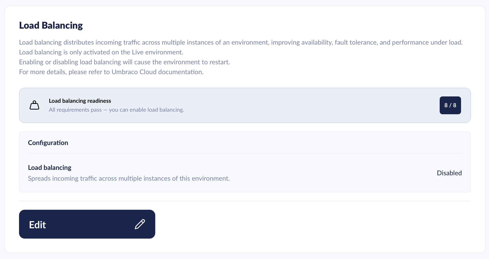

# Load Balancing

Load balancing distributes traffic across multiple instances of the same Umbraco Cloud environment. Enable it when you need higher throughput, resilience against instance failures, or capacity for traffic spikes.


You enable and configure load balancing in the [Umbraco Cloud Portal](https://www.s1.umbraco.io/) under `Project -> Configuration -> Load Balancing`.


## What load balancing is and why you would enable it

Load balancing runs an Umbraco Cloud environment on two or more instances that share the same database, media storage, and Redis backplane. Incoming requests are distributed across the instances by the platform.

Enable load balancing when you need:

* **Higher throughput** — more concurrent requests than a single instance can serve.
* **Smoother traffic spikes** — capacity for short-term load increases such as campaigns or product launches.
* **Improved availability** — a single failing instance does not take the environment offline.

Load balancing is **not** a multi-region failover and does not provide zero-downtime deployments. See [Deployments and restarts](#deployments-and-restarts) below.

## Prerequisites

The Umbraco Cloud Portal checks these prerequisites automatically under `Project -> Configuration -> Load Balancing`. You cannot enable load balancing until every prerequisite passes.

| Prerequisite | What it is | Learn more |
| --- | --- | --- |
| Payment plan | Load balancing is only available on projects with an **Invoiced** or **Credits** payment plan. | [Payments](../../begin-your-cloud-journey/the-cloud-portal/payments.md) |
| Professional plan with a dedicated server | Load balancing runs on dedicated infrastructure, available from the **Professional Dedicated 1** plan and up. | [Dedicated Resources](../../build-and-customize-your-solution/set-up-your-project/project-settings/dedicated-resources.md) |
| Environment alone on a dedicated server | Load balancing scales every site on the server. The environment must be the only one on its dedicated server. | [Dedicated Resources](../../build-and-customize-your-solution/set-up-your-project/project-settings/dedicated-resources.md) |
| Umbraco CMS **17.5.0** or higher | The base Umbraco CMS package meets the minimum supported version. | [Minor Upgrades](../manage-product-upgrades/product-upgrades/minor-upgrades.md) |
| Umbraco.Cloud.Cms **17.2.0** or higher | The Umbraco Cloud CMS package meets the minimum supported version. | [Minor Upgrades](../manage-product-upgrades/product-upgrades/minor-upgrades.md) |
| Umbraco.Deploy.Cloud **17.2.0** or higher | The Umbraco Deploy Cloud package meets the minimum supported version. | [Minor Upgrades](../manage-product-upgrades/product-upgrades/minor-upgrades.md) |
| Runtime mode set to Production | `Umbraco:CMS:Runtime:Mode` is set to `Production`. | [Runtime Modes](https://docs.umbraco.com/umbraco-cms/fundamentals/setup/server-setup/runtime-modes#production-mode) |
| Hosting debug disabled | `Umbraco:CMS:Hosting:Debug` is set to `false`, as required in production. | [Hosting Settings](https://docs.umbraco.com/umbraco-cms/develop-with-umbraco/configuration/hostingsettings) |
| ModelsBuilder mode set to Nothing | `Umbraco:CMS:ModelsBuilder:ModelsMode` is set to `Nothing`, so models are pre-compiled. | [ModelsBuilder Settings](https://docs.umbraco.com/umbraco-cms/reference/configuration/modelsbuildersettings) |


Production mode enforces the `ModelsMode = Nothing` and pre-compiled views requirements at boot. An Umbraco app in Production mode that fails either check throws `BootFailedException`.


The Portal also checks that your Razor views are pre-compiled. This check is a recommendation and does not block you from enabling load balancing. Make sure your `.csproj` does not set `<RazorCompileOnBuild>` or `<RazorCompileOnPublish>` to `false` — see [Runtime Modes](https://docs.umbraco.com/umbraco-cms/fundamentals/setup/server-setup/runtime-modes#production-mode).

## Scaling modes

Umbraco Cloud supports manual scaling. Dynamic scaling, where the platform adjusts the instance count automatically based on load, is planned for a future release.

### Manual scaling

You choose the exact number of instances your environment runs on. The count remains fixed until you change the value.

Choose manual scaling when:

* Your traffic is predictable.
* You want full control over running cost.
* You are sizing for a known peak.


Load-balanced environments currently have sticky sessions enabled. Each visitor is routed to the same instance for the duration of their session, which limits how evenly traffic is distributed across instances.


## Cache Configuration by Cloud Plan

Load balancing is available on **Professional** plans with a dedicated server, from **Professional Dedicated 1** and up. It is not available on Starter, Standard, or shared Professional plans. If you need load balancing on a smaller plan, contact Umbraco Support to discuss upgrade paths.

Each load-balanced environment runs against a managed Redis instance. Redis acts as the SignalR backplane and the distributed cache that keeps state consistent across all running instances. If the environment does not already have Cache enabled, Umbraco Cloud provisions a managed Redis cache as part of enabling load balancing — see [Cache Configuration](cache-configuration.md).

Umbraco CMS uses Microsoft's HybridCache for its distributed cache. See the [HybridCacheOptions reference](https://docs.umbraco.com/umbraco-cms/reference/configuration/cache-settings#hybridcacheoptions) for configuration details.

When you enable load balancing, Umbraco Cloud selects a Redis Stock Keeping Unit (SKU) automatically based on your plan. All eligible plans include High Availability (HA) and a Service Level Agreement (SLA) on the Redis instance.

| Plan            | Default Redis SKU | High Availability |
| --------------- | ----------------- | ----------------- |
| Pro Dedicated 1 | Small+            | ✅                 |
| Pro Dedicated 2 | Small+            | ✅                 |
| Pro Dedicated 3 | Small+            | ✅                 |

For the full list of available Redis SKUs and how to choose one, see [Cache Configuration](cache-configuration.md).

## What Umbraco Cloud configures automatically

When you enable load balancing, Umbraco Cloud configures everything needed to run your environment across multiple instances. You do not need to change `Program.cs` or add configuration code. The platform sets up:

* **SignalR backplane** — real-time backoffice messages are distributed across all instances over Redis.
* **Shared Data Protection keys** — the keys that protect login cookies, antiforgery tokens, and `TempData` are shared across all instances. Umbraco Cloud stores them on a replicated filesystem managed for the environment, so authentication and forms keep working on every instance.

A shared Redis cache keeps cached content consistent across instances. For the cache that backs these features, and how to use Redis in your own code, see [Cache Configuration](cache-configuration.md).

## Performance and availability

Load balancing changes how performance and availability behave in an Umbraco Cloud environment. Two behaviors stand out:

### Logs are split per instance

Each instance writes a separate log stream. Per-instance logs trace requests to the specific serving instance. This helps diagnose problems affecting only one instance.

For where to find logs and how to read them, see [Log files](../monitor-and-troubleshoot/resolve-issues-quickly-and-efficiently/log-files.md).

### Capacity and resilience

Multiple instances absorb traffic spikes more effectively than a single instance. If one instance becomes unhealthy, the remaining instances continue to serve traffic while the platform recovers the failed instance.

## Deployments and restarts


Load balancing does **not** provide rolling updates. When you deploy code or publish content, all instances are restarted. Visitors may experience brief downtime while instances restart.


Plan deployments and large content transfers during low-traffic windows where possible.

## Related articles

* [Cache Configuration](cache-configuration.md) — managed Redis cache that backs load-balanced environments; lists available SKUs.
* [Umbraco CMS Load Balancing](https://docs.umbraco.com/umbraco-cms/fundamentals/setup/server-setup/load-balancing) — for projects hosted outside Umbraco Cloud.
* [Load Balancing the Backoffice](https://docs.umbraco.com/umbraco-cms/fundamentals/setup/server-setup/load-balancing/load-balancing-backoffice) — backoffice-specific configuration available from Umbraco 17.
* [Dedicated Resources](../../build-and-customize-your-solution/set-up-your-project/project-settings/dedicated-resources.md) — when to combine load balancing with dedicated server resources.
