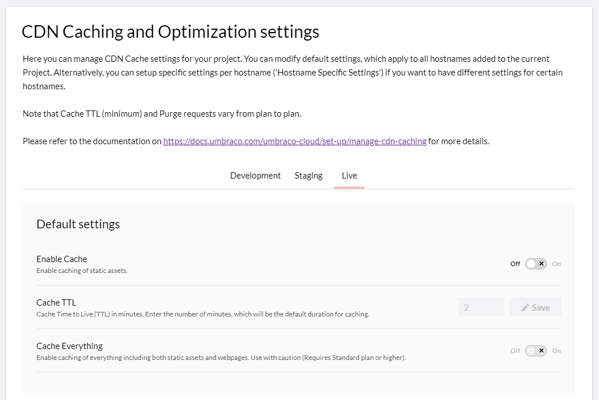
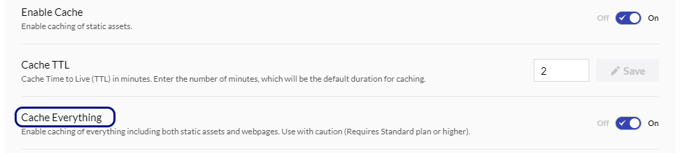
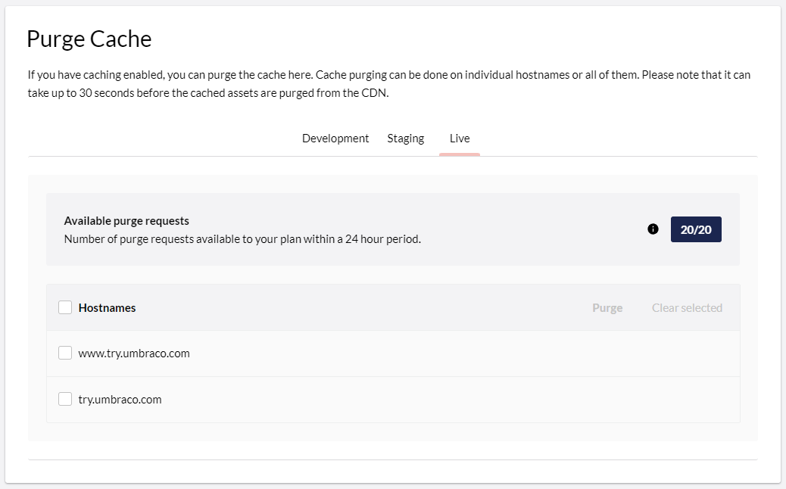
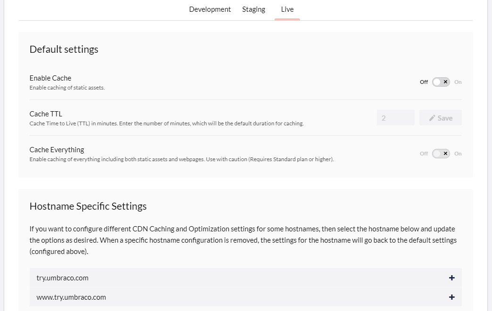

# CDN Caching and Optimizations

After [adding custom hostnames](../../go-live/manage-hostnames/) to your project, it's possible to configure Content Delivery Network (CDN) Caching. This can be done for all or specific hostnames within your project. The default `*.{region}.umbraco.io` hostnames that come with the project cannot be cached, see [Custom hostname requirement](manage-cdn-caching.md#custom-hostname-requirement).

The caching options relate to the traffic that goes through your hostname from the origin (Umbraco Cloud) to the end-user. This is the traffic of your website and assets from the webserver to the browser.

The options that are currently available are:

* Enable Cache (default: On)
* Cache TTL: Time to Live (default: 120 minutes)
* Cache Everything (default: off)



When a new hostname is added to a Project, the default settings will be applied. However, you can change the default settings for your project so that the new hostnames will get the settings you have chosen. This means that when enabling caching in the default settings and adding a new hostname, caching is enabled for that new hostname.

## Custom hostname requirement

The CDN sits in front of your custom hostnames. This means that CDN Caching only applies to hostnames you have added to the environment yourself, for example `www.example.com`.

The default hostnames that come with an Umbraco Cloud project are not enough to enable CDN Caching:

* Default hostnames follow the `*.{region}.umbraco.io` pattern, such as `snoopy.euwest01.umbraco.io` for the Live environment and `dev-snoopy.euwest01.umbraco.io` for the Development environment.
* Default hostnames are not listed under **Hostname-specific settings**, so you cannot configure caching for them.
* Requests to a default hostname are served from the origin. Enabling **Enable Cache** or **Cache Everything** in the **Default settings** has no effect on those requests.

The practical consequences are:

* A project that has not gone live yet, and therefore only uses its default hostnames, gets no CDN Caching regardless of the settings on the page.
* Testing caching behavior on a Development or Staging environment requires a custom hostname on that specific environment, for example a subdomain such as `test.example.com`. Settings are scoped per environment, so a custom hostname on the Live environment does not enable caching on Development or Staging.
* Verifying whether a response was served from the CDN must be done through the custom hostname, not through the `umbraco.io` URL.

To add a custom hostname, follow the steps in [Managing Hostnames](../../go-live/manage-hostnames/). Once the hostname is added and shows as **Protected**, it appears under **Hostname-specific settings** and inherits the caching options from **Default settings**.

## Caching Explained

When caching is enabled on your project static assets like CSS and images are cached in the Content Delivery Network (CDN) used by Umbraco Cloud. How assets are cached is up to you, as you can control it through 'cache-control headers'.

By default, Umbraco Cloud enforces a minimum TTL based on the plan of your Umbraco Cloud Project. This means that assets cannot be cached for a shorter period than what your Plan allows. You can always choose a longer duration, especially, if you don't expect your assets to change.

The following file types are cached as static assets through the CDN: 

| `7z`  | `ppt`  | `webm` | `bz2`   |
| `csv` | `tiff` | `bin`  | `eps`   |
| `gif` | `zst`  | `ejs`  | `jpeg`  |
| `midi`| `avif` | `jar`  | `pdf`   |
| `png` | `docx` | `ogg`  | `svgz`  |
| `tif` | `ico`  | `rar`  | `woff2` |
| `zip` | `mp3`  | `webp` | `class` |
| `avi` | `pptx` | `bmp`  | `exe`   |
| `doc` | `ttf`  | `eot`  | `js`    |
| `gz`  | `apk`  | `jpg`  | `pict`  |
| `mkv` | `dmg`  | `otf`  | `swf`   |
| `ps`  | `iso`  | `svg`  | `xls`   |
| `mp4` | `css`  | `woff` | `flac`  |
| `pls` | `mid`  | `tar`  | `xlsx`  |

If you want to disable caching on certain types of static assets, you can use a 'no-cache' cache-control header. This will be respected by the caching strategy in the CDN. You can utilize an outbound rewrite rule to add such a cache-control header to the request.

The following example adds a cache-control header with 'no-cache' as the value when the requested Url contains a PDF file:

```xml
<rewrite>
    <outboundRules>
        <rule name="Set Cache-Control - No-Cache PDF">
            <match serverVariable="RESPONSE_Cache_Control" pattern=".*" />
            <conditions>
                <add input="{REQUEST_URI}" pattern="\.(pdf)$" />
            </conditions>
            <action type="Rewrite" value="no-cache"/>
        </rule>
    </outboundRules>
</rewrite>
```


The webpage itself is not cached when CDN Caching is enabled.


## Cache Everything



When **Cache Everything** is enabled, everything including the webpage is cached in the CDN. So, in addition to static assets, the webpage will also be cached and served from the CDN instead of loading from the origin.


When a webpage is cached, it will be stripped of any cookies that are otherwise part of the request. If you use cookies as part of the website, be aware of the implications of using Cache Everything.



When using Cache TTL, the Editor's expectations of when the webpage is refreshed is matched with a new version loaded from the origin. As an example, choosing a Cache TTL of 2 hours means that the webpage will be served from the cache for 2 hours. Then it will be refreshed with a copy from the origin. If Editors make changes every 30 minutes, they will have to wait at least two hours until they can see the changes on the website.


We recommend using Cache Everything with caution.


## Purge Caching



When you need to refresh cached assets, you can purge the CDN cache to remove everything and force a refresh. This can be useful after having deployed changes to JS and CSS files, which are cached in the CDN. If you have caching enabled, you can purge the cache in the Purge Cache section at the bottom of the page.

Cache purging is done per hostname and can take up to 30 seconds before assets are gone from the CDN, as it's refreshed globally.

By default, all hostnames are selected, but you can choose to purge specific hostnames from the environments in your Umbraco Cloud project.

Purging the cache is a heavy operation, so there is a constraint on how many purge requests can be done within 24 hours. The 24 hours starts from the moment you Purge. If you have 2 Purge requests available and Purge twice within an hour, you can Purge again in 23 hours and then 24 hours.

In the Purge Cache section, you can see how many Purge requests you have available and when.


The available number of Purge requests varies depending on your Cloud Plan. For more information, see the [Plan specific features](manage-cdn-caching.md#plan-specific-features).


## Plan specific features

Access to the different options varies depending on the Umbraco Cloud Plan your project is on. Currently, the features available are as follows:

* Starter:
  * Enable Cache
  * Cache TTL (see below for minimum TTL)
* Standard:
  * Enable Cache
  * Cache TTL (see below for minimum TTL)
  * Cache Everything
* Professional:
  * Enable Cache
  * Cache TTL (see below for minimum TTL)
  * Cache Everything

The minimum Cache TTL varies as follows:

* Starter: 2 hours/120 minutes
* Standard: 30 minutes
* Professional: 2 minutes

The number of Cache Purge requests within 24 hours:

* Starter: 2
* Standard: 10
* Professional: 20

## CDN Caching and Optimizations

From your Umbraco Cloud Project, click **CDN Caching & Optimization** from the **Settings** dropdown to configure the caching options. All settings are scoped per environment. This means that if you have multiple environments you can select the specific environment at the top of the page.

Aside from environments, the CDN Caching & Optimization page is divided into two parts: **Default Settings** and **Hostname Specific Settings**.



Use the **Default settings** to configure default settings that should be applied to new and existing hostnames.

If you want to have different caching options for different hostnames, select the hostname under **Hostname-specific settings** and adjust the options. This might be useful if you want to test the different options on another hostname than your primary hostname.
