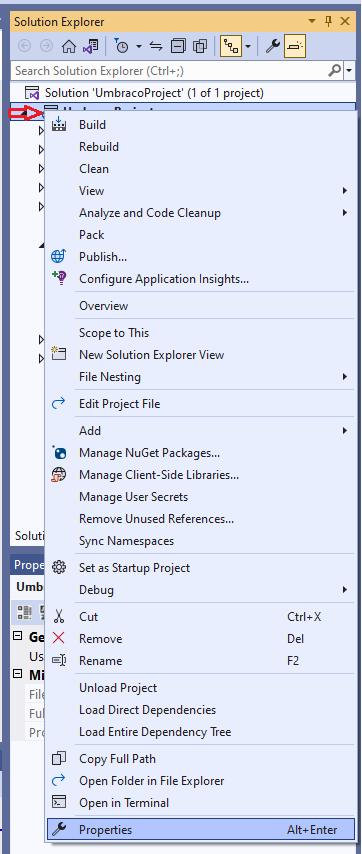

# Major Upgrades


**Are you using any custom packages or code on your Umbraco Cloud project?**

You need to ensure that any packages you use are available in the latest version of Umbraco. You must also ensure your custom code is valid with the new .NET Framework version.

**Breaking Changes**

Ensure you know the [Breaking changes](https://docs.umbraco.com/umbraco-cms/fundamentals/setup/upgrading/version-specific#breaking-changes) in the latest version of Umbraco CMS.

**Upgrading from Umbraco 9**

When upgrading from Umbraco 9, you need to upgrade to the closest [Long-term Support (LTS) major](https://umbraco.com/products/knowledge-center/long-term-support-and-end-of-life/). For Umbraco 9 that is Umbraco 10. From Umbraco 10 you can then upgrade directly to the next long-term support which is Umbraco 13.

When upgrading from Umbraco 9 to Umbraco 10, follow the dropdowns named: _**"Upgrading from Umbraco 9"**_ in the steps of the guide.

These are extra steps needed when going from Umbraco 9 to Umbraco 10.

**Upgrading from Umbraco 10**

You can upgrade from Umbraco 10 to the latest version directly. If you choose to skip upgrading to versions 11 and 12, you will no longer receive warning messages for obsolete features. However, if you do skip these versions, any breaking changes will no longer compile.

It is recommended to upgrade to the closest [Long-term Support (LTS) major](https://umbraco.com/products/knowledge-center/long-term-support-and-end-of-life/) version before upgrading to the latest version. For Umbraco 10, the closest long-term support version is Umbraco 13 so a direct upgrade is possible.



## Prerequisites

* Follow the **requirements** for [local development](https://docs.umbraco.com/umbraco-cms/fundamentals/setup/requirements#local-development).
* A Umbraco Cloud project running [the latest version of your current Umbraco CMS installation](https://our.umbraco.com/download/releases)
* The **latest** .[NET version](https://dotnet.microsoft.com/en-us/download/visual-studio-sdks) is installed locally.
* **At least 2 environments** on your Cloud project.
* A backup of your project database.
  * Directly from your environment. See the [Database backups](../databases/backups.md) article,
  * Or clone down, restore the project, and backup the local database.

## Video Tutorials




Upgrade tutorial Umbraco 10+





Upgrade tutorial Umbraco 9 to 10 on Cloud




## Step 1: Enable .NET

* Go to the project in the Umbraco Cloud portal.
* Navigate to **Settings** -> **Advanced**.
* Scroll down to the **Runtime Settings** section.
* **Ensure that the latest version of .NET is enabled** for each environment on your Cloud project, by selecting it from the dropdown.

<figure><figcaption><p>Runtime settings</p></figcaption></figure>

## Step 2: Clone down your environment

* Clone down the **Development** environment.
* Build and run the [project locally](../set-up/working-locally.md#running-the-site-locally).
* Log in to the backoffice.
* Restore content from your Cloud environment.

## Step 3: Upgrade the project locally using Visual Studio

* Open your project in Visual Studio - use the `csproj` file in the `/src/UmbracoProject` folder.
* Right-click your project solution in **Solution Explorer**.
* Select **Properties**.

<figure><figcaption></figcaption></figure>

* Select the same **.Net** **Target Framework** drop-down in the **General** section of the **Application** tab as on your Cloud project.


* Go to **Tools** > **NuGet Package Manager** > **Manage NuGet Packages for Solution...**.
* Navigate to the **Updates** tab.
* Checkmark all packages made **by Umbraco**:
  * `Umbraco.Cms`
  * `Umbraco.Deploy.Cloud`
  * `Umbraco.Deploy.Contrib`
  * `Umbraco.Forms`
  * `Umbraco.Deploy.Forms` (From Umbraco 13+, **Umbraco.Deploy.Forms** is called **Umbraco.Forms.Deploy**.)
  * `Umbraco.Cloud.Identity.Cms`
  * `Umbraco.Cloud.StorageProviders.AzureBlob`
* Checkmark the `Microsoft.Extensions.DependencyInjection.Abstractions` package if it appears in the list.
* Select **Update**.



If you have more projects in your solution or other packages, make sure that these are also updated to support the latest .NET framework.


<details>

<summary>Upgrading from Umbraco 9 - Update program.cs, appSettings.json and remove files.</summary>

*   Update the `Program` class in the `Program.cs` file to the following:\
    using Umbraco.Cms.Web.Common.Hosting;

    ```

    public class Program
        {
            public static void Main(string[] args)
                => CreateHostBuilder(args)
                    .Build()
                    .Run();

            public static IHostBuilder CreateHostBuilder(string[] args) =>
                Host.CreateDefaultBuilder(args)
                    .ConfigureUmbracoDefaults()
                    .ConfigureWebHostDefaults(webBuilder =>
                    {
                        webBuilder.UseStaticWebAssets();
                        webBuilder.UseStartup<Startup>();
                    });
        }
    ```
* Re-enable the appsettings IntelliSense by updating your schema reference in the **appsettings.json** file from:

```json
"$schema": "./umbraco/config/appsettings-schema.json",
```

To:

```json
"$schema": "./appsettings-schema.json",
```

Apply this change to the following files as well:

* **appsettings.Development.json**
* **appsettings.Production.json**
* **appsettings.Staging.json**

Remove the following files and folders _manually_ from your local project:

* `/wwwroot/umbraco`
* `/umbraco/PartialViewMacros`
* `/umbraco/UmbracoBackOffice`
* `/umbraco/UmbracoInstall`
* `/umbraco/UmbracoWebsite`
* `/umbraco/config/lang`

</details>

## Step 4: Finishing the Upgrade

* Enable the [Unattended Upgrades](https://docs.umbraco.com/umbraco-cms/fundamentals/setup/upgrading#run-an-unattended-upgrade) feature.
* Run the **project locally**.
* Log in to the Umbraco backoffice to **verify the upgrade** has happened.
  * If you are unable to login locally via Umbraco ID and URL shows `/umbraco/authorizeupgrade?redir=` then this is because of the Unattended Upgrades setting. It needs to be set to `true` and deployed to the environment before performing the upgrade.
* **Disable** the Unattended Upgrades feature if necessary.
* **Build and run** the project to verify everything works as expected.


Once the Umbraco project runs locally without any errors, the next step is to deploy and test on the Cloud Development environment.

<details>

<summary>Upgrading from Umbraco 9 - Remove files from the development environment.</summary>

* `/wwwroot/umbraco`
* `/umbraco/PartialViewMacros`
* `/umbraco/UmbracoBackOffice`
* `/umbraco/UmbracoInstall`
* `/umbraco/UmbracoWebsite`
* `/umbraco/config/lang`

The files and folder above need to be removed on the **Development** environment through `KUDU` -> `Debug Console` -> `CMD` -> `Site` -> from both the `repository` and `wwwroot` folders.


</details>

* Push the changes to the **Development** environment. See the [Deploying from local to your environments](../deployment/local-to-cloud.md) article.
* Test **everything** in the **Development** environment.

We highly recommend that you go through everything in your Development environment. This can help you identify any potential errors after the upgrade, and ensure that you are not deploying any issues onto your Live environment.

## Step 5: Going live

<details>

<summary>Upgrading from Umbraco 9 - Remove files from staging/live the environment.</summary>

Before deploying the upgrade to your next environment, you will need to remove the folders you also removed from Kudu on your Development environment.

The files are:

* `/wwwroot/umbraco`
* `/umbraco/PartialViewMacros`
* `/umbraco/UmbracoBackOffice`
* `/umbraco/UmbracoInstall`
* `/umbraco/UmbracoWebsite`
* `/umbraco/config/lang`

They need to be removed through `KUDU` -> `Debug Console` -> `CMD` -> `Site` -> from both the `repository` and `wwwroot` folders.


</details>

Once everything works as expected in the development environment, you can push the upgrade to the live environment.

* [Working locally with Umbraco Cloud](../set-up/working-locally.md)
* [KUDU on Umbraco Cloud](../set-up/power-tools/)
