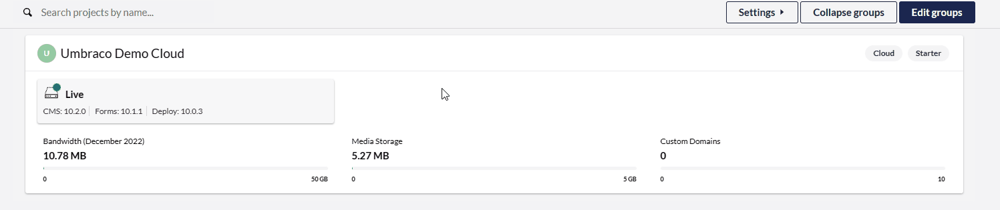

# Release Notes, January 2023

## Key Takeaways

* **UK Region Hosting** - With support for the azure hosting region "UK South", it is now possible to spin up a cloud project in 3 regions.
* **Multi-factor authentication list** - As an administrator at a cloud organization, you can see the multi-factor authentication connection for all the organization's members.
* **More allowed prefixes for naming secrets** - When naming secrets, you can reference the security related settings for Umbraco:CMS:Global:Smtp and Umbraco Forms api-key and field recaptchas.

## [UK Region Hosting]

Umbraco Cloud has reached yet a new milestone with the support of UK region. You are now able to create a new Umbraco Cloud project in either "West Europe", "US East", or "UK South" to the delight of the majority of our European and American customers.

## Organization Project view
Since October last year, our users have had the opportunity to enable multi-factor authentication (MFA) and thereby authenticate with a password and either phone, email or an authenticator app.

Now we deliver the second part of the planned three steps of the MFA feature, by ensuring that an administrator in a cloud organization can see the multi-factor authentication settings for all organization members.

IMAGE

The third and final step will be the enforcement of MFA per user level based on an organization setting. This means that an administrator can set the desired MFA type (email, phone or authenticator app) for each individual user, which will then be imposed on the user at the next login to Umbraco Cloud. This feature is expected to be delivered in the first quarter of 2023.

## Public access page

On the "Public Access" page, you can now specify a name when you add a new entry in the allowlist for an environment.

<figure><figcaption></figcaption></figure>

When choosing to add the public IP for the network you are currently working on, your name will automatically be used as the descriptive text.

## Kudu quicklink in Projects Dashboard

And finally, we've added a quicklink to Kudo that you can see by hovering over an environment.&#x20;

<figure><figcaption></figcaption></figure>

You now have the opportunity to access both the cloud project's page, backoffice and Kudo from the "Projects Dashboard".
