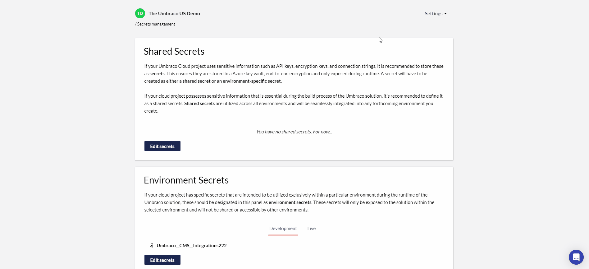

# October 2023

## Key Takeaways

* **Umbraco CI/CD Flow** - Elevate your deployment process with seamless integration between your existing CI/CD pipeline and Umbraco Cloud. Experience automated, efficient, and error-free deployments like never before.
* **Automatic Upgrades for Minor Versions** - Experience enhanced efficiency with our expanded Automatic Minor Upgrades for Umbraco CMS, Umbraco Forms, and Umbraco Deploy.

## Umbraco CI/CD Flow: Bridging Your CI/CD Pipeline with the Cloud

Umbraco CI/CD Flow represents a significant enhancement in how developers can integrate, test, and deploy their projects on Umbraco Cloud. The feature is engineered to function as an extension to your existing CI/CD pipeline, allowing automated deployments directly to Umbraco Cloud. This creates a synergy between your existing robust CI/CD setup and Umbraco Cloud's specialized hosting capabilities that are optimized for Umbraco CMS.

If you already have a CI/CD pipeline, you're halfway there. Umbraco CI/CD Flow brings an added layer of sophistication by allowing seamless integration with Umbraco Cloud through the "Umbraco Public API."

Whether you're new to CI/CD or an experienced developer, Umbraco Cloud has you covered. If you don't already have a CI/CD setup, our comprehensive documentation offers helpful examples using platforms such as Azure DevOps or GitHub Actions. And for those with existing pipelines, you can easily integrate and streamline your deployment process with Umbraco Cloud's specialized hosting capabilities.

Dive into our guides to master the Umbraco Public API, or follow our step-by-step tutorials to establish a CI/CD pipeline using Azure DevOps or GitHub Actions. With either approach, you'll enjoy a seamless, automated deployment experience.

## Automatic Upgrades for Minor Versions
We are pleased to announce an extension to our Automatic Upgrade feature. Previously limited to Patch versions, Automatic Upgrades for Umbraco CMS, Umbraco Forms, and Umbraco Deploy now include Minor versions. This update aims to further simplify your project management by automating more comprehensive updates.
For those running existing Cloud projects, the good news is that you can opt-in to enable these Automatic Minor Upgrades directly from Umbraco Cloud on the new Automatic upgrade page.

If you're starting a new Cloud project, the feature will be enabled by default, ensuring you're always running on the latest and most secure version across Umbraco CMS, Umbraco Forms, and Umbraco Deploy.

With Automatic Minor Upgrades, you can enjoy several benefits. First, you'll save a significant amount of time, allowing you to focus on more important aspects of your project. Second, you'll have access to the latest features and enhancements across all key components. Lastly, the most recent security patches are applied automatically, giving you peace of mind.

For further details, please consult our Upgrading Documentation where you'll find a comprehensive guide on the upgrade process. Our support team is also on standby to assist with any queries you may have.
