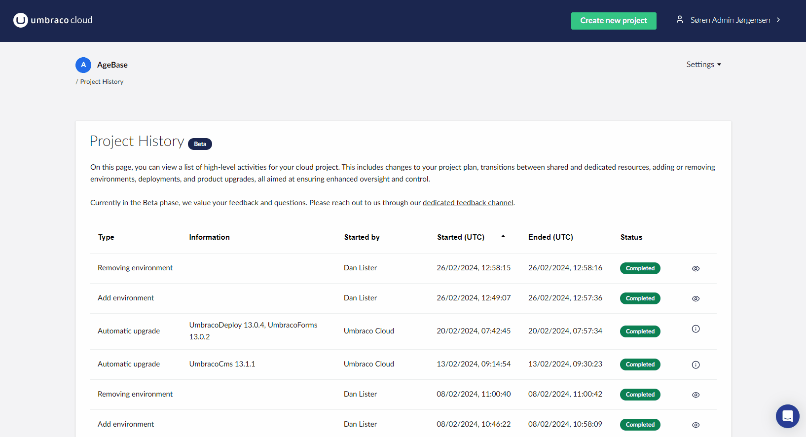
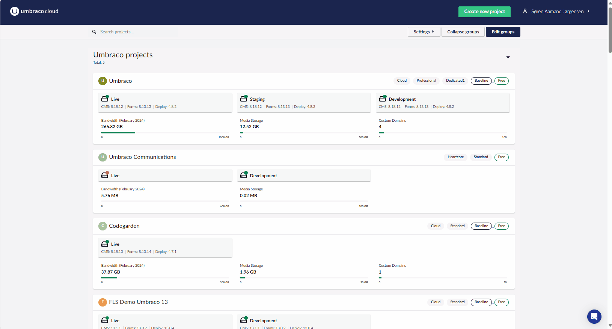

# February 2024

## Key Takeaways

* **Project History Page (Beta)** - Gain insight into past project activities like plan changes, adding environments, portal deployments, and upgrades, aimed at enhancing project transparency and control.
* **Upgrade Details Page** - Delivers detailed insights into every project upgrade, including product versions, timestamps, statuses, and error reports.
* **Improved Search on Projects Dashboard** - Enhances project searchability with the ability to use project names, associated tags, and product versions, complemented by a filter-as-you-type functionality for streamlined navigation and project management.

## Project History Page (Beta)
The "Project History Page," today released as a beta release, provides a detailed insight into the significant activities within your project. This feature catalogs events initiated by users or by Umbraco Cloud itself, including modifications to your project plan, portal deployments, and automatic and manual upgrades.

Each entry in the overview is interactive, allowing you to click on it for more detailed information. This feature ensures that you have easy access to in-depth details about each event, further enhancing your insight into your project's history and ongoing activities.

The overview today concentrates on activities spurred by users and Umbraco Cloud. However, our vision for the future is more expansive. As we diligently work on enhancing and refining this feature, the "Project History Page" is set to evolve into an all-encompassing overview. It will offer an unparalleled glimpse into the entirety of events that have transpired throughout your cloud project's existence.

## New Upgrade Details Page

The new "Upgrade Details" page is your gateway to detailed insights for every upgrade. By clicking the 'info' link from the "Project History" page for manual or automatic upgrades, you'll land on a page that highlights the essentials—product version, precise timestamps, current statuses, and error reports for troubleshooting. The page also showcases the impact of these upgrades across all relevant environments for your project.

The "Upgrade Details" page offers a clear view of how updates are applied within each environment of your project. This feature provides a straightforward breakdown, enabling you to understand the specific effects and application of upgrades across different environments. Designed to enhance your workflow, this page equips you with essential knowledge for efficient upgrade management, supports precise decision-making, and contributes to the smooth operation and success of your project.

We're here to support your journey every step of the way. Should you have any questions or need further assistance, feel free to reach out. Happy upgrading!

## Improved Search on Projects Dashboard
Finally, we have rolled out a significant update to the search functionality on the Projects Dashboard. The update makes it easier and faster for you to navigate your projects. Now, you're not limited to only searching by project names. This enhancement introduces the ability to search using a wide array of associated tags and even specific product versions within each project's environment. 

Examples of searchable tags include:

* Project type.
* Project plans.
* Payment type. 
* If the project is a baseline or a child.

Providing a multifaceted approach to organizing and locating your projects.

This update shines with its filter-as-you-type functionality, designed to refine search results in real-time as you type. This immediate response system not only speeds up your search process but also makes it more intuitive and tailored to your specific needs. Whether you're looking for a specific project plan or need to filter projects by payment type, this new search tool adapts to your workflow, allowing for a smoother, more efficient project management experience. Dive in and explore how this enhanced search capability can transform your navigation experience on the Projects Dashboard.
