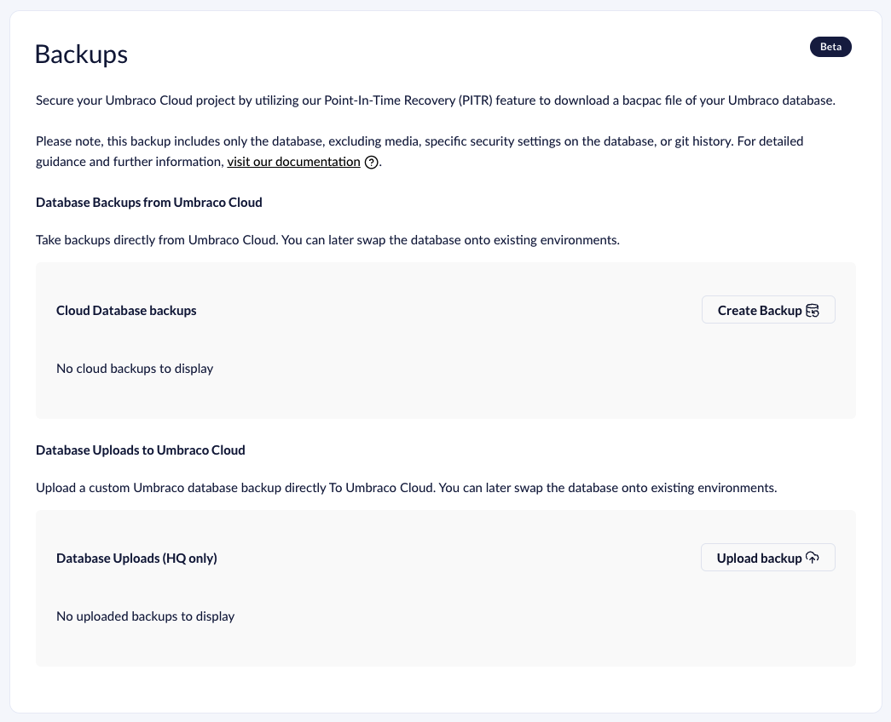
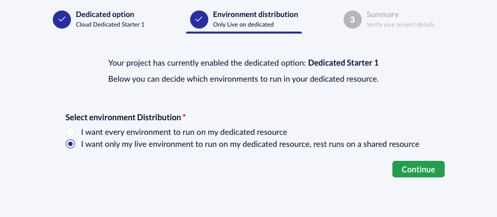

# May 2024

## Key Takeaways

* **Upload Custom Database** - You can now upload your Umbraco database onto the Umbraco Cloud. (Add additional text, restoring is right around the corner!)

* **Dedicated Environments** - You can now decide how to best host your Umbraco website with dedicated Environments, with the option to isolate your Live environment on a dedicated server.

## Upload Custom Database

Introduction the Point-In-Time Recovery (PITR) feature on the Backups page, we started the process of enabling backing up and restoring Umbraco Cloud websites. 

This release has enabled you to upload your custom Umbraco database to Umbraco Cloud. Utilizing the current backup functionality or bringing your own database is possible. We expect the possibility of restoring a database to your environment will be available in May or June 2024

## Dedicated Environments

We’re excited to introduce the ability to isolate your live environment on dedicated resources while keeping your development and staging environments on shared resources. This means your live site enjoys faster load times, reduced latency, and enhanced security without affecting your workflow in development and staging. 

