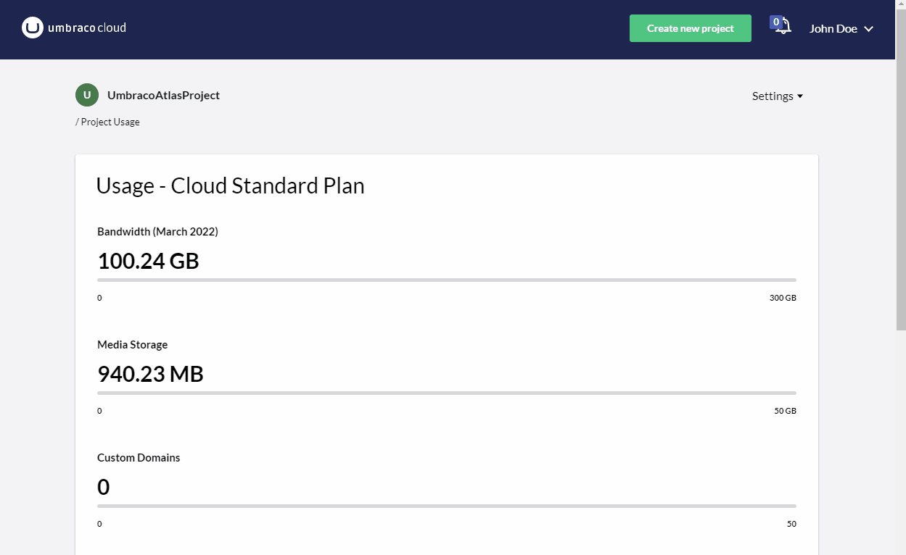

# March 2022

### Backoffice user group selection

On the project invites page users will now see more details for their project. As a user, you will see the **expiration date** of the invite, its **status**, and you are able to **remove** the ones that have expired.

This feature completes the planned improvements of the project invite flow. It has never been easier to invite portal users or backoffice users from the Umbraco Cloud Portal. Try it today!

### Outgoing IPs for Umbraco Heartcore webhooks

Webhooks for Umbraco Heartcore projects are now fired from either of the two static IPs listed below.

These two static outgoing IPs make it possible to allow webhook communication to bypass firewall restrictions for any external services. If you need to use a CIDR (Classless Inter-Domain Routing) Range for the IPs: 20.86.53.156/31.

### Bandwidth usage top 10 (Beta)

When your Umbraco Cloud project is the expected success and has hundreds or even thousands of daily visitors your projects might start using more bandwidth than you are expecting.

On the _Usage_ page of a project, you will now see a top 10 of the HTTP **referers causing the most bandwidth**. A referer is the name of an optional HTTP header field that identifies the address of the web page, from which the resource has been requested. It is the bandwidth generated from these resource requests that counts in the monthly usage limit of the project.

You can use this insight of pages generating the most bandwidth to see where optimization and minimizing the file size of resources will have the most impact.

The top 10 bandwidth usage for referrers is currently launched as a **Beta** version as the bandwidth listed does not always match the total bandwidth shown for the project. We will update you when the list offers 100% trusted bandwidth values.

### Static Outbound IP Address

You will need **static outbound IP addresses** for your cloud project when your Umbraco project connects to an external endpoint. The external endpoint requires connections originating from a static IP, such as a database or a web service using an IP address-based firewall.

On the _Advanced_ page of your project, you are now able to turn on the static outbound IP address feature to ensure persistent communication. This opt-in feature can be switched on for Standard, Pro, and Enterprise cloud projects.

For Starter projects, there is likewise a new addition. On the Advanced page, you can see the current outbound IP addresses of your project. These are however dynamic and are likely to change at some point due to either Azure or Umbraco optimizing hosting resources.

### [Managing Transport Security](../../../manage-security.md)

Once you have added your own hostnames it's possible to configure certain **transport security options** for all or for specific hostnames within your Cloud project. These security options all relate to the traffic that goes through your hostname from the origin (Umbraco Cloud) to the end user. The options are the protocols and encryption used to transport your website and assets from the webserver to the browser.

This can be done on the new _Security_ page.


The Manage Transport Security feature will be rolling out on individual projects this week. It is expected that all relevant projects are able to access the new _Security_ page on March 18th, 2022.


The options currently available are:

* HTTP/2 (default: on)
* Transport Layer Security (TLS) 1.3 (default: off)
* Minimum Transport Layer Security (TLS) Version (default: 1.2)

When a new hostname is added to a Project it will have the default settings applied for all environments. You can change the default settings for your Project, so new hostnames will get the default settings you have chosen.

You can also add hostname-specific settings if needed and thereby overriding the default settings.

### [Content Comparison](https://umbraco.com/blog/umbraco-forms-81193-and-deploy-4593-release/#content)

The Umbraco Commercial Packages team has made some great improvements to Umbraco Forms and Umbraco Deploy [lately](https://umbraco.com/blog/umbraco-forms-81193-and-deploy-4593-release/) adding immediate value to your Cloud projects. One of the Umbraco Deploy features, Content Comparison, enables you to preview content changes directly in the backoffice prior to transferring them to another environment. This is often helpful to ensure the correct updates are transferred and improves predictability when working with content in multiple environments.

You can see what has changed and understand what will change if you proceed with a transfer upstream or a restore into the local environment.

Content comparison is now available in all Umbraco Cloud projects running Umbraco Deploy 9.3+ for Umbraco 9 and 4.5 + for Umbraco 8.

## Bandwidth Usage Top 10 for resources

The bandwidth top 10 for referrers is now out of Beta. We are introducing a **new top 10 for resources** that displays the resources contributing the most to the total bandwidth of your project. Each resource is represented by its path together with the number of requests and its total contribution of bandwidth.

You can use the paths generating the most bandwidth usage to see where optimizing and minimizing the file size of resources will impact the most.

The top 10 bandwidth usage for resources is currently in Beta and for March it only contains requests from the 15th of March or later. From April 2022 and onwards the top 10 will contain all bandwidth for the specific month.
