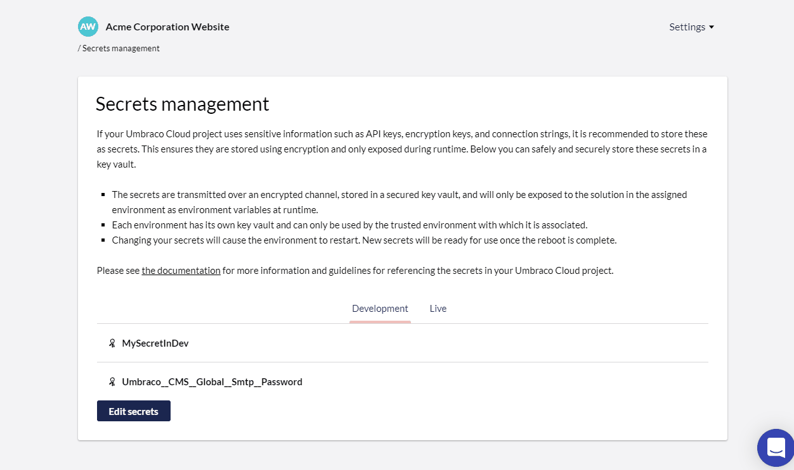
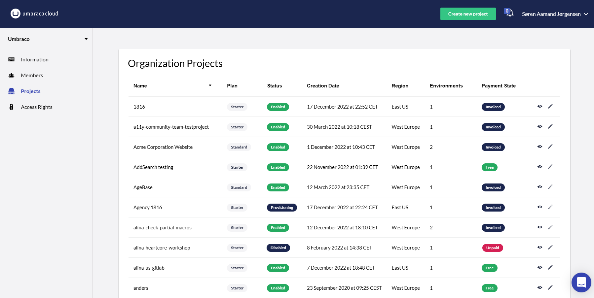
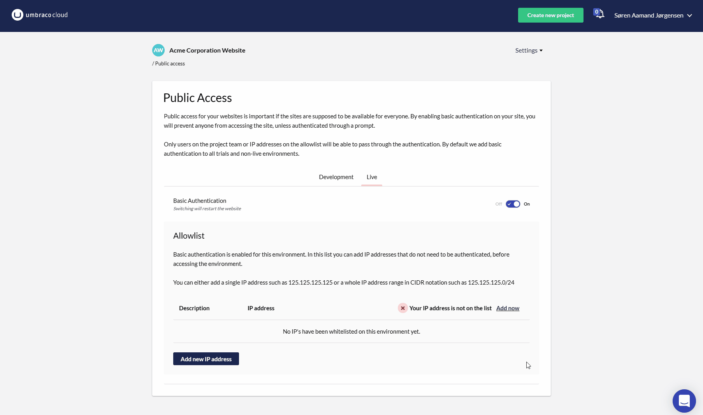

# December 2022

## [Secrets Management](../../../begin-your-cloud-journey/project-features/secrets-management.md)

The new _secrets management_ feature in Umbraco Cloud enables you to store your secrets securely in Azure key vaults.

This being digital authentication credentials such as private keys, database passwords, and 3rd-party API tokens

Hereby, you will never have to worry about exposing the most sensitive information of your Umbraco Cloud solution in code repositories.

Every environment has its own key vault and the secured values can only be accessed by the associated environment. The secret will be referenced with the assigned name as an environment variable. During runtime of your Umbraco application, the secret can be accessed using standard .NET conventions such as \_secretMessage = Environment.GetEnvironmentVariable("SecretName");

Storing Secrets Management in Azure key is enabled for all Umbraco cloud projects on Standard and Professional plans.

See the documentation section [Secrets Management](https://docs.umbraco.com/umbraco-cloud/set-up/project-settings/secrets-management) for more information.

## Organization Project view

As a member of a Umbraco Cloud organization, on the "Projects" page under your organization, you'll find a more detailed overview of your projects.

In addition to the name, plan, and status of the project, you can now also see:

* Creation date.
* Hosting region.
* Payment status.
* The number of environments.

You can sort your organization projects ascending and descending for all columns in the projects table.

## Public access page

On the "Public Access" page, you can now specify a name when you add a new entry in the allowlist for an environment.

<figure><figcaption></figcaption></figure>

When choosing to add the public IP for the network you are currently working on, your name will automatically be used as the descriptive text.

## Kudu quicklink in Projects Dashboard

And finally, we've added a quicklink to Kudo that you can see by hovering over an environment.

<figure><figcaption></figcaption></figure>

You now have the opportunity to access both the cloud project's page, backoffice and Kudo from the "Projects Dashboard".
