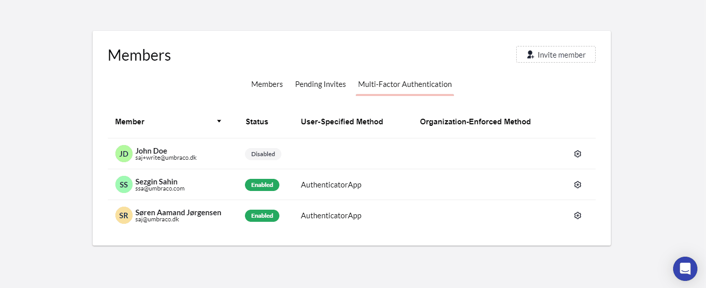

# February 2023

## Highlights video


Cloud highlights February 2023


## Enforced Multi-factor Authentication (MFA) for Organizations

We're excited to introduce our latest security feature in Umbraco Cloud - _organization-enforced multi-factor authentication_.

With this new feature, you can **enforce MFA for all members in your organization**, ensuring that everyone follows the same security protocols. You can customize the authentication method required for each member, depending on your organization's security policies and preferences.

The organization-enforced method will **override any MFA setting that the member has registered**. And ensure that the user will have to use the specified MFA method when during his login session involving UmbracoID.

This organization-enforced MFA feature is effective to set up and manage, helping protect your organization's data and resources in Umbraco Cloud. Enforcing MFA on all the members of your organization is a vital step in assuring your cloud projects and backoffice are secured from unauthorized access.

## New Project Creation Flow

We are continuously migrating the pages of Umbraco Cloud Portal to a new front end stack. Lately, we have updated the [hostnames](https://docs.umbraco.com/umbraco-cloud/set-up/project-settings/manage-hostnames) page and the project creation flow. In particular, for the latter, you will notice some significant improvements compared to the previous version.

The new flow has a **more modern and visually appealing design**, which makes it more engaging and user-friendly. It features a **step-by-step guide** that leads users through the process of creating a new project, ensuring that they don't miss any important details.

You will start by selecting the preferred project type, then you choose your project plan, CMS version (for Umbraco Cloud), and region. Next, you only need to register a project name, and the cloud project will be ready for you within a few minutes.

Whether you're a seasoned Umbraco Cloud developer or new to Umbraco development, you'll appreciate the ease and efficiency of our new project creation flow.

So why wait? Try out our new project creation flow today and start building your next cloud project based on the Friendly CMS on Umbraco Cloud.

## Improved Deployment and Error Handling

We have made **significant improvements to the deployment process and error handling** in Umbraco Cloud. We understand that seamless deployment between environments is crucial for your developer experience working in Umbraco Cloud. We have therefore been hard at work to make it even better.

Our updated deployment process facilitates that your website is deployed quickly and accurately every time you make changes to your project. We have also improved our error handling system to provide you with clear and concise guidance when unexpected errors occur during deployment.

Some of the deployment issues reported by users are related to the configuration of the Umbraco Cloud project or schema mismatches between environments. In these scenarios, we strive to provide a helpful text that will guide you in the right direction to solve the issue at hand.

If you are experiencing a deployment error, a question, or a remark about the deployment feature, **consult our experienced support team**. Both the Umbraco Support and Cloud Team are dedicated to removing any friction caused by deployments on Umbraco cloud. Our vision is to make the deployment process in Umbraco Cloud as perfect as it can be.

## Restore Content Optimization

The latest patch releases for Umbraco Deploy have introduced some important improvements to deploy restore and transfer operations. The update contains significant performance improvements. It should ensure, **restoring and transferring content** in a setup with a four-digit number of content nodes are not in danger of timing out.

The new configuration settings and options will work instantly on the cloud projects that previously have experienced long process times during restore and transfer operations. However, you might find more insight on the pages for [troubleshooting](https://docs.umbraco.com/umbraco-deploy/troubleshooting) and [configuration](https://docs.umbraco.com/umbraco-deploy/deploy-settings) for the deployment and restoring feature of Umbraco Cloud.
