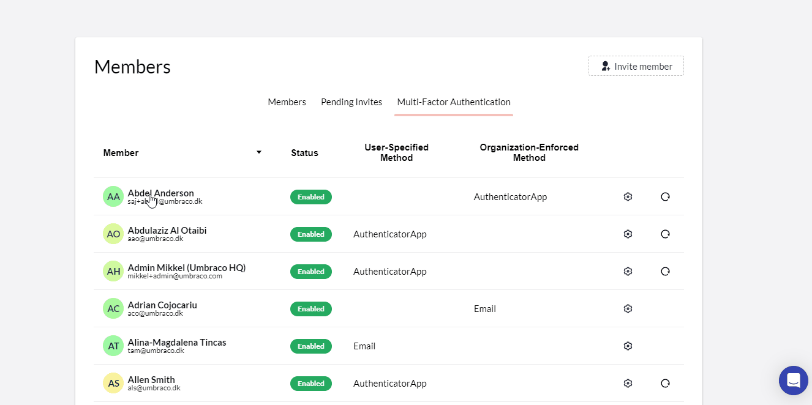

# April 2023

## Highlights video


Cloud highlights April 2023


## Reset Authenticator App settings

The latest addition to the multi-factor-authentication feature is the option for **administrators of an organization to reset the authenticator app settings**. This can be done for every member of the organization that is using an authenticator app during the login process to Umbraco Cloud.

This can be handy in situations where the member is switching to another authenticator app and then starts using a new phone. Or it could be due to another reason to reset the authenticator app.

When the setting has been reset, the member will during his next login have to re-register an entry in his authenticator app of choice.

## Other Umbraco Cloud Portal updates

During March and April, we made multiple minor fixes and improvements to the Umbraco Cloud Portal. Here are some of the highlights.

* The **auto-upgrade** feature and its handling of particular Umbraco 7 and Umbraco 8 projects have been **improved**. We consider the upgrade feature to be more solid than ever.
* When a user starts a new project creation flow based on a baseline project, the **potential baselines will load a lot faster** than earlier.
* New versions of the project subpages **“Security”** and **“CDN Caching and Optimization”** have been released and the documentation updated accordingly.
* When a user decides to send a project invite to an email that represents a user that already is part of the project, an **informative error message** will be shown.
* The **UmbracoID login dialog** has received some minor tweaks in the front end.
* And a whole lot of other minor tweaks and improvements.
