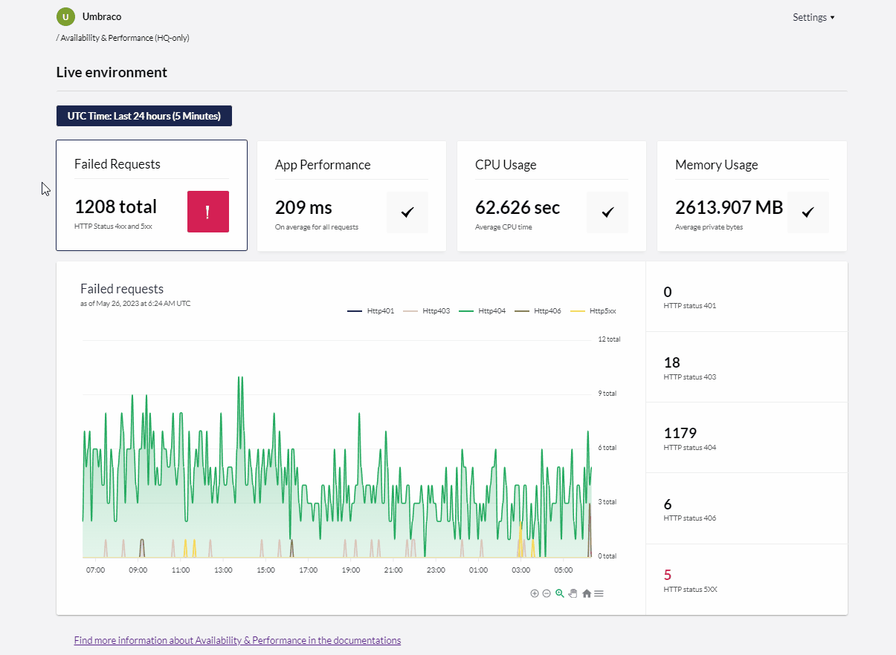

# May 2023

## Key Takeaways

* **Availability & Performance** - With Umbraco Cloud's user-friendly interface, you will receive a new set of tools to monitor and optimize your cloud projects effectively.
* **Specific views for dedicated and shared project plans** - The Availability & Performance feature will show different views for CPU Usage and Memory usage, highlighting a comparison to the plan quota for shared plans.
* **What the future will bring to the feature** - More exciting features and enhancements will be added to Availability & Performance in the future.
* **Removal of minify feature in Umbraco Cloud** - The option to activate minification of static resources for cloud projects in Umbraco Cloud has been removed.

## Availability & Performance

Umbraco Cloud's "Availability and Performance" feature offers you a new option to monitor the health and performance of your cloud projects. Leveraging HTTPS status codes, response times, CPU time, and memory usage, you can proactively identify and address issues. This will in turn support you in delivering a seamless experience for the users of your cloud project.

The page is initially shown for all project plans. More detailed visualization and tools intended for troubleshooting to be added in the future will be restricted to “Standard” and “Professional” project plans.

Entering the page you will find a panel with four tiles where you have the option to see the following:

* Failed Requests
* App Performance
* CPU Usage
* Memory Usage

You might also find an error or warning indicator for each tile if there is something you should consider.

## Specific views for dedicated and shared projects

When selecting a specific topic the chart will be updated with specific data points in the selected time range and granularity. Cloud projects with **dedicated** options enabled, you'll for the CPU usage and memory usage find the average value for the CPU time and private bytes highlighted.

Projects on **shared** plans and a selected granularity of 5 minutes, will find a comparison of the maximum CPU time compared to the shared plan quota. In case the live environment project has exceeded the plan quota that will be highlighted with an error indicator on CPU usage tile. The same is the case for memory usage, where the memory consumption of the environment is held up against the project’s plan quota.

## What the future will bring to the feature

The first version of the “Availability and Performance” feature released on May 26th, 2023 includes a basic visualization and a set of highlighted numbers for:

* Failed requests
* Application performance
* CPU time -Memory usage.

We expect to add even more information about each of these domains in the future. This will enable you to get more details about potential errors, what might have caused them, and what likely fix to address it could be.

While the visualization and basic numbers are accessible for any project plan, some future extensions and improvements will only be available for Standard or Professional plans.

## Removal of minify feature in Umbraco Cloud

Due to a recent change in Cloudflare services, the minification of HTML, CSS, and JavaScript had to be discontinued in Umbraco Cloud. Accordingly, it is no longer possible to enable the minification of static resources on the page "CDN Caching and Optimization" settings page. It is still possible to manage CDN cache settings for your Cloud project. Both as a default setting and as a specific setting for each of your customer hostnames in each of your environments.
