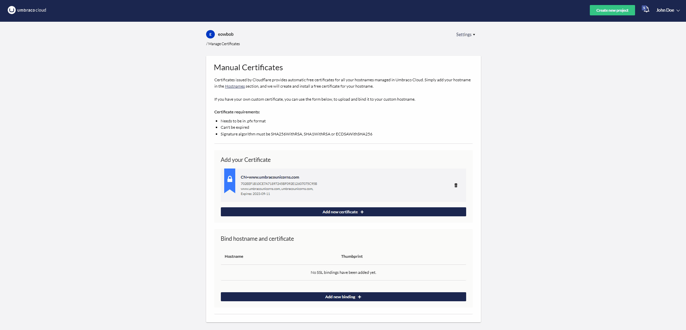

# June 2023

## Key Takeaways

* **Customize Environment Ordering** - You are now able to change the order of environments in the _Projects Dashboard_ according to your preference.
* **All Project Sub-Pages Upgraded** - With the migration of the _Certificates_ page to the new front-end tech stack, all project sub-pages have now been migrated. Next focus: a new navigation structure.
* **Umbraco 12 Support** - Umbraco Cloud always allows you to create new cloud projects with the latest versions. That now includes Umbraco 12 which was released on June 29th, 2023.

## Customize Environment Ordering

We've listened to your feedback and are delighted to provide more flexibility and control over how the environments on the Projects Dashboard are listed.

By default, the Live environment is positioned as the first environment, followed by Staging and Development environment. However, we understand that different users may have different workflows and preferences. Therefore, we have introduced the ability to customize the ordering to align with the “left-to-right” deployment model.

Whether you prefer the default order or wish to switch to the "left-to-right" model, the choice is now in your hands.

## All Project Sub-Pages Upgraded

Great news! With the recent migration of the Certificates page to our new front-end tech stack, all project sub-pages have now been successfully converted. This transition marks an important milestone in our ongoing efforts to improve the overall user experience in the Umbraco Cloud Portal.

With the completion of this migration, our team is now shifting its focus to further enhancing the user experience and navigation within Umbraco Cloud. We understand the importance of intuitive navigation and streamlined workflows in providing a seamless and enjoyable experience while working on your Umbraco Cloud projects.

Our goal is to create a better navigation experience that enables you to effortlessly find and access the features and functionalities you need. We are committed to refining the user interface, optimizing the menu structure, and implementing intuitive navigation controls to simplify your interactions with Umbraco Cloud.

Stay tuned for significant improvements to the navigation structure of Umbraco Cloud in Q3.

## Support of Umbraco 12

Umbraco Cloud offers the creation of cloud projects based on the latest and greatest Umbraco CMS versions. Starting from the release date on June 29, 2023, you can now select Umbraco 12 when creating a new cloud project.

Umbraco Cloud also offers you a hassle-free migration process for users who wish to upgrade their projects from Umbraco 11 to Umbraco 12. To assist you in this process, we highly recommend utilizing the Major Upgrade Guide available at [Umbraco Documentation](https://docs.umbraco.com/umbraco-cloud/product-upgrades/major-upgrades).

The Major Upgrade Guide outlines the necessary steps and best practices to successfully upgrade your projects from Umbraco 11 to Umbraco 12. The guide is designed to simplify the migration process, providing clear instructions and insights into any potential challenges you may encounter.

For more information about the new great version 12 of Umbraco CMS, read this great [blog post](https://umbraco.com/blog/umbraco-12-release/).

It highlights the latest and greatest new improvements in Umbraco CMS such as:

* Headless capabilities out-of-the-box
* Built-in support for Entity Framework Core,
* Updates of different dependencies and frameworks.

We look forward to seeing the incredible projects you will create with Umbraco 12.
