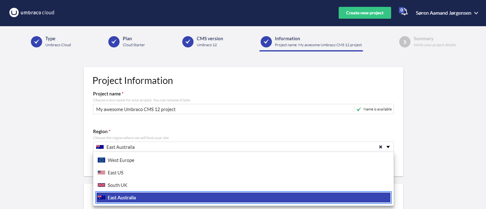
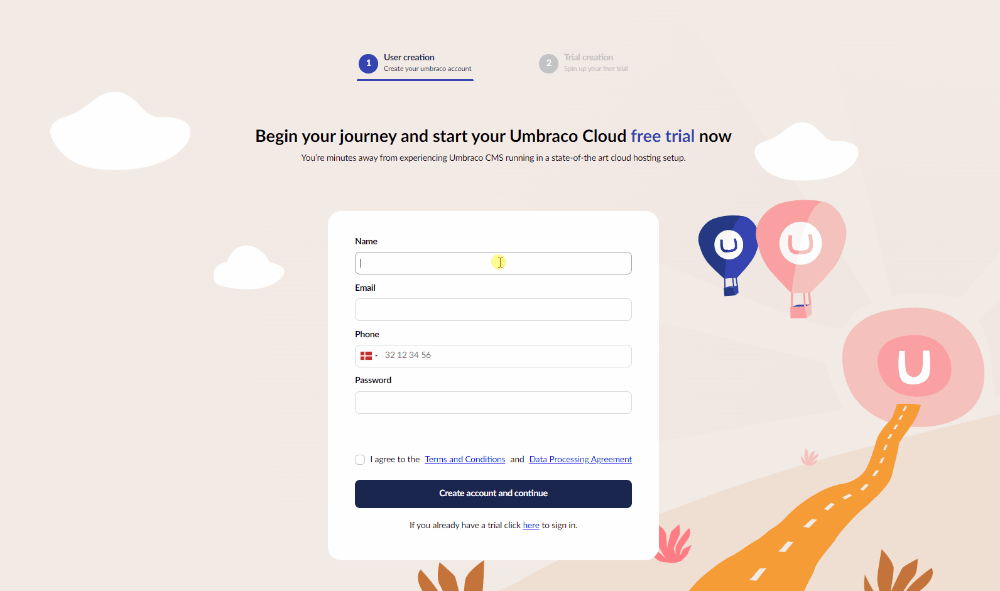

# August 2023

## Key Takeaways

* **Australia region hosting** - Umbraco Cloud expands its regional hosting offerings with the addition of _Australia East_, catering to a wider range of hosting preferences.
* **Visualization of Events on “Availability & Performance”** - Elevate project insights with Umbraco Cloud's Event Visualization. Track critical events and their impact on your project's journey.
* **Improved trial flow for Umbraco Cloud** - The trial flow has undergone a significant visual upgrade, now offering a more engaging and intuitive experience.

## Australia region hosting

There is an interest increase in expanding the regional hosting choices for Umbraco Cloud as the preferred development and hosting platform for Umbraco projects. This demand is particularly pronounced given factors like privacy regulations and data governance standards, as the physical location of data holds increasing significance.

The availability of _**regional hosting**_ options empowers you to pinpoint the exact location for hosting and storing your Umbraco Cloud project. It also encompasses all its environments and data with a significant improvement in performance for users close to the selected hosting center.

Another significant stride for Umbraco Cloud is the introduction of the East Australia regional hosting option, marking the fourth supported region. This addition is met with great enthusiasm by professionals within this region and those collaborating with clients here

Read the entire [blog post](https://umbraco.com/blog/umbraco-cloud-expands-with-regional-hosting-option-in-australia/) for more information.

## Visualization of Events on “Availability & Performance”

Umbraco Cloud introduces a pragmatic enhancement – Event Visualization on the "Availability & Performance" dashboard. This feature seamlessly incorporates event monitoring into the Scalable Vector Graphics (SVG) visualization for each metrics panel.

Gain insight into critical project events, such as restarts, automatic and manual upgrades, updates involving environment deployments, and changes in plans. This concise display allows for a comprehensive understanding of the events affecting your project.

Stay informed about pivotal alterations, ranging from routine restarts to intricate deployments and upgrades. Whether it's a system restart, an environment deployment, or an upgrade, you'll have gained more of the information you need. This information will assist you in potential troubleshooting, make informed decisions, and ensure smooth project management.

Next, we will be improving the deployment events to be aligned in a time range instead of two individual events. And to offer support for other environments than the live environment on the “Availability & Performance” page.

## Improved Trial Flow for Umbraco Cloud

We're pleased to introduce that the trial flow has undergone a significant visual upgrade, now offering a more engaging and intuitive experience. We've enhanced it by incorporating key links and resources that provide new users with the most valuable starting points for effectively working with Umbraco

New users to Umbraco get the option to explore the new trial flow for Umbraco Cloud and Heartcore projects to better understand their capabilities.

And maybe it is also something for you! Whether you're an experienced developer or new to web development, this enhanced trial flow caters to your needs. Embrace Umbraco Cloud or Umbraco Heartcore with confidence, benefitting from a robust and user-friendly environment.

Try out the enhanced trial experience today for [Umbraco Cloud Projects](https://try.umbraco.com/) and [Umbraco Heartcore](https://try.umbraco.com/heartcore) projects.
