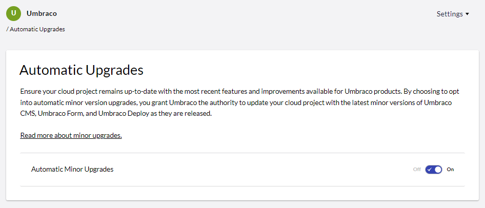

# October 2023

## Key Takeaways

* **Umbraco CI/CD Flow** - Elevate your deployment process with seamless integration between your existing CI/CD pipeline and Umbraco Cloud. Experience automated, efficient, and error-free deployments like never before.
* **Automatic Upgrades for Minor Versions** - Experience enhanced efficiency with our expanded Automatic Minor Upgrades for Umbraco CMS, Umbraco Forms, and Umbraco Deploy.

## Umbraco CI/CD Flow: Bridging Your CI/CD Pipeline with the Cloud

Umbraco CI/CD Flow represents a significant enhancement in how developers can integrate, test, and deploy their projects on Umbraco Cloud. The feature is engineered to function as an extension to your existing CI/CD pipeline, allowing automated deployments directly to Umbraco Cloud. This creates a synergy between your existing robust CI/CD setup and Umbraco Cloud's specialized hosting capabilities that are optimized for Umbraco CMS.

If you already have a CI/CD pipeline, you're halfway there. Umbraco CI/CD Flow brings an added layer of sophistication by allowing seamless integration with Umbraco Cloud through the "Umbraco Public API."

The basic flow is depicted in the sequence diagram below.

Whether you're a CI/CD novice or a seasoned developer, we offer tailored guidance for a frictionless deployment experience. If you're starting from scratch, our thorough documentation outlines how to establish a CI/CD pipeline with popular platforms like Azure DevOps or GitHub Actions. For those with an existing setup, integrate effortlessly with Umbraco Cloud's specialized hosting features.

Our [documentation](https://docs.umbraco.com/umbraco-cloud/set-up/project-settings/umbraco-cicd) serves as a roadmap, detailing various routes tailored to your needs. Learn how to invoke the Umbraco Cloud API from within your CI/CD pipeline, explore the specific endpoint details, or discover how to call this endpoint from an already established pipeline. Each path culminates in a seamless, automated deployment experience, empowering you to deploy with confidence.

## Automatic Upgrades for Minor Versions

We are pleased to announce an extension to our Automatic Upgrade feature. Previously limited to Patch versions, Automatic Upgrades for Umbraco CMS, Umbraco Forms, and Umbraco Deploy now include Minor versions. This update aims to further simplify your project management by automating more comprehensive updates.

For those running existing Cloud projects, you can opt-in to enable Automatic Minor Upgrades directly from Umbraco Cloud on the new Automatic upgrade page.

If you're starting a new Cloud project, the feature will be enabled by default, ensuring you're always running on the latest and most secure version across Umbraco CMS, Umbraco Forms, and Umbraco Deploy.

With Automatic Minor Upgrades, you can enjoy several benefits. First, you'll save a significant amount of time, allowing you to focus on more important aspects of your project. Second, you'll have access to the latest features and enhancements across all key components. Lastly, the most recent security patches are applied automatically, giving you peace of mind.

For further details, please consult our Upgrading Documentation where you'll find details regarding the upgrade process. Our support team is also on standby to assist with any queries you may have.
