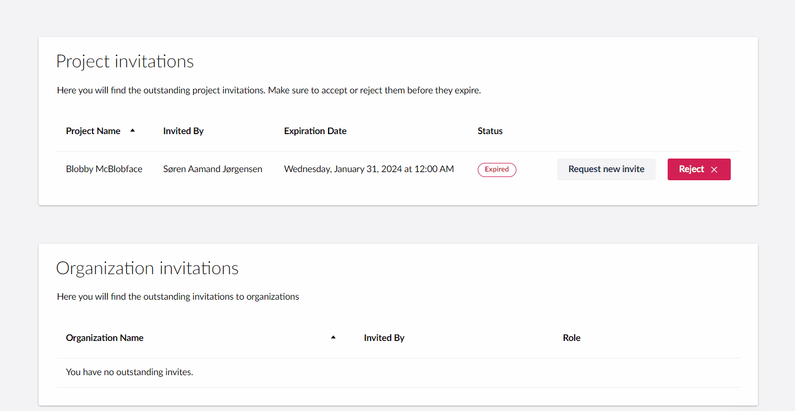

# January 2024

## Key Takeaways

* **Self-Service Cipher Suite Management** - Effortlessly manage and disable cipher suites on the Security page for tailored efficient control.
* **Project Invitation Renewal Request** - Easily request a resend of expired Umbraco Cloud project invitations with this new 'Request New Invitation' feature.

## [Self-Service Cipher Suite Management](../../../manage-security.md#cipher-suite-management)

In our ongoing effort to enhance your experience with Umbraco Cloud, we've introduced a new feature that puts the power of cipher suite management at your fingertips. Now available as a self-service option in the Cloud Portal's “Security Page”, this update lets you enable or disable cipher suites directly through a user-friendly "Ciphers" dropdown menu.

We understand that managing security settings is a critical aspect of any cloud project, and our goal is to make this process as seamless as possible. With this latest update, you have the flexibility to tailor security settings to your specific needs, whether it's for an individual project or across multiple hostnames. By default, we've kept all cipher suites enabled, ensuring that you start with robust security measures in place

The interface for this feature has been designed with simplicity in mind. You can now adjust your security settings with just a few clicks, saving you time and effort and allowing you to focus on the more critical aspects of your work. We believe this streamlined approach will significantly enhance your overall efficiency and ease of use.

## Project Invitation Renewal Request

We are pleased to introduce an update to Umbraco Cloud, focusing on the efficient management of project invitations. This new feature allows users to request a resend of expired project invitations directly within the platform.

When an invitation expires, you'll on the “Pending Invites” page under your profile, see a "Request New Invitation" button. Clicking this button triggers an email to the original inviter, prompting them to take action. The email contains a link that redirects the inviter to the "Edit Team" page of the project, where they can issue a new invitation to replace the expired one.

This new feature aims to significantly reduce any friction caused by expired project invites, ensuring seamless and uninterrupted collaboration across teams and organizations in Umbraco Cloud.

This feature is just a glimpse of what's to come. Stay tuned for more updates aimed at enhancing your Umbraco Cloud experience!
