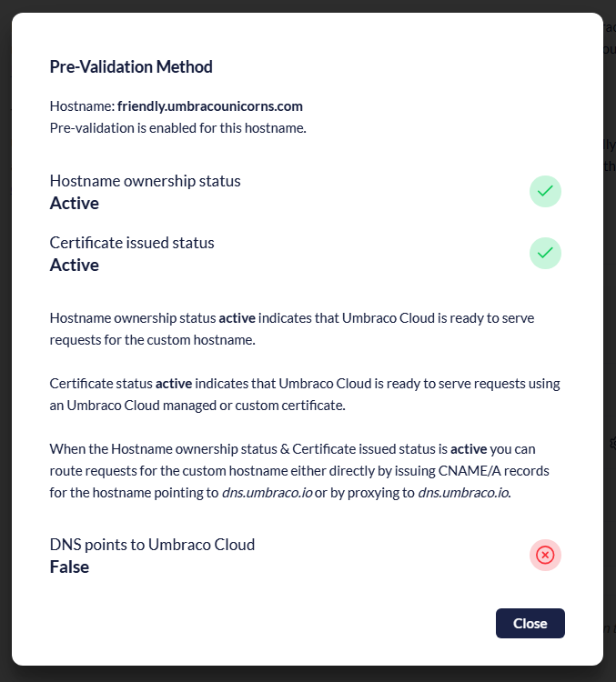
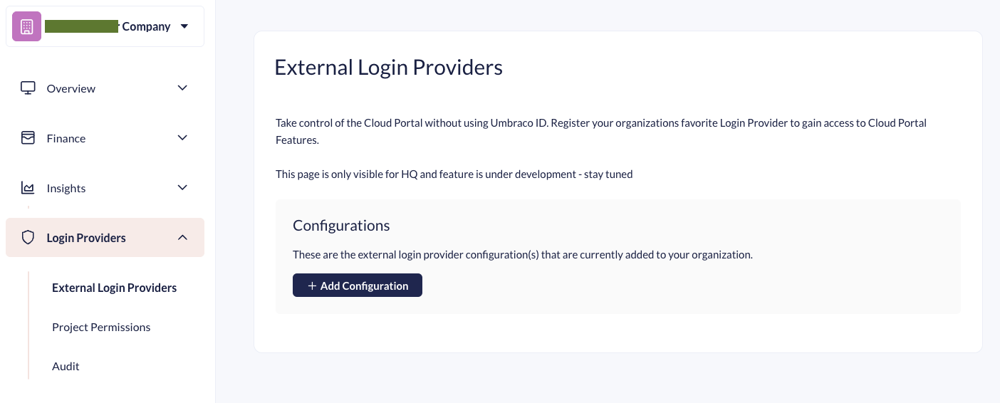

# September 3, 2025

## Key Takeaways

* **Hostname Pre-Validation** – Add and validate hostnames before switching DNS, enabling zero-downtime migrations and support for on-premise proxies.
* **Managed Challenges** – Protect projects from malicious traffic surges with automated verification based on request geography or attack likelihood.
* **Custom Identity Provider (Public Beta)** – Use your existing identity provider for Cloud Portal access, permissions, and user management.

## Hostname Pre-Validation

### “Move your site to Umbraco Cloud with zero downtime. Hostname Pre-Validation makes hostname migrations smooth and risk-free.”

Pre-validating hostnames allows you to prepare domains before pointing DNS to Umbraco Cloud. This ensures TLS certificates are issued and routing is active ahead of time, so projects can go live instantly once DNS is updated.

<figure></figure>

* **Zero-downtime hostname migration** – Move production domains to Umbraco Cloud without service interruptions.
* **On-premise proxy support** – Keep using your existing proxy or WAF setup while preparing hostnames in Umbraco Cloud.

This means safer go-lives and improved domain management. Read the 

## Managed Challenges

### “Managed Challenges keep bots out and let your real users in.”

When websites face unusual load, whether from bots, scraping, or coordinated attacks, Managed Challenges step in. Requests that do not meet the threshold are automatically served a lightweight CAPTCHA that helps filter out bad traffic.

* Can be applied globally, per hostname, or even per continent.
* Works seamlessly alongside the built-in Web Application Firewall.

Web Application Firewall sensitivity and Manage Challenge features can be applied in Security Settings:
<figure></figure>

You get added resilience without manual intervention and tools to ensure resources are spent serving customers, not malicious requests. Read more about the new features in the updated [Managing Transport Security documentation](https://docs.umbraco.com/umbraco-cloud/build-and-customize-your-solution/set-up-your-project/security/managing-transport-security)

## Custom Identity Provider (Public Beta)

### “Use your own identity provider to manage Cloud Portal access.”

You can now connect identity providers, like Microsoft Entra ID, Octa, or Google, directly to your Umbraco Cloud organization. This lets team members sign in with familiar credentials and manage project permissions through their existing setup.

* Centralized authentication with OpenID Connect.
* Map roles and project access directly from your provider.
* Keep audit logs of external login usage.

<figure><figcaption></figcaption></figure>

Enterprises and organization can rely on centralized account management with industry standard security. The means less time spent managing accounts and permissions, whether you're onboarding or offboarding. 

Custom Identity Providers for Cloud organizations is currently in Public Beta, and we aim for full release early October. If you have any feedback or encounter issues with the feature please raise an issue on the Umbraco Cloud tracker on Github. For a full overview of the features and how to use it, see the [Organization Login Providers documentation](../../begin-your-cloud-journey/the-cloud-portal/organizations/organization-login-providers.md). 