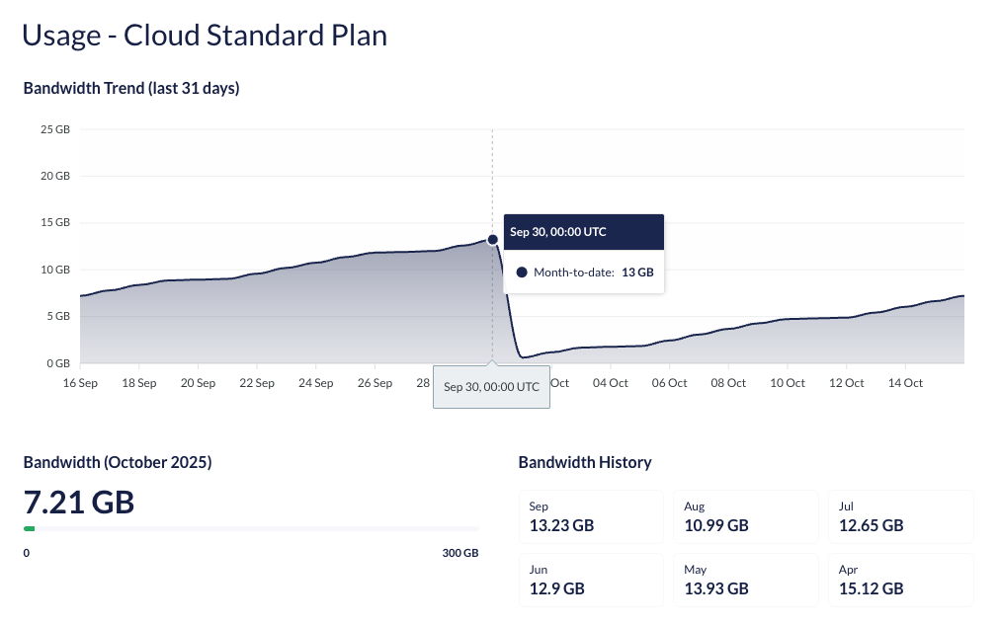

# October 2025

## Key Takeaways

* **Daily Usage** - Gain daily insights into your project’s bandwidth trends over the last 31 days for a faster feedback loop and optimization.
* **CI/CD Improvements** - Deployments now complete faster when no changes are detected and include a verification step to ensure successful deployments.

## Daily Bandwidth Usage

A new **Daily Usage** graph is now available in the **Usage** section of Umbraco Cloud. It provides a rolling 31-day view of bandwidth usage, giving you faster feedback on the effects of site optimizations and improved predictability.
    

For instance, you can now see the impact of reducing image sizes, disabling autoplay videos, or improving caching strategies. This makes it easier to understand how adjustments influence bandwidth consumption day by day.

## CI/CD Improvements

Made updates to the CI/CD flow to improve speed, reliability, and transparency during deployments.

**Faster completion for unchanged deployments**

If your uploaded package has no new changes affecting the Cloud Environment, the CI/CD job skips unnecessary steps. This makes deployments complete faster.

**New verification step for deployment completion**

A new verification step ensures that changes pushed to the App Service have been successfully deployed through Kudu.  

These improvements make the deployment flow faster, more predictable, and easier to troubleshoot. See the documentation for more details:
   
   - [Deployment reports: No changes detected - cleaning up](../../build-and-customize-your-solution/handle-deployments-and-environments/umbraco-cicd/troubleshooting.md#deployment-reports-no-changes-detected---cleaning-up)
   - [Unable to verify Deployment has finished](../../build-and-customize-your-solution/handle-deployments-and-environments/umbraco-cicd/troubleshooting.md#unable-to-verify-deployment-has-finished)
