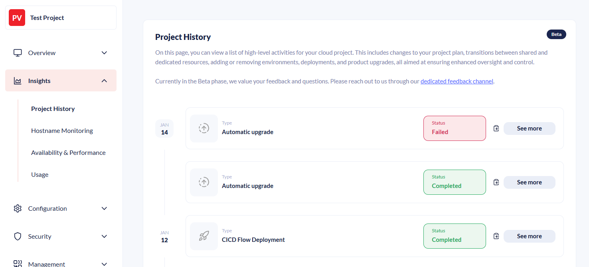

# January 2026

## Key Takeaways

* **CI/CD Flow page** - CI/CD Flow has been moved from the `Configuration -> Advanced` page to a standalone page `Configuration -> CI/CD Flow`
* **Enhanced debug information for CI/CD deployments** - Added a new "See More" link on the `Insights -> Project History` page for CI/CD Flow deployment events. That leads to a new page with logs, artifact info, etc. about the deployment.
* **List of deployment artifacts** - Added a list of deployment artifacts on the `Configuration -> CI/CD Flow` page with a download link to help with debugging

## CI/CD Flow page

The CI/CD flow on the `Configuration -> Advanced` page has been moved to `Configuration -> CI/CD Flow`. TThis has been done in preparation for comming enhancements to the CI/CD Flow that will include more configuration and more feedback on the deployments being sent back to the users.

## Enhanced debug information for CI/CD deployments

On the `Insights -> Project History` page you will now see CI/CD Flow deployments, as well as a "See More" button that leads to a page that has much more useful information.

This detail page for the event contains:

- Metadata for the deployment
- Metadata about the deployment artifact, including a download link
- The configured deployment options
- The process log
- The Kudu log

This makes debugging deployments that went wrong much easier.

## List of deployment artifacts

Added a list of deployment artifacts on the `Configuration -> CI/CD Flow` page with a download link to help with debugging:

