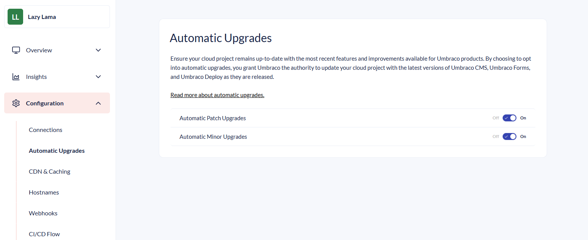

# February 2026

## Key Takeaways

* **Release Umbraco.Cloud.Cms 13.0.1, 16.0.2 & 17.0.2** - Adds middleware that ensures the internal Azure URL remains hidden on initial requests.
* **Configure automatic patch upgrades** - Allows project admins to enable or disable automatic patch upgrades so you can now fully control when your project upgrades.
* **Disable parallel builds** - Disable parallel builds for Umbraco 9+ sites to prevent resource contention.

## Release Umbraco.Cloud.Cms 13.0.1, 16.0.2 & 17.0.2

This release resolved an issue where Cloud sites end up using `localhost` or `*.azurewebsites.net` as their root domain. The issue was caused by early Azure platform requests during site startup being persisted as the site's base URL.

We fixed this by using early middleware and forwarded headers to ensure the [`umbracoApplicationUrl`](../../../17/umbraco-cms/reference/configuration/webroutingsettings.md) overrides Azure hostnames before they are persisted.

## Configure automatic patch upgrades

It is now possible to [disable automatic patch upgrades](../../build-and-customize-your-solution/set-up-your-project/project-settings/README.md#automatic-upgrades) from the Project Settings page. New projects default to having automatic upgrades enabled. 

 
If you have previously disabled automatic upgrades through Umbraco Support this will still be in effect. You can enable upgrades again using the toggles.


For more on configuring automatic upgrades refer to the [Projects Settings documentation](../../build-and-customize-your-solution/set-up-your-project/project-settings/README.md#automatic-upgrades).

## Disable parallel builds

 
The following applies to sites using Umbraco 9 and newer.


When deploying to Umbraco Cloud, the build step of a deployment could previously utilize all available resources on the underlying infrastructure. This had the side effect that the deployments could end up experiencing resource contention, causing it to complete slowly or fail entirely.

We have now disabled parallel builds, ensuring that a single deployment can no longer consume all available resources. This reduces issues caused by the "noisy neighbor" effect and improves overall deployment reliability.