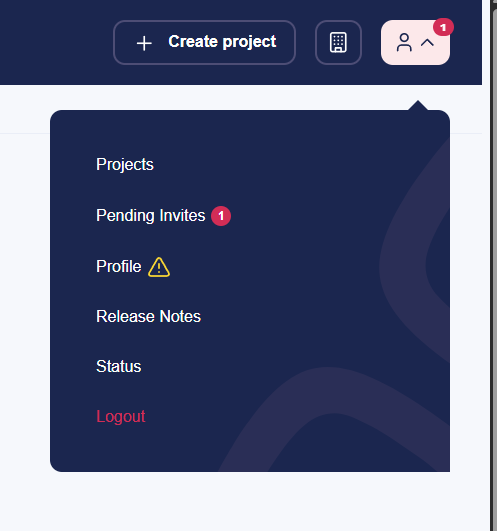

# February 2026

## Key Takeaways

* **Release Umbraco.Cloud.Cms 13.0.1, 16.0.2 & 17.0.2** - Adds middleware that ensures the internal Azure URL remains hidden on initial requests.
* **Project invite notifications** - Adds UI notifications when receiving project invitations, improving visibility and making it easier to respond directly from the Portal.

## Release Umbraco.Cloud.Cms 13.0.1, 16.0.2 & 17.0.2

This release resolved an issue where Cloud sites end up using `localhost` or `*.azurewebsites.net` as their root domain. The issue was caused by early Azure platform requests during site startup being persisted as the site's base URL.

We fixed this by using early middleware and forwarded headers to ensure the [`umbracoApplicationUrl`](../../../17/umbraco-cms/reference/configuration/webroutingsettings.md) overrides Azure hostnames before they are persisted.

## Project invite notifications

This update introduces in-app notifications in the Cloud Portal when you receive a project invitation.

A notification badge is now displayed in the UI, incrementing based on the number of pending invitations. For example, if you have five outstanding invites, the notification indicator will display 5, giving you a clear and immediate overview of outstanding actions.

This makes project onboarding more visible and ensures that invitations are not missed, especially for users who are invited to multiple projects.

<figure><figcaption>
Pending Invite Notification
</figcaption></figure>