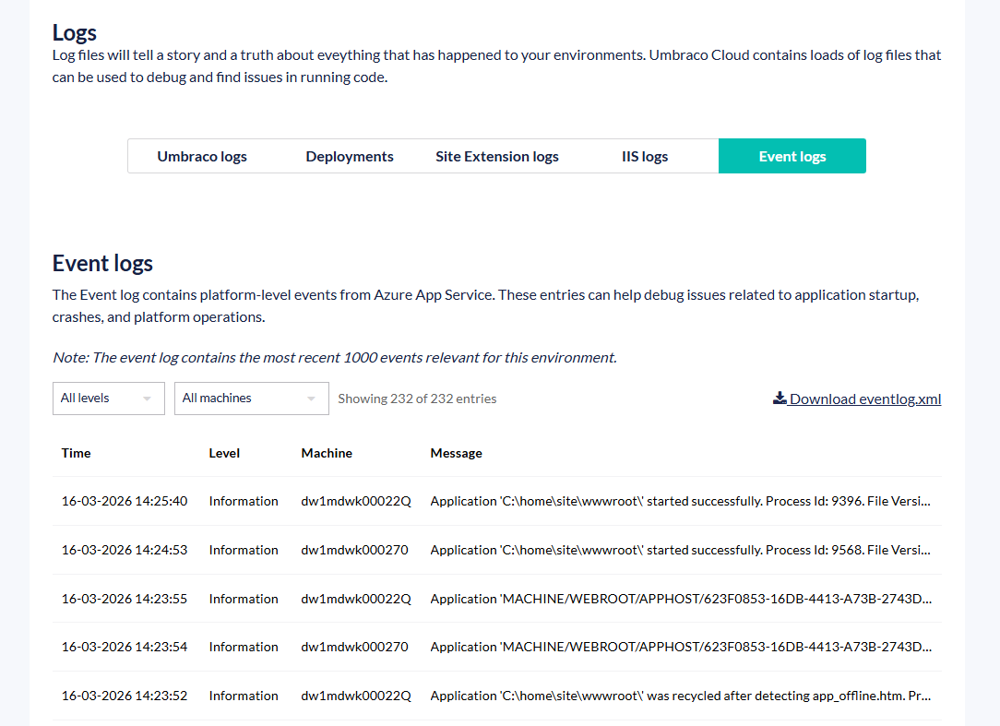
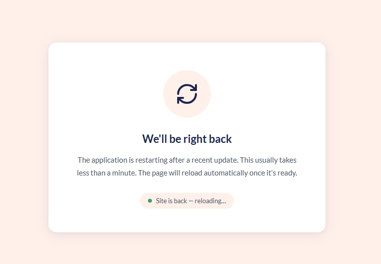
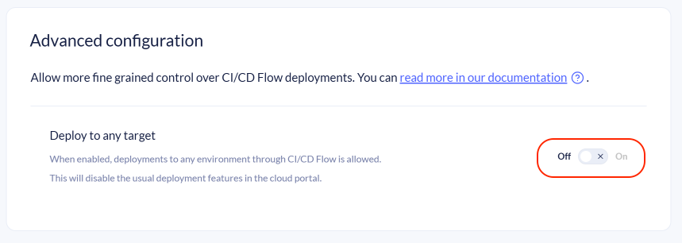
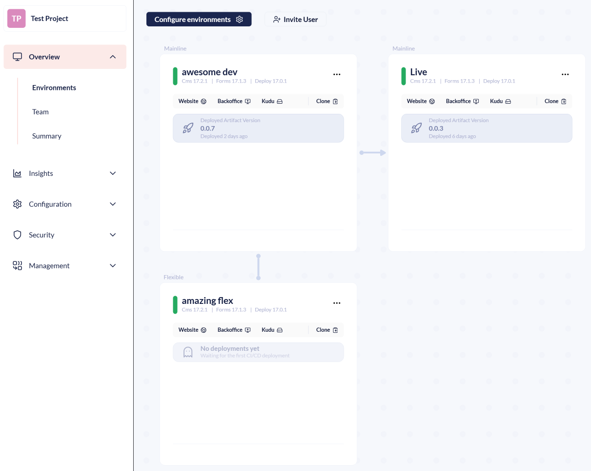
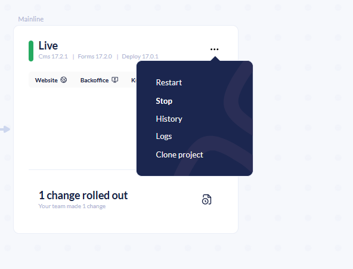

# March 2026

## Key Takeaways

* **Show Windows event logs on the log page** - On the environments log page we already showed the Umbraco logs, Deployment logs, Site extension logs and IIS logs. Now this page has been expanded with a new log type - Event logs.
* **Umbraco Cloud branded error pages for platform errors** - After deploying or restarting environments, the default IIS 503 message is no longer served. Instead, you'll see an error page that automatically refreshes once the site is back up.
* **CI/CD Deploy to any target** - Enables CI/CD Flow deployments to all environments in your project, giving you full control over which environment receives each deployment.
* **Release Umbraco.Cloud.Identity.Cms 13.2.6, Umbraco.Cloud.Cms 16.0.3 & 17.0.3** - Retains current user group if user already exists, and allows for mapping a single role to multiple Umbraco user groups.
* **Start and stop environments** - You can now start and stop your Cloud environments directly from the project overview, giving you more control over your hosting resources.
* **Release Umbraco.Cloud.Cms 17.1.0** - Preparation for the upcoming Load Balancing feature.
* **Proactive Auto-Heal toggle for Dedicated plans** - Projects on a Dedicated plan can now disable Proactive Auto-Heal. This prevents automatic restarts during high-resource workloads such as content imports, index rebuilds, and schema migrations.

## Show Windows event logs on the log page

The Windows Event logs have previously been findable through Kudu, where it is presented in its base XML format that can be hard to read. Event log messages are now visible on the environment log page and can be downloaded without going through Kudu. Learn more about the improvement from reading the [related discussion](https://github.com/umbraco/Umbraco.Cloud.Issues/discussions/833).

It also allows you to filter on the log level, and the machine name.

The logs page now persists the selected tab in the URL, preserving it across refreshes and shared links. Learn more about this decision by reading the [related discussion](https://github.com/umbraco/Umbraco.Cloud.Issues/discussions/909).

## Umbraco Cloud branded error pages for platform errors

When doing a deployment or a restart of an environment on Umbraco Cloud, it often results in the website being restarted. This causes the platform (Azure) to serve a default `503 - Service Unavailable` error page, indicating that something is wrong. We have replaced this page with a notice that the site is undergoing maintenance and will be back shortly. The page will automatically refresh once the environment is fully back online.

<figure><figcaption>
Custom error page for 503 errors
</figcaption></figure>

## CI/CD Deploy to any target

By default, CI/CD Flow only allows deployments to the left-most or the flexible environment. The new **"Deploy to any target"** toggle is available in the `Configuration -> CI/CD Flow` advanced configuration section. When enabled, CI/CD Flow deployments can target all environments in your project.

<figure><figcaption>
CI/CD Flow - Advanced configuration section showing the "Deploy to any target" toggle.
</figcaption></figure>

When enabled, deploying between environments through the Cloud Portal is disabled. All deployments must be handled through CI/CD Flow. As a result, the environments overview will no longer show:

* **Pending changes indicator** — the Portal will not track how far ahead environments are relative to each other.
* **Deploy button** — you can no longer push changes forward using the Cloud Portal UI.

<figure><figcaption>
Example of the updated environment overview when "Deploy to any target" is enabled.
</figcaption></figure>

Instead, each environment card shows which artifact is currently deployed.


Enabling "Deploy to any target" means each CI/CD deployment creates a unique commit per environment. The more you use the feature, the more environments will diverge. Disabling the feature later requires realigning all environments, which is a time-consuming process.


For more information on setting up pipelines that deploy to multiple environments, see [Advanced Setup: Deploy to multiple targets](../../build-and-customize-your-solution/handle-deployments-and-environments/umbraco-cicd/samplecicdpipeline/advanced-multiple-targets.md).

## Release Umbraco.Cloud.Identity.Cms 13.2.6, Umbraco.Cloud.Cms 16.0.3 & 17.0.3

If a user’s email matches an existing account during external login, their user groups are now preserved instead of being overwritten. Learn more about this decision by reading the [related issue](https://github.com/umbraco/Umbraco.Cloud.Issues/issues/993).

Added functionality that allows you to map a single role in your External Login Provider to multiple Umbraco user groups. Learn more about this decision by reading the [related issue](https://github.com/umbraco/Umbraco.Cloud.Issues/issues/990).

## Start and stop environments

You can now start and stop your Cloud environments directly from the project overview. The **Stop** option is available in the environment context menu alongside the existing **Restart** option. This lets you shut down environments not actively in use and start them when needed. The feature was requested in the [related discussion](https://github.com/umbraco/Umbraco.Cloud.Issues/discussions/1002).

<figure><figcaption>
The environment context menu now includes options to stop and restart environments.
</figcaption></figure>

## Release Umbraco.Cloud.Cms 17.1.0

A release of Umbraco.Cloud.Cms has been created. This version does not contain any user-facing changes. It contains code preparing for the upcoming Load Balancing feature.

This version will not be auto-upgraded as it contains no relevant changes.

## Proactive Auto-Heal toggle for Dedicated plans

Projects on a Dedicated plan can now disable Proactive Auto-Heal from the **Configuration** > **Advanced** section in the Umbraco Cloud Portal. Proactive Auto-Heal is an Azure App Service feature that automatically restarts your environment when it detects unhealthy resource usage. While this is beneficial for most projects, it can cause unnecessary restarts during legitimate high-resource operations. Some of these operations can be large content imports, Examine index rebuilds, or schema migrations. Learn more about this feature by reading the [related discussion](https://github.com/umbraco/Umbraco.Cloud.Issues/discussions/1007).

With this release, Dedicated plan customers have full control over whether Proactive Auto-Heal is active on their project. If the project is downgraded from a Dedicated plan to a Shared plan, Proactive Auto-Heal is automatically re-enabled.

For more details, see the [Proactive Auto-Heal](../../build-and-customize-your-solution/set-up-your-project/project-settings/proactive-auto-heal.md) documentation.