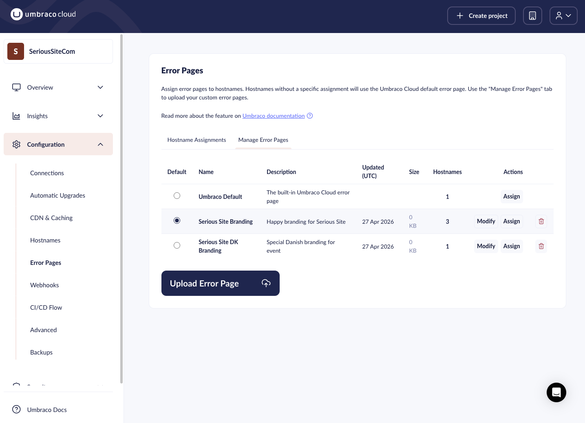

# May 2026

## Key Takeaways

* **Error pages** - Upload your own HTML error pages and assign them per hostname. Visitors see your page instead of the default Umbraco Cloud error page when your site is temporarily unavailable.
* **Baseline enhancements** - An activity starts when the baseline pushes updates to child projects.
* **Basic Authentication for all plans** - Basic Authentication is now available on all Umbraco Cloud plans.

## Error pages

You can now upload custom HTML error pages directly from the Umbraco Cloud Portal and assign them to any hostname across your environments. When an environment restarts, like during a deployment, visitors see your page instead of the default Umbraco Cloud error page.

<figure><figcaption>
The Manage Error Pages tab lists all uploaded pages and their hostname assignments.
</figcaption></figure>

The feature is available under **Settings** > **Error Pages** and has two tabs:

* **Managing Error Pages**: Upload, preview, edit, replace, and delete custom HTML pages (max 20 KB per file). Mark one as the default fallback for all new hostnames.
* **Hostname Assignments**: See every hostname across all environments and which error page it uses. Assign pages individually or in bulk, and filter by environment, domain, or Top Level Domain.

Because error pages are served by Cloudflare directly from blob storage, they must be fully self-contained. All CSS, JavaScript, and fonts need to be inline; external resources will not load. A reload mechanism is recommended, automatically sending visitors back to your site once it recovers.

For authoring guidelines and a ready-to-use HTML template, see the [Error Pages](../../build-and-customize-your-solution/handle-deployments-and-environments/error-pages.md) documentation.

## Baseline enhancements

Pushing a baseline update to child projects will trigger an activity on the baseline project. The activity is non-blocking, but will run until all children are updated.

## Basic Authentication for all plans

Basic Authentication is now available on all Umbraco Cloud plans. You can enable it from **Settings** > **Public Access** to restrict access to your project environments to project members and allowed IPs.

For setup steps and configuration details, see the [Public Access](../../build-and-customize-your-solution/set-up-your-project/project-settings/public-access.md) documentation.
