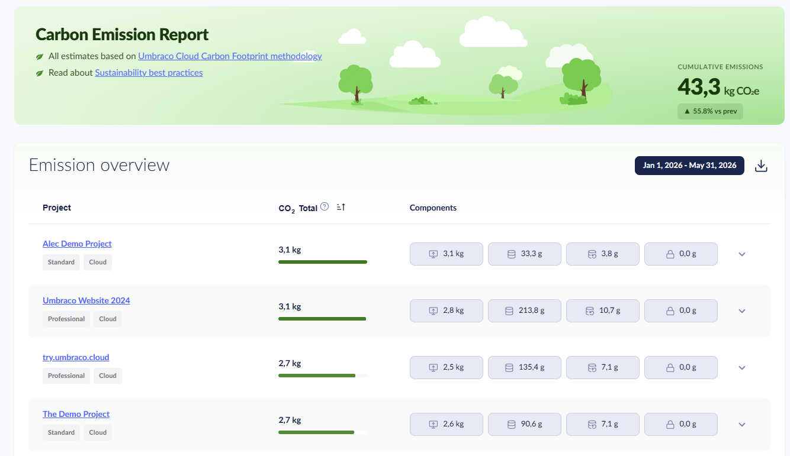

# June 2026

## Key Takeaways

* **Baseline enhancements** - The **Manage child projects** page loads faster. More data is shown on each child project, and the list has more filtering options.
* **Sustainability Dashboard improvements** - The dashboard now reports CO2 emissions using Microsoft's Azure Carbon Optimization data and covers more Azure resources. New date range selection, per-component breakdown, and CSV export.
* **Release Umbraco.Cloud.Cms v17.2.0** - Enhancements to make cloud ready for Load Balancing. Adds Danish localization for the Umbraco ID backoffice UI. Fix for a timing issue related to Umbraco ID sign-in screen.

## Baseline enhancements

The **Manage child projects** page now loads faster after an overhaul of the underlying API call flow.

<figure><figcaption>
The Manage child projects page lists child projects connected to the baseline.
</figcaption></figure>

Filtering options now allow you to sort by `Project name` or `Last update (UTC)`.

If you have a long list of baseline children, the action bar and headers are now sticky. They stay visible when you scroll.

The action bar has a button to select all children where component versions are behind the baseline.

The **Manage child projects** page has also been enhanced with more data:

**Last update (UTC)** has been added for each child. If a child has not been updated within the last 5 baseline updates, it shows a generic message. [Related GitHub issue](https://github.com/umbraco/Umbraco.Cloud.Issues/issues/148)

<figure><figcaption>
A child project that has not been updated within the last 5 baseline updates shows a generic message.
</figcaption></figure>

A child project can have an indicator to show that it contains any components that are behind the baseline. Tracked components are: Umbraco CMS, Deploy, Forms, Umbraco ID, `Umbraco.Cloud.Cms` and more.

<figure><figcaption>
Show components on child project which are behind the baseline.
</figcaption></figure>

## Sustainability Dashboard improvements

The Sustainability Dashboard now reports CO2 emissions based on Microsoft's Azure Carbon Optimization data. The emissions are reported as carbon dioxide equivalent (CO2e) and cover Scope 1, Scope 2, and Scope 3. Coverage now extends beyond App Service to SQL Database, SQL Elastic Pool, Storage Account, and Key Vault. Emissions are reported per month, and a month's data becomes available a few weeks after the month ends.

The dashboard also has a refreshed view. You can select a date range to report on, with the current year to date as the default. You can sort projects by emissions to find your highest-impact projects. You can also expand a project to see its per-component breakdown and download the report as a CSV file.

<figure><figcaption>
The Sustainability Dashboard with the date range, per-component breakdown, and CSV export.
</figcaption></figure>

For details, see the [Sustainability Dashboard](../../optimize-and-maintain-your-site/monitor-and-troubleshoot/sustainability-dashboard.md) documentation.

## Release Umbraco.Cloud.Cms v17.2.0

Enhancements in `Umbraco.Cloud.Cms` to ensure a seamless setup for Load Balancing in Umbraco Cloud.

The backoffice UI shipped with the `Umbraco.Cloud.Cms` package is now translated into Danish, alongside the existing English translations. The translations cover the Umbraco ID sign-in experience, session timeout messages, and profile management links in the backoffice.

You can also add support for other languages or customize specific strings in your own Cloud project. See [Customizing Translations](../../expand-your-projects-capabilities/cloud-extensions/customizing-translations.md) for details.

A change in Umbraco CMS 17.4 affected the timing of manifest registrations. The timing change could cause the Umbraco ID auth provider not to be ready when visiting `https://{cloudsite}.{region}.umbraco.io/umbraco`.
The backoffice showed the native Umbraco Login instead of redirecting to the Umbraco ID login page.

* Umbraco CMS 17.5 contains a fix (target release June 25th 2026). [Umbraco-CMS PR](https://github.com/umbraco/Umbraco-CMS/pull/23167)
* The `Umbraco.Cloud.Cms` package has also changed how manifests are loaded to ensure the Umbraco ID auth provider is loaded as early as possible. [Umbraco.Cloud.Issues #1053](https://github.com/umbraco/Umbraco.Cloud.Issues/issues/1053)
