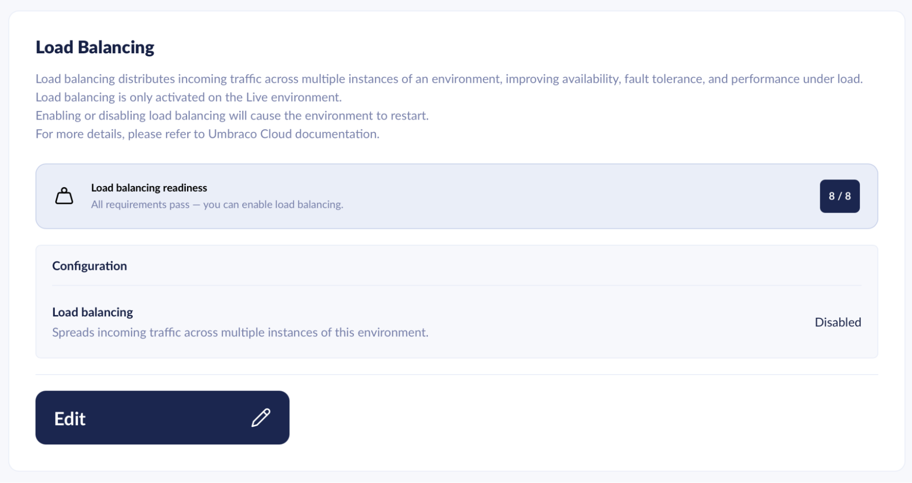
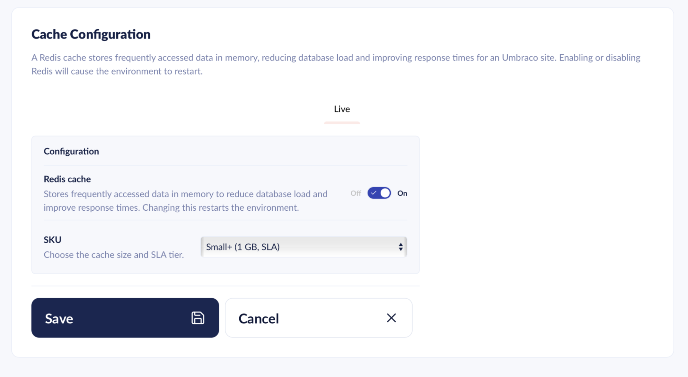

# July 2026

## Key Takeaways

* **Readiness gating** - During restarts, outages, and upgrades, Umbraco Cloud now keeps showing the error page until your site reports that it is ready. This prevents queued traffic from overwhelming a site that is still warming up.
* **Release Umbraco.Cloud.Cms 13.1.0, 17.2.1, & 18.0.1** - Fixes cases where the internal `azurewebsites.net` URL could get through the Umbraco Cloud proxy. The 13.1.0 release also backports the .NET health checks from Umbraco 17.3, used by the readiness gating feature.
* **Load Balancing** - Distribute incoming traffic across multiple dedicated instances to handle higher load and keep your site running smoothly under pressure.
* **Dedicated Redis** - A dedicated Redis cache that stores hot data for the CMS. Required for Load Balancing as session storage, and available on its own as a second-level cache.
* **New Dedicated Resource tiers** - Updated Dedicated Resource tiers as a first step toward better options and more flexibility. Available sizes: Extra Small, Small, Medium, and Large.
* **Sustainability Dashboard - Bandwidth emissions** - The dashboard now includes the CO2 from network egress as a new Bandwidth component, estimated from your sites' actual data transfer. Network emissions were previously not counted.

## Load Balancing

Load Balancing distributes incoming traffic to your website across multiple dedicated servers. This lets you handle more incoming traffic and ensures your website keeps running smoothly under increased load.

When you enable Load Balancing, Cloud automatically provisions and configures an additional Redis cache resource. This is used to store and share hot data across the dedicated instances, keeping them in sync.

<figure><figcaption>
Enable Load Balancing on the Live environment once all readiness requirements pass.
</figcaption></figure>

For more information, see the [Load Balancing documentation](https://docs.umbraco.com/umbraco-cloud/optimize-and-maintain-your-site/optimize-performance/load-balancing) and the [Cache Configuration documentation](https://docs.umbraco.com/umbraco-cloud/optimize-and-maintain-your-site/optimize-performance/cache-configuration).

## Dedicated Redis

Dedicated Redis can improve website performance significantly by storing vital hot data. This offloads the cache burden from the CMS instance itself.

Dedicated Redis is required for Load Balancing, where it handles session storage across your instances. It is also available on its own, making it a perfect second-level cache for the CMS even when you are not load balancing.

Depending on your project's needs, you can now choose from the following Redis plans:

| Name | Size | High Availability | Service Level Agreement (SLA) |
| :-- | :-- | :-- | :-- |
| Extra Small | 0.5 GB | No | No |
| Extra Small + | 0.5 GB | Yes | Yes |
| Small + | 1 GB | Yes | Yes |
| Medium + | 3 GB | Yes | Yes |
| Large + | 6 GB | Yes | Yes |
| Extra Large + | 12 GB | Yes | Yes |

<figure><figcaption>
Enable Dedicated Redis and choose a plan from the Cache Configuration page.
</figcaption></figure>

For more information, see the [Cache Configuration documentation](https://docs.umbraco.com/umbraco-cloud/optimize-and-maintain-your-site/optimize-performance/cache-configuration). If you need additional performance, take a look at Load Balancing.

## Dedicated Resources

We have updated our Dedicated Resource tiers. This is the first step toward providing better options and more flexibility. The available sizes are Extra Small, Small, Medium, and Large.

| Size | Available on | CPU | RAM |
| :-- | :-- | :-- | :-- |
| Extra Small | Starter, Standard | 1 | 4 GB |
| Small | Standard, Professional | 2 | 8 GB |
| Medium | Professional | 4 | 16 GB |
| Large | Professional | 8 | 32 GB |

Size and pricing are now consistent across plans. Where two plans offer the same size, they use exactly the same resource. There is no longer a difference between plans for an identical dedicated resource.

For more information, see the [Dedicated Resources product page](https://umbraco.com/products/umbraco-cloud/dedicated-resources/).

## Sustainability Dashboard: Bandwidth emissions

The Sustainability Dashboard now reports the CO2 emissions from network egress. This is the data your sites transfer to visitors over the network. It appears as a new **Bandwidth** component, alongside the Azure resources already in the report.

Until now, the dashboard counted only the Azure infrastructure that hosts your sites, and network traffic was listed as not included. The Bandwidth component closes that gap. The report now reflects both the hosting and the delivery of your sites.

Umbraco Cloud estimates these emissions from the volume of data your sites transfer each month, measured at the edge. The estimate uses the network energy intensity from the Sustainable Web Design Model: 0.059 kWh per GB. It multiplies that by a global average grid carbon intensity of 494 g CO2e per kWh. Data served from the cache is counted at a lower rate, because it travels a shorter network path.

Bandwidth appears in the per-component breakdown for each project and in the CSV export. Like the other components, it is reported per month. A month's data becomes available a few weeks after the month ends.

For details on the calculation, see the [Sustainability Dashboard](../../optimize-and-maintain-your-site/monitor-and-troubleshoot/sustainability-dashboard.md) documentation.

## Readiness gating

When an environment restarts, recovers from an outage, or upgrades, Umbraco Cloud now holds back public traffic until the site reports that it is ready. Previously, all queued traffic was released at the first successful response. That could overwhelm a site that was still warming up and take it down again.

Readiness is reported by the site itself through the readiness endpoint `GET /umbraco/api/health/ready`. Visitors see your custom error page if one is assigned, otherwise the default Umbraco Cloud maintenance page. Once the site reports ready, normal traffic resumes within roughly ten seconds.

Readiness gating is active on Umbraco 13 sites with `Umbraco.Cloud.Cms` version 13.1.0 or later, and on Umbraco 17.6 and later. On all other versions, behaviour is unchanged.

For supported versions and always-accessible paths, see the [Readiness Gating](../../build-and-customize-your-solution/handle-deployments-and-environments/readiness-gating.md) documentation.

## Release Umbraco.Cloud.Cms 13.1.0, 17.2.1, & 18.0.1

New versions of the `Umbraco.Cloud.Cms` package are available: 13.1.0, 17.2.1, and 18.0.1.

All three versions contain a fix for cases where the internal `azurewebsites.net` URL could get through the Umbraco Cloud proxy and reach visitors.

The 13.1.0 release also introduces .NET health checks that mirror the ones introduced in Umbraco 17.3. This backport enables the readiness gating feature on Umbraco 13 sites.
