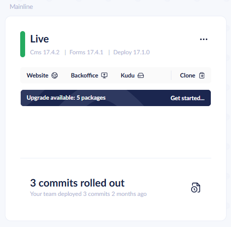
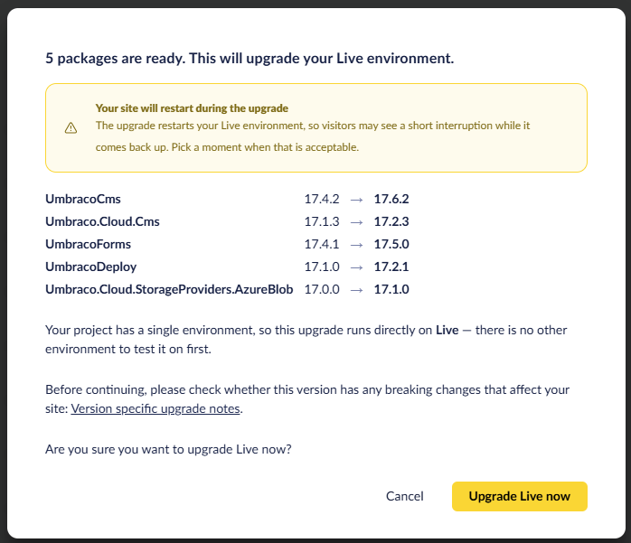

# September 2026

## Key Takeaways

* **Upgrade available banner enhancements** - The **Upgrade available** banner now offers patch upgrades as well as minors, upgrades every eligible package in one go, and works on single-environment projects. Pending changes between environments no longer block an upgrade.
* **Release Umbraco.Cloud.Cms 17.2.3 & 18.0.3 and Umbraco.Cloud.Identity.Cms 13.2.9** - Remove obsolete endpoints related to Umbraco Id.

## Upgrade available banner enhancements

The **Upgrade available** banner on the left-most environment card in the Cloud Portal has been extended. Project administrators use the banner to upgrade a project on demand, independent of the automatic upgrade settings.

<figure><figcaption>
The Upgrade available banner on an environment card
</figcaption></figure>

The following has changed:

* **Patch upgrades are offered.** The banner previously offered minor upgrades only. Any higher minor or patch version within the same major is now offered.
* **All eligible packages are upgraded in one go.** Previously, one product was upgraded per click. Umbraco CMS, Forms, Deploy, Deploy Contrib, Umbraco Cloud CMS, Umbraco ID, and the Azure Blob Storage provider are now upgraded together. The confirmation dialog lists every package with its current and target version.
* **Single-environment projects can upgrade.** Projects with only a Live environment were previously asked to add an environment first. Live is now upgraded directly. The confirmation dialog warns that the site restarts during the upgrade and links to the version-specific upgrade notes.
* **Pending changes no longer block the upgrade.** The upgrade commit is added on top of the pending changes on the environment and is included in the next deployment.

<figure><figcaption>
The confirmation dialog on a single-environment project
</figcaption></figure>

Major version upgrades are still not offered by the banner. On projects with more than one environment, the banner still upgrades the left-most mainline environment only. You test the upgrade there and deploy onward yourself.

See the [Upgrade from the Cloud Portal](../../optimize-and-maintain-your-site/manage-product-upgrades/product-upgrades/minor-upgrades.md#upgrade-from-the-cloud-portal) section for details on which versions are offered.

## Release Umbraco.Cloud.Cms 17.2.3 & 18.0.3 and Umbraco.Cloud.Identity.Cms 13.2.9

New versions of the `Umbraco.Cloud.Cms` package are available: 17.2.3 and 18.0.3.

A new version of the `Umbraco.Cloud.Identity.Cms` package is available: 13.2.9.

All three versions contain the same change.

### Remove obsolete endpoints related to Umbraco ID

Obsolete endpoints have been removed from the package.
