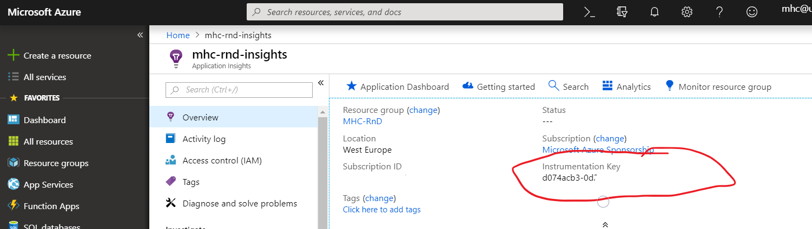

# Application Insights on Umbraco cloud

## Installing Application Insights

This guide will instruct you on how to install Application Insights (AI) for your cloud solution.

### Azure Portal

Before installing AI, set up an AI resource on Azure. Open your preferred browser, log in to the [Azure Portal](https://portal.azure.com), and create a new AI Resource.

After that, you can go ahead and grab your `instrumentation key`, from the AI Resource overview



### Cloud Solution

The next thing we need to look at is how to enable AI for your Umbraco solution.

The easiest way is to open the command prompt of your choice and run the following command:

`dotnet add package Microsoft.ApplicationInsights.AspNetCore`

This will install Application Insights and all of its dependencies. Open the `appSettings.json` file and paste in your `instrumentation key` found in the previous section.

```json
"ApplicationInsights": {
    "InstrumentationKey": "your_key_here"
  },
```

The last step is to enable Application Insights in your application. You can achieve this by updating the `Startup.cs` class.

```csharp
public void ConfigureServices(IServiceCollection services)
{
    services.AddUmbraco(_env, _config)
        .AddBackOffice()
        .AddWebsite()
        .AddComposers()
        .Build();

    // The following line enables Application Insights telemetry collection.
    services.AddApplicationInsightsTelemetry();
}
```

Upload the changes to your solution and that is it.

## Application Insights Limitations on Umbraco Cloud

Unless you have a dedicated Umbraco Cloud server, you are sharing resources with other Umbraco Cloud users. By default, Application Insights is configured to provide information about resources allocated and used by the system, however this can be a misrepresentation.

## Microsoft Documentation

For more information, check out Microsoft's documentation on [Application Insights](https://docs.microsoft.com/en-us/azure/application-insights/app-insights-overview)
