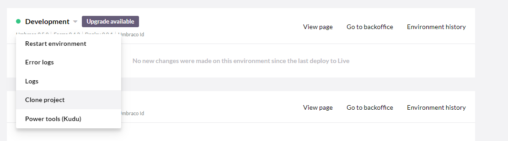

# Visual Studio Setup

In this article you will find:

- [Visual Studio Setup](#visual-studio-setup)
  - [The Visual Studio Solution](#the-visual-studio-solution)
  - [Prerequisites](#prerequisites)
  - [Video tutorial](#video-tutorial)
  - [Generate a Visual Studio Solution](#generate-a-visual-studio-solution)
  - [The Git repositories](#the-git-repositories)
  - [What's next?](#whats-next)
  - [Working with Visual Studio](#working-with-visual-studio)
    - [Using ModelsBuilder and IntelliSense](#using-modelsbuilder-and-intellisense)
    - [Using Umbraco namespaces in your `*.Core` project](#using-umbraco-namespaces-in-your-core-project)
  - [Git - what should be committed](#git---what-should-be-committed)
  - [Setup for new team members](#setup-for-new-team-members)
  - [Working with NuGet](#working-with-nuget)

## The Visual Studio Solution
If you're writing a lot of custom code (or like Intellisense), we recommend the following setup:

A Visual Studio solution with a

* Website Project for the Umbraco site (coming from the cloned git repository from the Umbraco Cloud Project), and
* Class Library Project for the code that will be created for the Umbraco site - this can be MVC Controllers, WebApi Controllers, Surface Controllers or data access plus whatever else you might need to write code for.

Below is a screenshot of our recommendation on how the projects should be configured. We use the following naming conventions: `*.Web` for the Umbraco website and `*.Core` for the accompanying code.

## Prerequisites

* Visual Studio 2017 v15.9.6 or later
* Git and/or Git Credential Manager for Windows



Are you used to using a Git client like GitKraken or SourceTree? You still need to make sure that you have Git CLI installed. Git CLI is used by the UaaS.cmd tool to clone down your Cloud project.



## Video tutorial


Video tutorial.


## Generate a Visual Studio Solution



**Important**: The UaaS.cmd tool is not being supportet by Umbraco HQ anymore. 



Manually creating and configuring a Visual Studio solution with the right projects can take a bit of time. We have made a little command line tool that will set the solution up for you.

Download the UaaS.cmd tool from [umbra.co/uaas-cmd](https://umbra.co/uaas-cmd) and place it in the folder you want the solution in.



**Important**: To use the UaaS.cmd tool you will need to have Visual Studio 2017 version 15.9.6 or any later version installed.





**Important**: Be aware if you run the Uaas.cmd tool as an adminstrator it will generate the files in your Windows/System folder.



This is a recommended setup. If you don't like the setup then you can play with it and make it your own. There's nothing magic about this setup. It is adding a few files to your Umbraco Cloud website to give you a flying start to begin working with Visual Studio.

What follows is **a recommendation and not the only way to work with Visual Studio**.

Before running the UaaS.cmd tool you will need the **git clone URL** for your Umbraco Cloud Project.

* Go to the Project in the Portal
* Copy the URL from "How to connect my machine"

Running the UaaS.cmd tool will download the latest Visual Studio generator (waasp.exe) and prompt you to enter the clone URL for your Project.
Then enter the "Namespace", which will be the name of the Visual Studio solution and thus the namespace for the solution as well.

Does an error appear where the tool says: "Unable to connect to the remote server", but you can still add the clone Url? You then need to allow the UaaS.cmd through your firewall/antivirus.

If you haven't cloned the repository before or don't have a [git credentials manager](https://github.com/Microsoft/Git-Credential-Manager-for-Windows) installed you will be asked to enter the username and password for the Umbraco Cloud Project. These are the same credentials as you use to access the Portal and the Umbraco backoffice.

Once it's done running the tool will have created a Visual Studio solution file `*.sln` and two Projects.

* `*.Web` contains the Umbraco site that was (git) cloned from your Project
* `*.Core` is a Class Library that you can use for your custom code, as mentioned above

Both projects are configured with the NuGet packages for Umbraco using the version that corresponds to the site cloned from Umbraco Cloud.

The result should look something like this within the folder where the UaaS.cmd tool ran:

You can now open the solution in Visual Studio and hit `F5` to start the site directly from Visual Studio.

## The Git repositories
One thing to notice about this setup is that you will get two git repositories as well as two projects.

1. The site cloned from your Umbraco Cloud Project will be contained within a git repository that is connected to your Project on Umbraco Cloud. Whenever you want to deploy changes to your (remote) Umbraco Cloud site you should commit everything within the `*.Web` folder, which is where the git repository for Umbraco Cloud is also located.

2. Going up one level to where the `*.sln` file is located you will notice a `.git` folder. This is the second git repository. You should use this repository for all the code you write as well as the solution and project files for Visual Studio.

Think of everything within the `*.Web` folder as your **deployment repository**, and everything surrounding that folder as your **source code repository**. The Umbraco Cloud repository (within the `*.Web` folder) will not (and should not) be committed to the other git repository.

## What's next?

Now that you've added your own touch to your site, you're ready to deploy to your Umbraco Cloud environment.
The key thing to know is that your custom code from the `*.Core` project will be built into a .dll file in your `*.Web` project that you can then push up to the Cloud repository.

Once you have everything your site will need committed you can follow the [deployment workflow](/umbraco-cloud/deployment/README.md) to complete the deployment.

## Working with Visual Studio
As mentioned in the previous section, you will start with two projects in Visual Studio. A project called `*.Web` with the Umbraco site (from Umbraco Cloud) configured as a Website project, and a project called `*.Core` configured as a class library for all of your code.

_So what goes where?_

Anything that is used within Umbraco, like plugins and configuration, should by default be placed in the `*.Web` project. Here is a list of other elements that you want to place in the `*.Web` project:

* Website assets like CSS, JavaScript and related images
* Views, Partial Views and Partial View Macros
* Configuration (`web.config` and all the Umbraco specific or related config files in `~/Config/`)
* Usercontrol ascx-files
* Plugins (typically located in App_Plugins)
* Meta data (the files that Umbraco Deploy uses in the folder `~/Data/Revision/`)

Media files will also be placed under the `*.Web` folder and you will be able to see these through Visual Studio, as Website projects show all files on disk by default. Media files from the /Media/ folder should not be committed to the git repository, but more on that in the next section.

We recommend placing all your code in the `*.Core` project (instead of, for example, using App_Code for that). This includes, but is not limited to:

* Controllers for MVC, Web Api
* Controllers for Umbraco Plugins, Surface, API
* Models and ViewModels
* Data Access (the `*.Core` project references Umbraco so you can use the Umbraco datalayer as needed)
* Extensions methods

### Using ModelsBuilder and IntelliSense

In order to use ModelsBuilder with IntelliSense in Visual Studio, you'll need to make some configuration changes to the web.config file of your `*.Web` project. This is to ensure that the models produced by ModelsBuilder are stored in the right place for compilation.
1. Make sure ModelsBuilder.Enable is set to true (default): `<add key="Umbraco.ModelsBuilder.Enable" value="true" />`
2. Set the Mode to `AppData` or `LiveAppData`. This will ensure you can use ModelsBuilder with Visual Studio. So in your Web.config, you should to have: `<add key="Umbraco.ModelsBuilder.ModelsMode" value="AppData" />`
3. Create a directory called "Models" in your App_Code folder in the `*.Web` directory of your site. Then add: `<add key="Umbraco.ModelsBuilder.ModelsDirectory" value="~/App_Code/Models/" />` to Web.config.

This will make the models of your Document Types available with IntelliSense in Visual Studio.
[You can read more about configuring ModelsBuilder here.](/11/umbraco-cms/reference/templating/modelsbuilder/)



Are using the [Visual Studio Extension for ModelsBuilder](https://marketplace.visualstudio.com/items?itemName=ZpqrtBnk.UmbracoModelsBuilderExtension&ssr=false) and getting the error message Unauthorized when generating models? You'll need to use or create a backoffice user in your local installation. You then need to supply the credentials for this user in the Visual Studio options. This is necessary because the extension is not able to authenticate against Umbraco Id.



### Using Umbraco namespaces in your `*.Core` project
In order to use Umbraco's features in your `*.Core` project, you have to add references to the DLLs in your `*.Web/bin`.

You can do this by right-clicking on **References** and selecting **Add Reference**. Browse and select the DLLs you'd like to use and then hit **OK**. Don't forget to build.

## Git - what should be committed

When working with this solution setup it's important to remember that you have one git repository for your source code, and one within the `*.Web` folder for committing and deploying your changes to Umbraco Cloud.

The cloned git repository from Umbraco Cloud comes with its own `.gitignore` so files that should NOT be committed are already handled.

As a rule of thumb all files that are required to run the Umbraco site should be committed to the git repository in the `*.Web` folder and deployed to Umbraco Cloud. This includes assemblies (`*.dll`).



To ensure that your `.dll` files are created in release mode, ensure that you switch to "Release" (instead of "Debug") mode when building the project.

It is recommend to build the project in release mode, before deploying the changes through Git.



For the `*.Core` part of the solution as well as the solution file and default `.gitignore` file you commit that to the source code repository. You should ideally set a remote for this git repository to your own git host like GitHub, BitBucket or Visual Studio Team Services.

These are the files and folders you typically want to commit in your own source code repository:

* The project and code files in `*.Core`
* The solution file `*.sln`
* `.gitignore`
* UaaSClone.cmd (used for re-establishing the `*.Web` folder with the git repository from Umbraco Cloud)

## Setup for new team members

When you are working in a team you will have additional people that will use this same setup. However, they will only clone your source code repository from your GitHub, Bitbucket, or Visual Studio Team Services account. They will, by default, not get the `*.Web` folder and the Umbraco site, because that part is not contained within the source code repository.

To help to get up and running we added a `UaaSClone.cmd`, which can be run after cloning the source code repository. Running this command line tool will clone the Umbraco Cloud repository to the right folder, and set up Visual Studio for them.

## Working with NuGet

Some Umbraco packages are available on NuGet and you can install NuGet packages into the `*.Web` project to add functionality to your site. Remember, this is a normal Visual Studio solution, so you can work with NuGet packages exactly like you're used to. Install them in the project where you need them. You should always install any NuGet packages you need in the `Web` project for them to work on your website and deploy to your environments.

For example, if you need to program something in your `*.Core` project and you depend on a NuGet package for the code you're writing, you should install that NuGet package in both:

- Install it in `*.Core` so you can write the code you need against the library you working with (obtained from NuGet)
- Also install it in `*.Web` so that the library files also end up in your website and your compiled code works there as well
