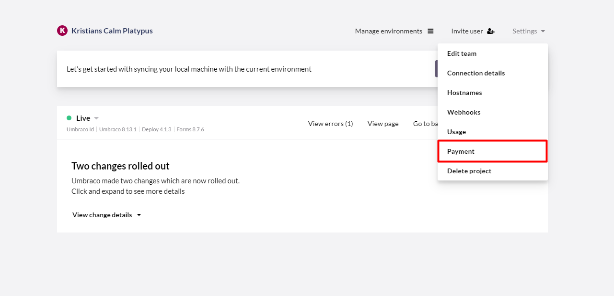

# Payments on Umbraco Cloud

:::note
This article is only for customers in the payment system released on the 5th of May, 2021.
For customers on Umbraco Cloud before the 5th of May, 2021 handling subscriptions is done through [the shop on Umbraco.com](https://shop.umbraco.com/profile/sign-in?returnURL=%2fprofile).
:::

In this article, you will be able to find information on how to manage your subscriptions, download and pay invoices, and change your credit card on Umbraco Cloud.

## Manage Subscriptions

To manage your subscription on Umbraco Cloud, go to the menu in the top right corner and select "Manage subscription".

You will see an overview of the subscriptions that you have running on your Umbraco Cloud account.

Here you can find information about the projects you are currently paying for on Umbraco Cloud.

## Payment methods

To change your payment method on Umbraco Cloud, go to your profile and select "Payment Methods" in the left side menu.

On this page you can see the credit cards you have already added or you can add a new one.

Once a credit card has been added it will show up in a drop-down when creating new projects and you can change the payment method for a specific project.

## Payment and Invoices

On Umbraco Cloud, we are sending out one single invoice with all the projects that you are paying for via email every month.

If you want to watch the Payment history and download an invoice from a previous month, you do this from the Payment setting in the dropdown menu on your projects.

From here you can see a history of the payments that have been done on the respective project that you are looking at.

You can see the Invoice number, the date the invoice was issued, the total amount that has been paid, and the payment status, as well as change which Credit card you are using to pay for the specific project.

When downloading an invoice for a given month, the invoice will contain all the projects that you were paying for during the month.

