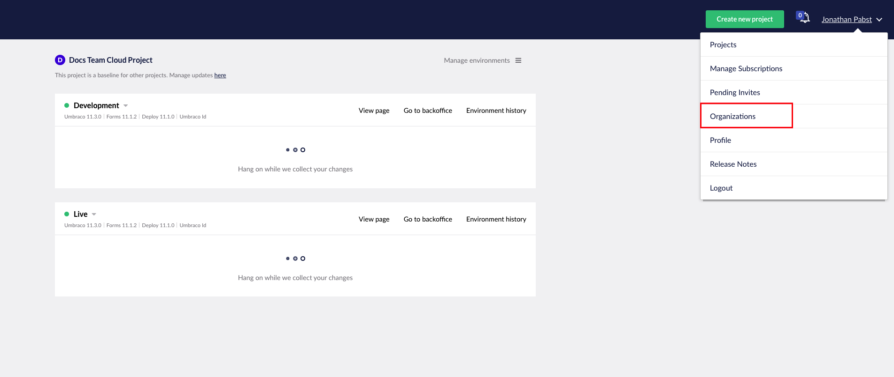

# Payments


This article is only for customers in the payment system released on the 5th of May, 2021. For customers on Umbraco Cloud before the 5th of May, 2021 handling subscriptions is done through [the shop on Umbraco.com](https://shop.umbraco.com/profile/sign-in?returnURL=%2fprofile).


In this article, you will be able to find information on the following:

* How to manage your subscriptions.
* How to download and pay invoices.
* How to change your credit card for payments.

## Manage Subscriptions

To manage your subscription on Umbraco Cloud, go to the menu in the top right corner and select "Organization".

You will see an overview of your organization on Umbraco Cloud. From here you can see the information about the organization.

To see the subscriptions running under your organization click on "Subscriptions" in the side menu

## Payment methods

To change your payment method on Umbraco Cloud, go to your organization and select "Payment Methods" in the left side menu.

On this page you can see the credit cards you have already added or you can add a new one.

Once a credit card has been added it will show up in a drop-down when creating new projects. You can also change the payment method for a specific project from here.

## Payment and Invoices

On Umbraco Cloud, we are sending out one single invoice with all the projects that you are paying for via email every month.

You can view the invoices for your projects under your organization in the Payment History section. From here you can see the following for each invoice:

* The payment number
* The total amount paid
* When the invoice was created
* The due date
* The status of the invoice

It is also possible to download the invoice. When downloading an invoice for a given month, the invoice will contain all the projects that you were paying for during the month.

