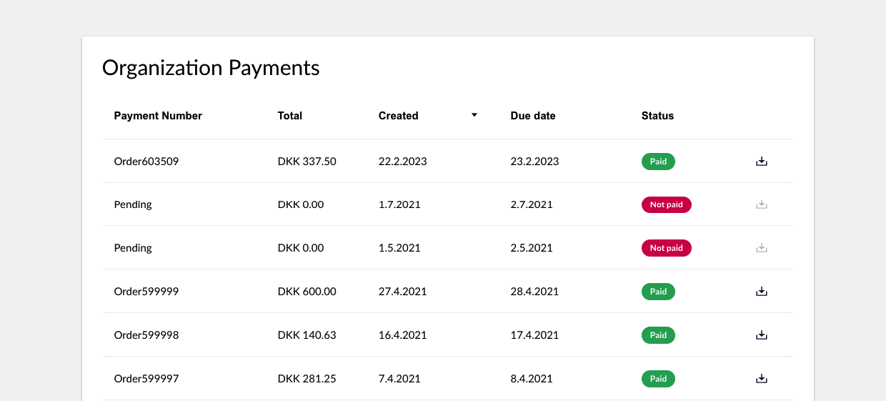

# Payments

In this article, you will be able to find information on the following:

* How to manage your subscriptions.
* How to download and pay invoices.
* How to change your credit card for payments.

## Manage Subscriptions

To manage your subscription on Umbraco Cloud, go to the menu in the top right corner and select "Organization".

<figure><figcaption>
manage subscriptions
</figcaption></figure>

You will see an overview of your organization on Umbraco Cloud. From here you can see the information about the organization.

To see the subscriptions running under your organization click on "Subscriptions" in the side menu

## Payment methods

To change your payment method on Umbraco Cloud, go to your organization and select "Payment Methods" in the left side menu.

<figure><figcaption></figcaption></figure>

On this page, you can see the credit cards you have already added or you can add a new one.

Once a credit card has been added it will show up in a drop-down when creating new projects. You can also change the payment method for a specific project from here.

<figure><figcaption>
Select Payment Methods
</figcaption></figure>

## Removing credit cards

In some cases, you might need to change the credit card information on the Umbraco Cloud Organization. 

Sometimes, it is not possible to remove a credit card from the organization right away. This is because it needs to be removed from the project first. To do this, you need to visit the payment section of the project which you can find through the following URL: 

'https://www.s1.umbraco.io/project/{project-alias}/payment'. 

## Payment and Invoices

On Umbraco Cloud, we are sending out one single invoice with all the projects that you are paying for via email every month.

You can view the invoices for your projects under your organization in the Payment History section. From here you can see the following for each invoice:

* The payment number
* The total amount paid
* When the invoice was created
* The due date
* The status of the invoice

It is also possible to download the invoice. When downloading an invoice for a given month, the invoice will contain all the projects that you were paying for during the month.

