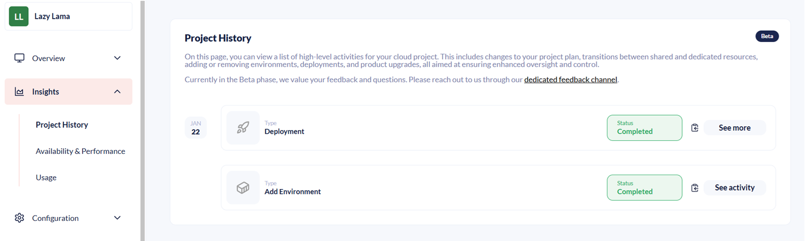
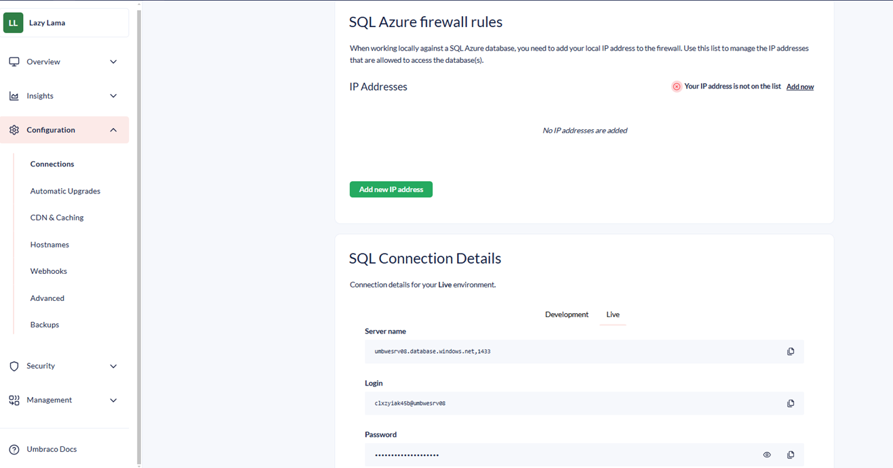
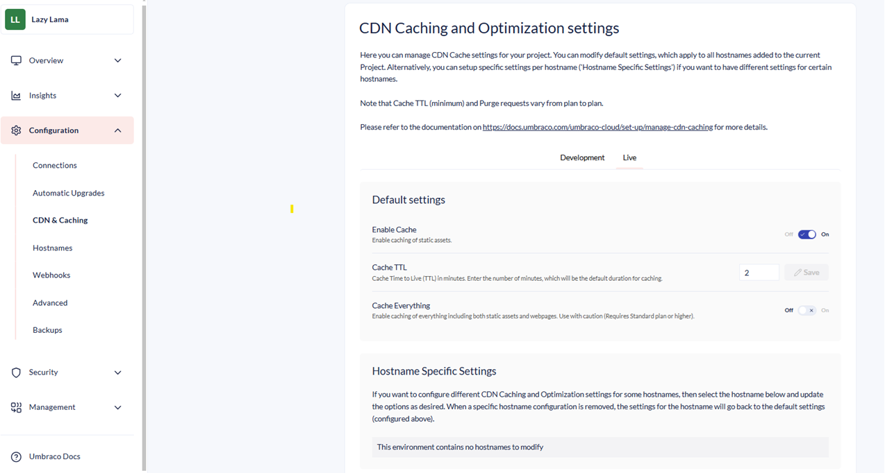
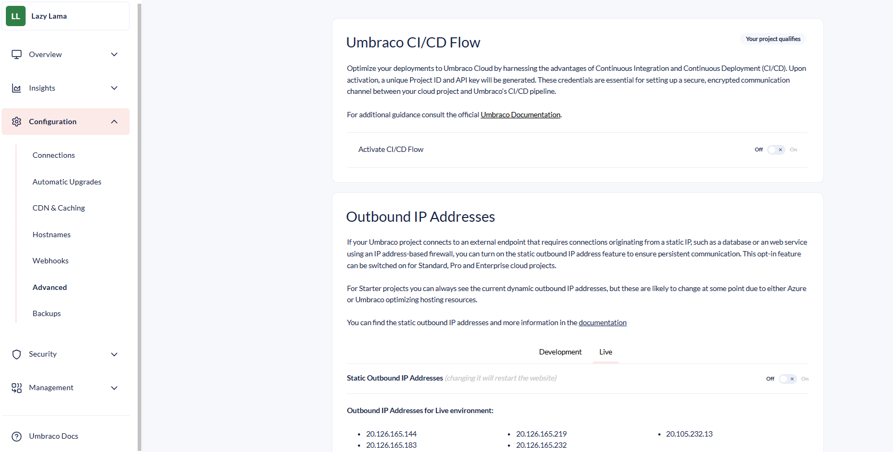

# Project Settings

When working with an Umbraco Cloud project, you can handle the project configuration directly in the Umbraco Cloud Portal. You can manage the following configurations from the left-side menu:

## Overview

### Environments

The Environments section provides an overview of your project’s environments. Here, you can:

* Access the Website (frontend) and backend,
* Open Kudu, and
* Clone down the environment locally.

### Team

The Team section allows you to:

* Manage team members and their permissions on different environments.
* Add new team members.
* Manage backoffice user groups and [Technical contacts](team-members/technical-contact.md) for your project.
* Monitor pending project invitations.

<figure><figcaption></figcaption></figure>

### Summary

The **Summary** section displays key information such as the project plan, the region where the project was created, payment status, and more.

## Insights

### [Project History](project-history.md)

In the Project History section, you can view a list of high-level activities for your cloud project.

### [Availability & Performance](availability-performance.md)

You can see metrics related to the overall health and performance of the Azure app service hosting the different environments of your solution.

### [Usage](usage.md)

The Usage section allows you to:

* View the usage of Custom Domains, Media Storage, Bandwidth, and Bandwidth History for your project.
* Check whether the project is using above or below the allowed amount for its plan.
* View the top 10 bandwidth usage paths, referrers, and the top 50 media files.

## Configuration

### [Connections](../../databases/)

The Connections section provides connection details for your Umbraco Cloud databases. You need to allow your IP to connect to the databases with your local machine.

### [Automatic Upgrades](../../product-upgrades/minor-upgrades.md)

The Automatic Upgrades section handles minor and patch upgrades for the Umbraco components used by Umbraco Cloud. By default, new projects are opt-in for these upgrades.
From here, you can control whether you opt in or out of automatic minor upgrades.

### [CDN & Caching](manage-cdn-caching.md)

The CDN & Caching section lets you manage CDN Caching and Optimization settings for your project.
You can:

* Modify the default settings that apply to all hostnames added to the project.
* Set specific caching settings per hostname if different configurations are required for certain hostnames.
* Purge Cache for individual hostnames or all of them.

### [Hostnames](manage-hostnames/)

In the Hostnames section, you can bind hostnames to your Umbraco Cloud project.

### [Webhooks](../../deployment/deployment-webhook.md)

You can configure deployment webhooks for your environments in this section. Webhooks are triggered upon successful deployments, and you can specify where the deployment information is sent.

### Advanced

The Advanced section provides options for managing advanced settings for your project, including:

* [Umbraco CI/CD Flow](umbraco-cicd/)
* [Enable static outbound IP addresses](external-services.md#enabling-static-outbound-ip-addresses) for projects on **Standard**, **Professional**, or **Enterprise** plans.
* Enable IIS logging for each environment. The log files can be accessed in Kudu at `C:\home\LogFiles\http`. IIS logs have a rolling size limit of 100 MB, overwriting the oldest files once the limit is reached.
* [Enable loading of a client certificate from the file system](application-settings.md#enable-client-certificate-loaded-from-file-system-explained).
* Change the .NET framework runtime for each environment of your Umbraco Cloud project.


Enabling IIS logging will cause the site to restart. For additional information, refer to the [Microsoft Documentation](https://docs.microsoft.com/en-us/iis/configuration/system.webserver/httplogging).


### [Backups](../../databases/backups.md#backup-on-umbraco-cloud)

The Backups section enables you to create database backups for one or more of your cloud environments.

## Security

### [Public access](public-access.md)


Public access is by default available for projects created after the 10th of January 2023.

The [Umbraco.Cloud.Cms.PublicAccess](https://www.nuget.org/packages/Umbraco.Cloud.Cms.PublicAccess) package can be installed to enable Public access for projects created before the 10th of January 2023.


You can deny access to your project with the Public access setting under the security tab.

Users who are not part of the project or whose IP has not been allowed will not be able to access the project.

You can disable/enable it with one click on the Public access page.

Access to manage Public access requires your project to be on the Standard plan or higher.

### [Transport Security](manage-security.md)

Manage transport security settings for your project. You can configure certain transport security options for all hostnames or specific hostnames within your project.

### [Management API Security](management-api-security.md)

Securing access to back-end services of your project can be done from the **Security** menu on the Umbraco Cloud Portal.

### [Certificates](manage-hostnames/security-certificates.md) (Only available on **Professional** or **Enterprise** plan)

If you have your own custom certificate, you can upload and bind it to your custom hostnames. This can be done instead of using the TLS: Transport Layer Security (HTTPS) certificates provided by the Umbraco Cloud service.

### [Secrets Management](secrets-management.md)

If your Umbraco Cloud project uses sensitive information such as API keys, encryption keys, and connection strings, it is recommended to store these as secrets.\

## Management

### Upgrade Plan

You can upgrade your project to a **Standard** or a **Professional** plan, from the **Settings** menu, depending on your needs. The option is not available if you are already on the specific plan or if you are running in **Trial** mode.

### Rename project

You can rename your Umbraco Cloud project from the **Management tab** in the menu.

<figure><figcaption>
Rename project
</figcaption></figure>


If you are working locally, you need to update the origin of your local git repository to point to the new clone URL. Alternatively, you can make a fresh local clone of the project, once you’ve changed your project name.


### [Renaming the Project file and folder](../working-locally.md#renaming-the-project-files-and-folders)

You can rename your project from the **Rename Project** section in the **Management tab** menu on the Umbraco Cloud Portal. When you rename a project, the default hostnames and clone URLs assigned to the project are updated to match the new project name. You can also rename your project files and folders locally.

### [Dedicated Resources](dedicated-resources.md)

You can change your Umbraco Cloud project to run in a dedicated setup with additional computational resources compared to the shared setup. You can choose between the different dedicated options depending on the number of resources you will need for your project.

### Delete Project

You can delete your Umbraco Cloud project from the **Management tab** menu. Deleting your Umbraco Cloud project is permanent - all data, media, databases, configuration, setup, and domain bindings are removed in the process.


Deleting your Umbraco Cloud project will also cancel any subscriptions you have set up for the project.

