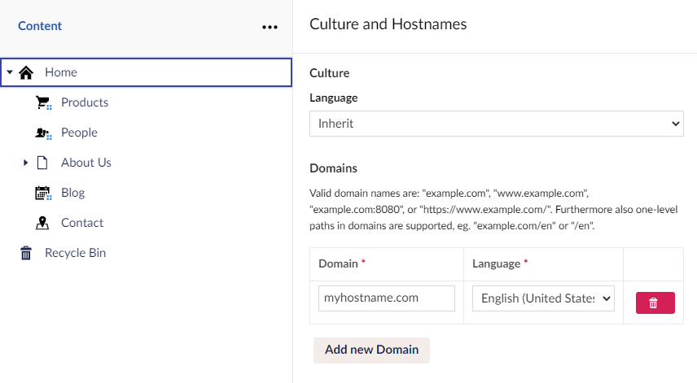

# Managing Hostnames

When you create an Umbraco Cloud project, the project URLs are based on the name of your project.

Let's say you have a project named `Snoopy`. The default hostnames will be:

* Umbraco Cloud Portal - www.s1.umbraco.io/project/snoopy
* Live site - snoopy.euwest01.umbraco.io
* Development environment - dev-snoopy.euwest01.umbraco.io
* Staging environment - stage-snoopy.euwest01.umbraco.io

The hostnames contain the region your project is hosted on. Currently, there are 4 options available when choosing a region for your Umbraco project:

* West Europe (euwest01),
* East US (useast01),
* South UK (uksouth01) and
* Australian East (aueast01)

To access the backoffice add `/umbraco` at the end of the Live, Development, or Staging URL.

## Domains

Under **Settings** in the Umbraco Cloud Portal, you'll find **Hostnames**. This is where you bind Hostnames to your Cloud environments.

<figure><figcaption><p>Manage hostnames</p></figcaption></figure>

Ensure that the hostname you are binding to your Umbraco Cloud environment has a DNS entry that resolves to the Umbraco Cloud service.

A & AAAA records should be created for the root of your domain.

For any subdomain, we recommended setting a CNAME to either the root of your domain or to dns.umbraco.io.

 Be aware that when using dns.umbraco.io, wildcard asterisks are not supported. Individual CNAME records must be created for each individual subdomain you want to use dns.umbraco.io. 

* CNAME record value:
  * `dns.umbraco.io`
* A records to either or both IPv4 addresses:
  * `162.159.140.127`
  * `172.66.0.125`
* AAAA records to either or both IPv6 addresses (to support IPv6 connectivity):
  * `2606:4700:7::7d`
  * `2a06:98c1:58::7d`

If you're using the [Former A and AAAA records](./#former-a-and-aaaa-records) consider changing them to the new A & AAAA records above.

<details>

<summary>Former A and AAAA records</summary>

The following Records will become obsolete in the future. Refrain from using them.

* A Records
  * `104.19.191.28`
  * `104.19.208.28`
  * `104.17.17.9`
  * `104.17.18.9`
* AAAA Records
  * `2606:4700::6813:bf1c`
  * `2606:4700::6813:d01c`
  * `2606:4700::6811:1209`
  * `2606:4700::6811:1109`

</details>


Once you have updated your DNS records, you need to remove the hostname and re-add it from Umbraco Cloud to re-validate the certificate with Cloudflare.


You can also check the DNS propagation using a site like [whatsmydns.net](https://www.whatsmydns.net/).


Check with your DNS host or hostname registrar regarding configuration details for your Hostnames.


Adding hostname and configuring CDN and Cache


To specify the hostname for each root node using a multisite setup, follow these steps:

1. Go to the **Backoffice** of the project.
2. Right-click the root content node.
3. Select **Culture and Hostnames**.
4. In the **Culture and Hostnames** window, click **Add New Domain**.
5. Enter your **Domain** name and select the **Language** from the drop-down list. 
6. Click **Save**.

Once you've assigned a Hostname to your Umbraco Cloud environment, you may want to hide the default `umbraco.io` URL (e.g. _snoopy.euwest01.umbraco.io_). To do so, see the [Rewrites on Cloud](rewrites-on-cloud.md#hiding-the-default-umbracoio-url) article.

### Automatic TLS (HTTPS)

All hostnames added to an Umbraco Cloud project's environment will get a TLS (HTTPS) certificate added, by default. The certificate is issued by Cloudflare and valid for 90 days after which it will be automatically renewed. Everything around certificates and renewals is handled for you and you only need to make sure that the DNS records are configured according to our recommendations listed above.


You will need to **remove the old DNS entry** before the Cloudflare service generates a new certificate for your Hostname.


### Is your Domain hosted on your own Cloudflare account?

Cloudflare is a popular DNS provider, which offers a variety of different services to improve performance and security. We also use it for DNS and Hostnames on Umbraco Cloud.

When your domain is also hosted with Cloudflare, you need to enroll the hostname you want to add to your Umbraco Cloud project in a slightly different way:

1. When creating a CNAME or A-record for your hostname in Cloudflare, you need to start with Proxy Status set to **DNS Only**.
2. Once your hostname is marked with **Protected** under the Hostname page for your Umbraco Cloud project and you can access your website through the hostname, you can choose to change Proxy Status to **Proxying**.
3. This is mostly relevant when you need to use specific Cloudflare services like Page Rules, Workers, and so on.
4. If you keep the Proxy Status set to **DNS Only**, Umbraco Cloud will handle the automatic TLS setup to ensure that your hostname is always protected with HTTPS.

### Using Certificate Authority Authorization (CAA) for your domain?

CAA is a [DNS resource record type](https://tools.ietf.org/html/rfc6844) defined in RFC 6844 that allows a domain owner to indicate which Certificate Authorities (CAs) are allowed to issue certificates for them. If you use CAA records on your domain, you will either need to remove CAA entirely or add the following through your DNS provider:

```sql
example.com. IN CAA 0 issue "pki.goog"
```

This is necessary because Google Trust Services is the Certificate Authority for the certificates issued on Umbraco Cloud.

CAA records can be set on the subdomain, but it's not something that is commonly used. If there’s a CAA record at, e.g., app.example.com, you’ll need to remove or update it. If you want to use wildcards and allow certificates for any subdomain, the CAA record should look like this:

```sql
example.com. IN CAA 0 issuewild "pki.goog"
```


The Certificate Authority (CA) used to issue certificates for all Umbraco Cloud sites' custom hostnames was changed on September 26, 2022. From October 31, 2022, certificate renewals for existing hostnames will also be updated to use the new CA.

**No action is required unless you set a Certificate Authority Authorization (CAA) record** on your domain in which case you will need to update the CAA record prior to renewal. Please follow the [Migrate to new Certificate Authority for custom hostnames](ca-record-migration.md) documentation.


## [Upload certificates manually](security-certificates.md)

On the Professional and Enterprise plan, you can manually add your certificate to your Umbraco Cloud project and bind it to one of the hostnames you've added.

## Using your WAF on Umbraco Cloud

If you need to use your Web Application Firewall (WAF) in front of your Umbraco Cloud website then this section will highlight some of the most common configurations needed.


Configuration may vary depending on which WAF you are using, so you should always consult your vendor for best practices and recommendations.


In most cases, you need to ensure that the WAF and Umbraco Cloud are using the same certificate on the specific hostname. Custom certificates are a plan-specific feature on Umbraco Cloud, so make sure that you have access to upload certificates.

1. Make sure the hostname is pointing to Umbraco Cloud (dns.umbraco.io).
2. Certificates are issued for the actual hostname. It is probably required to have a custom certificate for a WAF hostname.
3. Be on a plan that supports custom certificates.

When configuring the hostname and certificate on Umbraco Cloud it will be necessary to validate the hostname using a TXT record. This is needed because in most cases the WAF will hide that the website is running on Umbraco Cloud, which means that the usual domain ownership verification cannot be performed. This same approach can also be used to configure a hostname before updating the DNS for the hostname.

So adding a hostname on a Cloud project is possible before a DNS change. It can take up to approx. 14 days before it's removed. That means that you have 14 days to add a TXT record in your DNS settings.

Reach out to support and they will assist you with the details that need to be in the TXT record. We will first be able to see what you need to add to the TXT record when you have added the hostname.

When that is added it should work immediately.

## [Rewrites on Umbraco Cloud](rewrites-on-cloud.md)

Learn more about best practices for working with rewrite rules on Umbraco Cloud projects.
