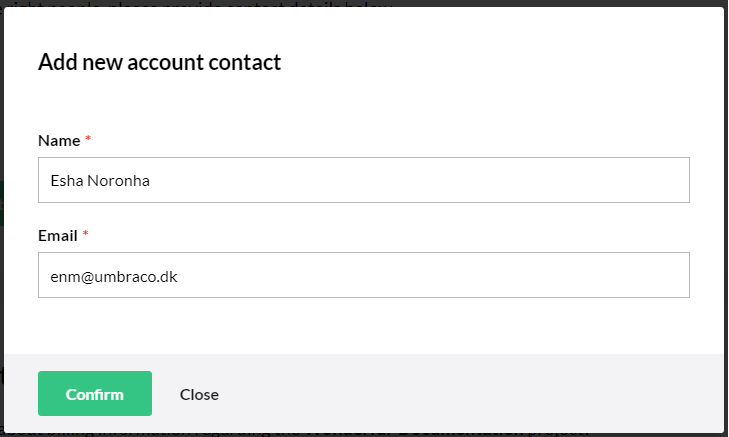
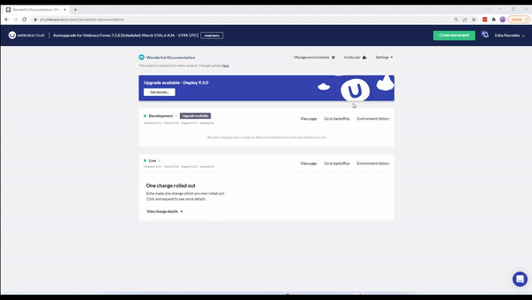

# Account Contacts

To ensure we notify the billing information to the right people, you need to add an **Account Contacts** to your project. This contact is our primary source of contact for project payment communications.


If you have more than one project on Umbraco Cloud, you will need to add an account contact to each of the projects manually.


To add an account contact, do the following:

1. Go to the Project in the Umbraco Cloud Portal.
2. Click **Settings** and go to **Edit Team**.
3. In the **Account contacts** section, click **Add account contact**. 
4.  In the **Add new account contact** window, enter the **Name** and **Email**.&#x20;

    <figure><figcaption></figcaption></figure>
5.  Click **Confirm**.

    

To edit an account contact, do the following:

1. Go to the Project in the Umbraco Cloud Portal.
2. Click **Settings** and go to **Edit Team**.
3. In the **Account contacts** section, select the contact whose details you wish to change and click **Edit**.
4.  In the **Edit account contact** window, enter the updated **Name** or **Email**.&#x20;

    <figure><figcaption></figcaption></figure>
5.  Click **Confirm**.

    


Video example.

