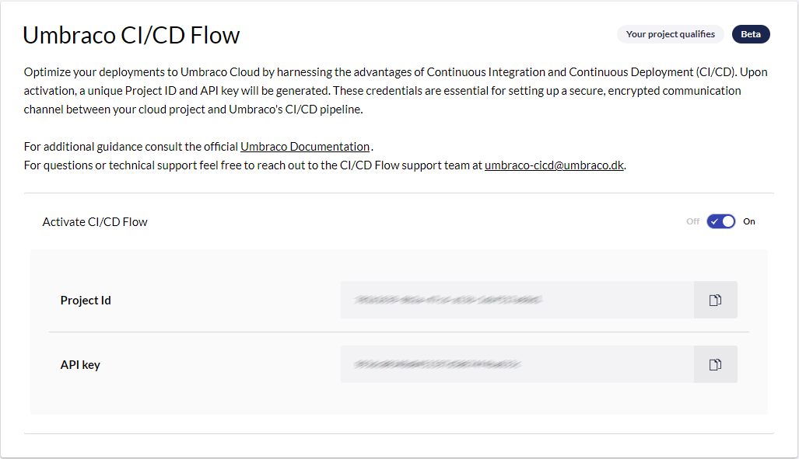

# Cloud API For CI/CD Flow

The Umbraco Cloud API serves as a publicly accessible endpoint that customers can utilize to execute relevant tasks.

While its initial focus is on automating and managing deployments in Umbraco Cloud projects via the "Umbraco CI/CD Flow," future enhancements will broaden its capabilities to encompass a wider range of activities and options for Umbraco Cloud users.

For the scope of this discussion, we will concentrate solely on the endpoints associated with interactions within the Umbraco CI/CD Flow.

## Getting started

To integrate Umbraco Cloud into your CI/CD pipeline, you'll need to make API calls to the following endpoint [`https://api.cloud.umbraco.com`](https://api.cloud.umbraco.com):

* `/$projectId/deployments`
* `/$projectId/deployments/$deploymentId`
* `/$projectId/deployments/$deploymentId/package`
* `/$projectId/deployments/$latestCompletedDeploymentId/diff`

You will find relevant examples using `Curl` and `Powershell` in the sections below.

### How to enable CI/CD Integrator in the Umbraco Cloud Portal

To authenticate with the Umbraco Cloud API, you'll need your Project ID and API Key. These credentials can be found under **Configuration > Advanced** in the Umbraco Cloud portal.



The two elements to be used for the authentication are:

* **Cloud Project ID**: The ID of your Umbraco project.
* **CI/CD API Key**: Your unique identifier.

By including the API key header in your HTTP requests, you ensure secure access to your Umbraco Cloud project's resources.

For enhanced security, it's crucial to store the provided API key in a secure location. Options include a variable group in Azure DevOps or using the Secrets feature in GitHub Actions. It's important to note that each API key is tightly coupled with a specific Umbraco Cloud project and can only be used for deployments related to that project.

### How to authenticate your requests

To authenticate your requests, include the API key in a custom HTTP header named API key.

_PowerShell_ is a command-line shell and scripting language commonly used for automating tasks and managing configurations. It offers a versatile set of cmdlets that allow you to interact with APIs, manipulate files, and much more. Within the context of the Umbraco Cloud API, PowerShell can be employed to authenticate your requests by incorporating your unique API key.

_Curl_ (Client URL) is a command-line tool commonly used for making HTTP requests. It's a versatile utility that allows you to interact with APIs, download files, and more. In the context of Umbraco Cloud API, curl can be used to authenticate your requests by including your unique API key.

To authenticate your API requests using curl, you'll need to include your API key in a custom HTTP header named Umbraco-Cloud-Api-Key. Here's how typical Powershell and curl commands would look for this purpose:



```powershell
Invoke-RestMethod -Uri $url -Headers @{ "Umbraco-Cloud-Api-Key" = $apiKey } -Method Get
```



```
curl -s -X GET $url -H "Umbraco-Cloud-Api-Key: $apiKey"
```



## How to make a deployment to Umbraco Cloud using the Umbraco CI/CD API

### Create the deployment

The Create Deployment endpoint initiates a new deployment and returns a unique `deploymentId`. This call serves as the initial step in the deployment process. It requires a `projectId` specified in the URL path and a commit message included in the request body. Essentially, this establishes the metadata necessary for initiating the deployment process. If a deployment is already underway, initiating a new one will be possible but should be avoided.

To create a deployment, you'll need to make an HTTP POST request. The request body should contain a simple JSON object with the commit message:

```json
{
    "commitMessage": "New dashboard for customer sales numbers"
}
```

In Powershell, the command to initiate a new deployment would be as follows

```powershell
...
$url = "https://api.cloud.umbraco.com/v1/projects/$projectId/deployments"
$headers = @{
    "Umbraco-Cloud-Api-Key" = $apiKey
    "Content-Type" = "application/json"
}

$body = @{
    commitMessage = $commitMessage
} | ConvertTo-Json

Invoke-RestMethod -Uri $url -Headers $headers -Method Post -Body $body
```

In curl, the command to initiate a new deployment would be as follows

```sh
...
url="https://api.cloud.umbraco.com/v1/projects/$projectId/deployments"

curl -s -X POST $url \
    -H "Umbraco-Cloud-Api-Key: $apiKey" \
    -H "Content-Type: application/json" \
    -d "{\"commitMessage\":\"$commitMessage\"}"
```

Part of the returned response will be the actual `deploymentId`. The response from the API should be an HTTP 201 Created response including a `deploymentId`. This ID can be stored in the pipeline variables so it can be used in later steps.

```json
{
    "deploymentId": "bc0ebd6f-cef8-4e92-8887-ceb862a83bf0",
    "projectId" : "abcdef12-cef8-4e92-8887-ceb123456789",
    "projectAlias": "",
    "deploymentState": "Created",
    "updateMessage": "",
    "errorMessage": "",
    "created": "2023-05-02T07:16:46.4183912",
    "lastModified": "2023-05-02T07:16:48.8544387",
    "completed": null
}
```

### Upload zip source file

To deploy content to the Umbraco Cloud repository, you need to perform an HTTP POST request to the Umbraco Cloud API. The deployment content should be packaged as a ZIP file, which must mirror the expected structure of the Umbraco Cloud repository. This ZIP file should include all relevant files such as project and solution files, and compiled frontend code. If your setup includes a frontend project with custom elements, the build artifacts from that project should also be included in the ZIP file, and placed in the appropriate directory within the repository structure.

The HTTP POST request should be made using the `multipart/form-data` content type. The request URL should incorporate both the `projectId` and `deploymentId` obtained from the previous step in the API path.

The ZIP file must be structured the same way as described in the `Readme.md` included in all cloud projects starting from Umbraco 9. This also means if you need to change the name and/or structure of the project, you should follow the guide in the same Readme.

By adhering to these guidelines, you ensure that the uploaded content is an exact match with what is expected in the Umbraco Cloud repository, facilitating a seamless deployment process.

The purpose of packaging your content into a ZIP file is to replace the existing content in the Umbraco Cloud repository upon unpackaging. This ensures that the repository is updated with the latest version of your project files.

Make sure your ZIP archive does not contain .git folder. If you're using the `.zipignore` file, you can add the following line `.git/*` to exclude it.

#### A note about .gitignore

Umbraco Cloud environments are using git internally. This means you should be careful about the .gitignore file you add to the package. If you have “git ignored” build js assets locally, you need to handle this so that this is not being ignored in the cloud repository.

**Note:** If the `.gitignore` file within the ZIP package does not exclude bin/ and obj/ directories, these will also be committed to the Umbraco Cloud repository.

**Best Practice:** If you have frontend assets your local repository's .gitignore file will most likely differ from the one intended for the Umbraco Cloud repository, it's advisable to create a separate .cloud\_gitignore file. Include this file in the ZIP package and rename it to .gitignore before packaging. This ensures that only the necessary files and directories are uploaded and finally committed to the Umbraco Cloud repository.

In curl uploading the source file will be:

```sh
...
url="https://api.cloud.umbraco.com/v1/projects/$projectId/deployments/$deploymentId/package"

curl -s -X POST $url \
    -H "Umbraco-Cloud-Api-Key: $apiKey" \
    -H "Content-Type: multipart/form-data" \
    --form "file=@$file"
```

The response of this call will be the same deployment object (in JSON) as when creating a new deployment, but the deploymentState should now be 'Pending':

```json
{
    "deploymentId": "bc0ebd6f-cef8-4e92-8887-ceb862a83bf0",
    "projectId" : "abcdef12-cef8-4e92-8887-ceb123456789",
    "projectAlias": "cicd-demo-site",
    "deploymentState": "Pending",
    "updateMessage":"Project information set\nDeployment pending\nDownloadUri set",
    "errorMessage": "",
    "created": "2023-05-02T07:16:46.4183912",
    "lastModified": "2023-05-02T07:17:48.8544387",
    "completed": null
}
```

### Start Deployment

After the source file has been uploaded the deployment can be started. This will queue the deployment in the Umbraco Cloud services which will start the deployment as soon as possible. Starting the deployment is an HTTP PATCH request to the Umbraco Cloud API. `projectId` and the `deploymentId` from the previous step must be included in the path, and the deployment state set to 'Queued' in the request body.

In curl starting a deployment will be:

```sh
...
url="https://api.cloud.umbraco.com/v1/projects/$projectId/deployments/$deploymentId"

curl -s -X PATCH $url \
    -H "Umbraco-Cloud-Api-Key: $apiKey" \
    -H "Content-Type: application/json" \
    -d "{\"deploymentState\": \"Queued\"}"
```

The response of this call will be the same deployment object (in JSON) as when creating a new deployment, but the deploymentState should now be 'Queued':

```json
{
    "deploymentId": "bc0ebd6f-cef8-4e92-8887-ceb862a83bf0",
    "projectId" : "abcdef12-cef8-4e92-8887-ceb123456789",
    "projectAlias": "cicd-demo-site",
    "deploymentState": "Queued",
    "updateMessage": "Project information set\nDeployment pending\nDownloadUri set\nDeployment queued",
    "errorMessage": "",
    "created": "2023-05-02T07:16:46.4183912",
    "lastModified": "2023-05-02T07:18:48.8544387",
    "completed": null
}
```

### Get Deployment status

To monitor the status of a deployment—whether it's completed, successful, or otherwise — you can periodically query the 'Get Deployment Status' API. This API endpoint is an HTTP GET request to the Umbraco Cloud API, and it requires both the `projectId` and the `deploymentId` obtained from previous steps to be included in the path.

Deployments in Umbraco services can take varying amounts of time to complete. Therefore, it's advisable to poll this API at regular intervals to stay updated on the deployment's current state. For example, in a simple project, you might choose to poll the API every 15 seconds for a duration of 15 minutes. These figures are just a starting point; the optimal polling frequency and duration may differ for your specific pipeline. Based on initial experience, a 15-minute window generally suffices, but we welcome your feedback to fine-tune these parameters.

Using a curl command, polling for the deployment status would look like this:

```sh
...
url="https://api.cloud.umbraco.com/v1/projects/$projectId/deployments/$deploymentId"

# Define a function to call API and check the status
function call_api {
  response=$(curl -s -X GET $url \
    -H "Umbraco-Cloud-Api-Key: $apiKey" \
    -H "Content-Type: application/json")
  echo "$response"
  status=$(echo $response | jq -r '.deploymentState')
}

# Call API and check status
call_api
while [[ $status == "Pending" || $status == "InProgress" || $status == "Queued" ]]; do
  echo "Status is $status, waiting 15 seconds..."
  sleep 15
  call_api
  if [[ $SECONDS -gt 900 ]]; then
    echo "Timeout reached, exiting loop."
    break
  fi
done

# Check final status
if [[ $status == "Completed" ]]; then
  echo "Deployment completed successfully."
elif [[ $status == "Failed" ]]; then
  echo "Deployment failed."
  exit 1
else
  echo "Unexpected status: $status"
  exit 1
fi

```

The response from this API call will return the same deployment object in JSON format as you would receive from other API interactions. Ultimately, the `deploymentState` field will indicate either 'Completed' or 'Failed'. Should the deployment fail, the 'ErrorMessage' field will provide additional details regarding the issue.

```json
{
    "deploymentId": "bc0ebd6f-cef8-4e92-8887-ceb862a83bf0",
    "projectId" : "abcdef12-cef8-4e92-8887-ceb123456789",
    "projectAlias": "cicd-demo-site",
    "deploymentState": "Completed",
    "updateMessage":"Project information set\nDeployment pending\nDownloadUri set\nDeployment queued\nDeployment triggered\nDeployment started\nCheck blocking markers\nCreate updating marker\nGit Clone\nDownload update\nExtract Update\nChecking versions\nDeleting repository files\nCopying files to repository\nNuGet Restore\nDotnet Build\nGit Stage\nGit Commit\nGit Tag\nGit Push\nDelete updating marker\nDeployment successful",
    "errorMessage": "",
    "created": "2023-05-02T07:16:46.4183912",
    "lastModified": "2023-05-02T07:20:48.8544387",
    "completed": "2023-05-02T07:20:49.8544387"
}
```

### Get Deployments

The endpoint lets you retrieve a list of completed deployments. It can only list deployments that has been run through the api.

The API allows you to filter and limit the number of returned deployments using query parameters:

* _Skip_ : optional, zero or positive integer
* _Take_ : optional, zero or positive integer
* _Includenulldeployments_ : optional, boolean, defaults to true

The "skip" and "take" parameters, while optional, are always required to be used together.

With `includenulldeployments` set to true, you will get all completed deployments, including those that did not create any new changes in the cloud repository.

To fetch the list of deployments using a curl command, the syntax would be as follows:

```sh
...
url="https://api.cloud.umbraco.com/v1/projects/$projectId/deployments?skip=0&take=1&includenulldeployments=false"

response=$(curl -s -X GET $url \
    -H "Umbraco-Cloud-Api-Key: $apiKey" \
    -H "Content-Type: application/json")
latestDeploymentId=$(echo $response | jq -r '.deployments[0].deploymentId')

```

The response from this API call will return an object containing a list of deployment objects. The deployment-objects are consistent with the structure used in other API responses. Deployments are listed in descending order based on their creation timestamp.

```json
{
  "projectId": "abcdef12-cef8-4e92-8887-ceb123456789",
  "deployments":
    [
      {
        "deploymentId": "bc0ebd6f-cef8-4e92-8887-ceb862a83bf0",
        "projectId" : "abcdef12-cef8-4e92-8887-ceb123456789",
        "projectAlias": "cicd-demo-site",
        "deploymentState": "Completed",
        "updateMessage": "...",
        "errorMessage": "",
        "created": "2023-05-02T07:16:46.4183912",
        "lastModified": "2023-05-02T07:18:48.8544387",
        "completed": "2023-05-02T07:22:48.8544387"
      }
    ]
}
```

### Get Deployment diff

Sometimes updates are done directly on the Umbraco Cloud repository. We encourage you to not do any actual work there, but auto-upgrades and environment changes will affect the umbraco-cloud-git-repos. To keep track of such changes, you can use the 'Get Deployment Diff' API. This API endpoint will provide you with a git-patch file detailing the changes between a specific deployment and the current state of the repository. To make this API call, you'll need to include both the `projectId` and the `deploymentId` of the deployment you want to check for differences against. This is a standard HTTP GET request.

Using a curl command, fetching the potential differences would look like this:

```sh
url="https://api.cloud.umbraco.com/v1/projects/$projectId/deployments/$latestCompletedDeploymentId/diff"
downloadFolder="tmp"
mkdir -p $downloadFolder # ensure folder exists

responseCode=$(curl -s -w "%{http_code}" -L -o "$downloadFolder/git-patch.diff" -X GET $url \
    -H "Umbraco-Cloud-Api-Key: $apiKey" \
    -H "Content-Type: application/json")

if [[ 10#$responseCode -eq 204 ]]; then # Http 204 No Content means that there are no changes
  echo "No changes"
  rm -fr $downloadFolder/git-patch.diff
elif [[ 10#$responseCode -eq 200 ]]; then # Http 200 downloads the file and set a few variables for pipeline
  echo "Changes - check file - $downloadFolder/git-patch.diff"
else
  echo "Unexpected status: $responseCode"
  exit 1
fi

```

The API response will vary based on whether or not there are changes to report. If no changes are detected, you'll receive an HTTP 204 No Content status. On the other hand, if there are changes, the API will return an HTTP 200 OK status along with a git-patch file as the content. This git-patch file can then be applied to your local repository to sync it with the changes.

### Possible errors

When interacting with the Umbraco Cloud API, you may encounter various HTTP status codes that indicate the success or failure of your API request. Below is a table summarizing the possible status codes, their corresponding errors, and basic root causes to guide your troubleshooting:

| Status Code | Error               | Basic Root Cause                                                                    |
| ----------- | ------------------- | ----------------------------------------------------------------------------------- |
| 400         | BadRequest          | Check the requested path, supplied headers and query-parameters                     |
| 401         | Unauthorized        | Check the Project Id and Api Key                                                    |
| 404         | NotFound            | Usually related to the supplied deploymentId in path not being found                |
| 409         | Conflict            | The state of the referenced deployment is not ready for the work you are requesting |
| 500         | InternalServerError | InternalServerError                                                                 |

Most errors have a response body that corresponds to this JSON, and the “detail” field will have a more complete error message.

```
{
  “title”: string,
  “status”: number,
  “detail”: string,
}
```
