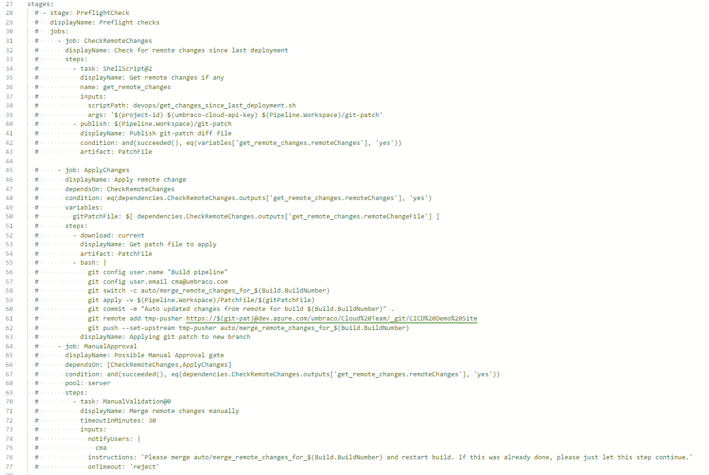
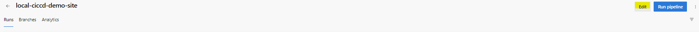

# Azure DevOps

## Setting Up the pipeline in Azure DevOps

Before setting up the pipeline in Azure DevOps, make sure that the steps in the [Configuring a CI/CD pipeline](./) are done.

The pipeline is defined in an Azure YAML file and includes some steps that call custom shell scripts to interact with the Umbraco Cloud API.

You can download the Azure DevOps sample scripts below:



Once unzipped, add the `devops` folder in the `local-cicd-demo-site` or your cloned project at the **root** folder.

The zip file includes the following files:

* Azure pipeline including stages and preflight checks for building and releasing `azure-release-pipeline.yaml`
* Create new deployment `create_deployment.sh`
* List of files and folders to exclude in `.zipignore`
* List of files and folders to include in `project-files-to-zip-list`
* Upload zip package for deployment `upload_package.sh`
* Start Deployment `start_deployment.sh`
* Get deployment status: `get_deployment_status.sh`
* Get diff since latest deployment: `get_changes_since_last_deployment.sh`

### Pushing changes to the Azure DevOps repository

Before setting up the pipeline in Azure DevOps make sure to unzip the AzureDevOpsSampleScripts.zip in the root folder of the local-cicd-demo-site. Once it has been unzipped push the changes to the repository.

Since we previously showed how to reconfigure the Git Remotes to the DevOps Repository, these changes will be pushed to that repository.

#### Creating the Pipeline in Azure DevOps

1.  **Load from Existing Repositories**

    Begin by loading your existing repositories into Azure DevOps.

    
2.  **Select the Repository**

    Choose the repository you want to use for the pipeline.

    
3.  **Configure the Pipeline**

    Next, configure the pipeline to use the existing YAML file from your selected repository.

    
4.  **Select the YAML File from the Repository**

    Finally, specify the YAML file that defines your pipeline. The file is a part of the sample script file.

    
5.  **Review your pipeline YAML**\
    The next step is reviewing the YAML pipeline. You  need to replace the following:

    1.  The value of umbraco-cloud-API-key and The value of project-id.&#x20;

        * The API key is needed to access the Umbraco Cloud API.
        * The ID of the project that the pipeline will be used for.

        The values can be found in the `Settings` -> `Advanced` section on your project in the [Umbraco Cloud Portal](https://www.s1.umbraco.io/projects).
    2. If you have renamed the `Master` Branch to `Main` then you will need to add `“main”`&#x20;
    3. From the commented `‘stages‘`, replace the **email@email.com** from`git config user.email email@email.com` and `git remote add tmp-pusher link` with preferred ones.
    4. If you have changed the default name of the `UmbracoProject.csproj` file you need to change it as well in the `‘stage: BuildAndTestStage’ - ‘job: BuildAndTestJob’ - ‘task: DotNetCoreCLI@2’`
    5. You can also add a user name in the ‘`notifyUsers‘`

    <figure><figcaption>
Changes for the  pipeline.yaml file.
</figcaption></figure>

    Once the changes have been made “save and run” the pipeline.

Following these steps, you'll have successfully set up a CI/CD pipeline in Azure DevOps for your Umbraco Cloud project.

### Overview of the example pipeline.

This guide outlines setting up a multi-stage pipeline in Azure DevOps using the provided sample scripts. The pipeline is defined in an Azure YAML file and consists of three key stages:

* **Preflight**: Validates if there are any remote changes since the last successful deployment.
* **Build, Test, and Package**: Executes standard build and test procedures, and packages the project.
* **Deploy**: Manages the creation, initiation, and monitoring of the actual deployment.

#### Import Scripts and Configure Variables

1. **Copy Scripts**: Start by copying the pipeline and associated scripts into a new folder within your own project repository.
2. **Configure Variables**: Open the `azure-release-pipeline.yaml` file and set the appropriate variables in the variables section. These variables can be found in the Settings -> Advanced section of your project on the [Umbraco Cloud Portal](https://www.s1.umbraco.io/projects).
3. **Variable Requirements**: The sample pipeline expects the following variables to be set:
   * `umbraco-cloud-api-key`: The API key needed to access the Umbraco Cloud API.
   * `git-pat`: A Personal Access Token (PAT) for Git interactions.
   * `project-id`: The ID of the project that the pipeline will be used for.

Following these steps, you'll have a staged pipeline configured in Azure DevOps tailored for your Umbraco Cloud project.

#### Pipeline Stage: Preflight Checks

This stage involves making an API call to retrieve the latest completed deployment. The goal is to identify any remote changes that may have occurred since the last successful deployment. If such changes are detected, they are applied to a new Git branch and pushed. A manual validation gate is introduced if changes are found.


The current pipeline script has room for improvement. For instance, it may falsely indicate remote changes even after a patch has been applied. It also requires manual intervention twice, as changes persist until they are deployed.


#### Pipeline Stage: Build, Test, and Package

In this stage, the Umbraco CMS project is built and tested. While this step is optional, it provides significant value. Especially if you're running custom frontend builds with different npm versions for both the backoffice and website views.

Automated tests can be run to ensure everything is functioning as expected. Additionally, manual verification steps can be included, such as deploying to a local server for QA validation.

The deployment artifact consists of source files to maintain consistency with Umbraco Cloud's existing Git-based deployment flow. Only zip-archived files are currently supported, and the folder structure must align with a standard Umbraco Cloud project.


As part of the sample scripts, we have included two text files to help you pack your source files. You should only use one of the approaches

* the `.zipignore` file specifies which files and folders to exclude in the zipped archive, ensuring that only the necessary files are packaged, without too much extra configuration. (Recommended approach)
* the `project-files-to-zip-list` file specifies which files and folders to include in the zipped archive, ensuring that only the necessary files are packaged. (If you change the project structure you will need to edit this file)

The Azure pipeline sample has examples of how to use both of them.


#### Pipeline Stage: Deploy

This stage is responsible for creating a new deployment and ensuring that it can be initiated. For more details, refer to the "Create Deployment API" section.

The deployment artifact, a zip file containing the source files, is uploaded at this stage. For more information, see the "Upload Zip Source File" section.

The deployment is then initiated. For further details, consult the "Start Deployment" section.

Feedback on the deployment's progress can be obtained by polling the "Get Status" API. Although this step is optional, it's the only current method for tracking deployment progress.

### Utilizing the Pipeline

#### Initial Run

Upon running the pipeline for the first time without making any modifications to the Umbraco CMS codebase, no deployment will be initiated in the leftmost environment. Consequently, it will also be impossible to generate any difference reports, as no deployment has taken place.

**Umbraco Cloud Project Overview (After the First Run)**\\

<figure><figcaption>
<strong>Umbraco Cloud Project Overview (After the First Run)</strong>
</figcaption></figure>

#### Triggering a New Deployment

The pipeline is designed to be triggered automatically upon any changes to the local repository. When you update and push a change, the pipeline will initiate.

**Pipeline Overview (After a Run with Changes)**

<figure><figcaption>
<strong>Pipeline Overview</strong>
</figcaption></figure>

**After the first deployment**

After the first deployment (with some schema changes) you will need to edit the .yaml file and uncomment the [Pipeline Stage: Preflight Checks](azure-devops.md#pipeline-stage-preflight-checks):

<figure><figcaption></figcaption></figure>

Once the pipeline has finished deploying, then you are able to transfer the content that you have locally directly to your environment on Umbraco Cloud.&#x20;


You can edit the pipeline by going to your Pipelines -> Edit



**Umbraco Cloud Project Overview (After the Second Run)**

<figure><figcaption>
<strong>Umbraco Cloud Project Overview (After the Second Run)</strong>
</figcaption></figure>

These changes are also synchronized to the Umbraco Cloud Git repositories. The red box in the image below indicates the code that was changed locally and pushed to the local repository. The pink box shows the state of the Umbraco Cloud Git repositories after the pipeline execution.

#### Deploying to Live Environment

Once changes have been made and tested in the Development environment, you can deploy them to the Live environment using Umbraco Cloud's standard deployment process. Simply click the green "Deploy Change to Live" button to initiate this.

**Changes Deployed to the Live Environment**

<figure><figcaption>
<strong>Changes Deployed to the Live Environment</strong>
</figcaption></figure>
