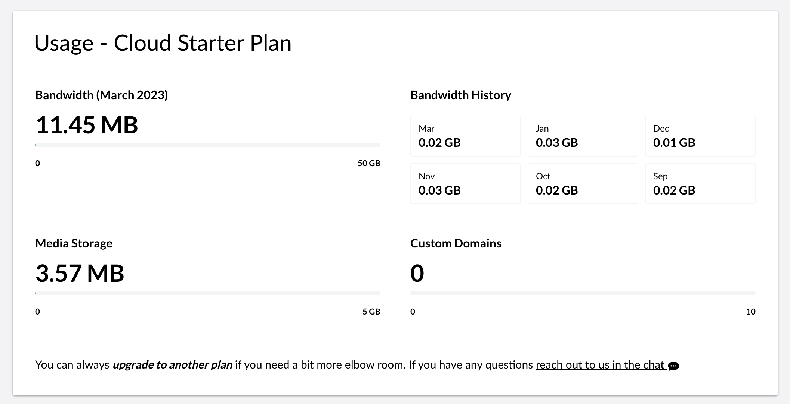

# Usage

In the Umbraco Cloud Settings menu, you can find a page called _Usage_.

On the Usage page, you will find an overview that displays your usage and evaluates it against the plan limitations of your project. On the page, you will also find the top 10 for the bandwidth usage of your project. This can give you important insight into where you can optimize resource management.

## Usage overview

The overview shows the bandwidth of the project for the current month, the media storage size, and the number of custom domains added to the project. It is also possible to see the bandwidth history for the previous six months.

In this overview, you will find the usage limitations for your Umbraco Cloud project as well as the plan that the project is on.

The usage shown is for the Live environment of your project as it is the usage in this environment that is measured against the plan usage limits. For _media storage,_ it is the size of all files in the blob storage including the cache that is considered.

## Bandwidth Top 10's

You will find a couple of top 10 for the bandwidth in the project's live environment.

### Top 10 - Bandwidth Usage Paths

The first is displaying the 10 resources that are contributing the most to the total bandwidth of your project. Each resource is represented by its path together with the number of requests and its total contribution of bandwidth.

<figure><figcaption></figcaption></figure>

### Top 10 - Bandwidth Usage Referrers

The second displays the top 10 HTTP Referrers causing the most bandwidth. A referer is an optional HTTP header field identifying the address of the web page from which the resource was requested. It is the bandwidth generated from these resource requests that counts in the monthly usage limit of the project.


Be aware that any third party services will also consume bandwidth. For example, an uptime service implementation can increase bandwidth usage as it pings the website more frequently.


## Top 50 - Media Files

It is also possible to see the top 50 media files on your live environment.

The list shows the name of the file, its path, size, and type (whether it is a jpeg or a png file).

## Usage limits

You can see the Usage limits and prices for the different plans on Umbraco Cloud on our [website](https://umbraco.com/umbraco-cloud-pricing/) or when [upgrading your plan](upgrade-umbraco-cloud-plan.md).

You can always upgrade your project to a higher plan if you have reached the limit of what you are allowed on your project. You can **Upgrade the Plan** from the **Management** tab on your project.


When one of the limits reaches 90%, you’ll see a warning banner in the portal and an email is sent to the project owner and the technical contact(s) of the project, notifying you that you’re getting close to your limit(s).


