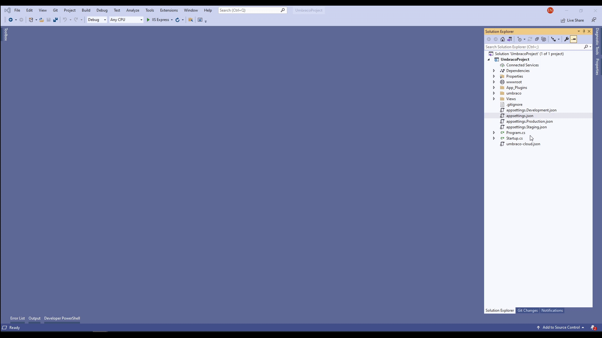

# SMTP Settings

In many cases, you might want to send emails from your Umbraco Cloud project. It could be for inviting users to the Backoffice or as part of an Umbraco Forms Workflow. To do so, you will need to have a Simple Mail Transfer Protocol (SMTP) server and configure this in your `appsettings.json` file.

SMTP server is not included with your Umbraco Cloud project. You will need to have your SMTP server set up elsewhere and then you need to configure this service with your Umbraco Cloud project.

## Why Configure SMTP?

There are a handful of reasons why configuring an SMTP service on your Umbraco Cloud project could come in handy or might even be necessary.

### Umbraco Forms

When you are working with Umbraco Forms, you have the option to set up email workflows. This enables you to create forms that send out emails. It could be a contact form where your customers can send emails directly to you.

To set up an email workflow to send out emails, you will need to configure the SMTP service. In some cases, you might also experience that you need to configure a _SenderEmail_ for notifications.

Configure _SenderEmail_ in the `appsettings.json` file under `Umbraco:CMS:Global:Smtp`. For more details, see the [`Send Email`](https://docs.umbraco.com/umbraco-forms/editor/attaching-workflows/workflow-types#send-email) section in the Workflow Types article.

```csharp
 "Umbraco": {
    "CMS": {
        "Global": {
            "Smtp": {
                "From":  "person@umbraco.dk"
            }
        }
    }
},
```


**Legacy Umbraco**

If your Cloud project is running Umbraco 7 or 8, the _SenderEmail_ is configured in the `<notifications>` section of the `web.config` file. Find more details on this in the [Legacy Documentation](https://our.umbraco.com/documentation/Reference/Configuration-for-Umbraco-7-and-8/umbracoSettings/).


### Backoffice Users

There are two scenarios for Backoffice users where configuring an SMTP service is needed:

1. When you want to add a user to your project directly from the Backoffice. Doing this involves sending out an email to the new user. For this scenario, we've set up a fallback, which means that even though you haven't yet configured an SMTP service, an email will still be sent to the new user. Keep in mind that the fallback is **only** for this particular purpose; inviting users to join your project.
2. To set up the SMTP service for your Umbraco Cloud project if one of your Backoffice users has forgotten their password. To reset their password, they have to request a password reset which will be sent to them by mail. This will only work once you've configured an SMTP service.


By default, the option to request password resets for Backoffice Users is disabled on Umbraco Cloud projects. This is mainly to ensure that your Backoffice login stays in sync with your Umbraco ID.


You can reset your Umbraco ID password from the Umbraco Cloud login page. Find more details about Umbraco ID in the ['Users on Cloud'](users-on-cloud.md) article.


## Configure SMTP Settings

As Umbraco Cloud doesn't provide SMTP servers, you will need to find hosting elsewhere. There are many services out there, here are a few we know work with Umbraco Cloud:

* [Sparkpost](https://www.sparkpost.com/) - quick to set up and developer-friendly.
* [SendGrid](https://sendgrid.com/) - quick to set up.
* [MailGun](https://www.mailgun.com/) - mainly for developers, as it is a bit more on the technical side.
* [Rapidmail](https://www.rapidmail.com/) - EU-based and GDPR compliant.


A video tutorial covering how to configure SMTP settings on an Umbraco Cloud project.


1. Set up the SMTP server.
2. Configure the service:&#x20;



The SMTP is configured in the `Umbraco:CMS:Global:Smtp` section in your `appsettings.json` file.


```json
"Umbraco": {
    "CMS": {
        "Global": {
            "Smtp": {
                "From": "person@umbraco.dk",
                "Host": "127.0.0.0",
                "Port": 587,
                "SecureSocketOptions": "StartTls",
                "Username": "person@umbraco.dk",
                "Password":  "password123/<API Key generated in your SMTP server account>"      
            }
         }
    }
},
```


To configure your SMTP service, enter the following details:

* **From**: The default address emails will be sent from.
* **Host**: IP address or hostname for your SMTP service.
* **Port**: The port of the SMTP host.
* **SecureSocketOptions**: Allows you to specify what security should be used for the connection sending the email.
* **Username**: Your username for the SMTP service.
* **Password**: The password you use to access your SMTP service.



The SMTP is configured in the `system.net/mailSettings` section of the `web.config` file.


```xml
<system.net>
    <mailSettings>
    <smtp from="noreply@example.com">
        <network host="127.0.0.1" userName="username" password="password" />
    </smtp>
    </mailSettings>
</system.net>
```


To configure your SMTP service you will need the following details:

* The **host**: IP address or hostname for your SMTP service.
* The **userName**: Your username for the SMTP service.
* The **password**: The password you use to access your SMTP service.






To make sure that your SMTP password is not visible in the `appSettings.json` file, you can use the [Secrets management](project-settings/secrets-management.md) feature to hide the setting by using the following key: `UMBRACO__CMS__GLOBAL__SMTP__PASSWORD.`


Once you've configured these settings for your SMTP service, you can send emails from your Umbraco Cloud project. For more information on SMTP configuration, see the [Global Settings](https://docs.umbraco.com/umbraco-cms/reference/configuration/globalsettings#smtp-settings) article.


You can test if you've configured your SMTP service correctly by running a [Health Check](https://docs.umbraco.com/umbraco-cms/extending/health-check) from the Umbraco Backoffice.

