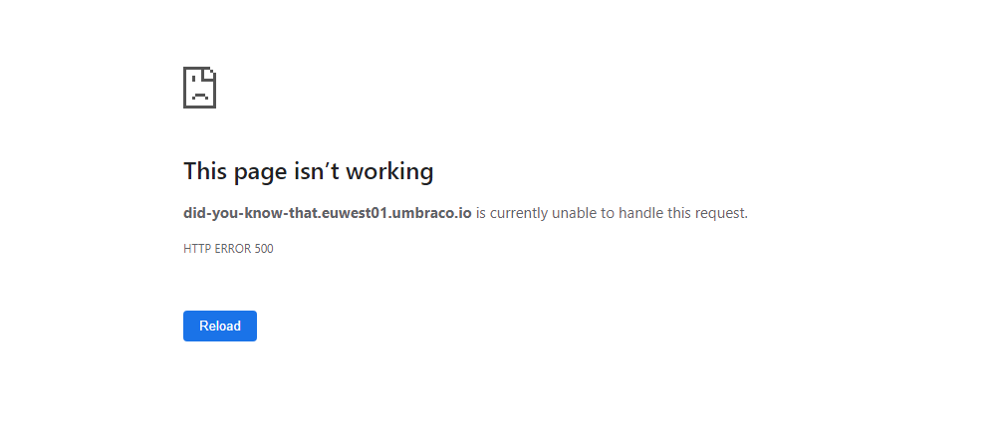

# The Frontend

An error in the Frontend could look like this:

<figure><figcaption></figcaption></figure>

The error above is a 500 error meaning that the server encountered an unexpected condition. This could be a code error in a Template file.

Errors on the frontend are presented in three ways:

* 500 (internal server error)
* Blank / not loading
* 404 (Page not found)

A **500 error** will show a generic error message like the one shown above or the full error stack trace if debug mode is enabled. The full error message can be found in the [Umbraco Logs](log-files.md).

A **blank page or a page that is not loading** is likely due to bad rewrite rules ending in a rewrite loop. Make sure you do not rewrite anything on these paths:

* ^/umbraco
* ^/DependencyHandler.axd
* ^/App\_Plugins

You can see examples of how to set up rewrites correctly in the [Rewrites on Cloud](../going-live/manage-hostnames/rewrites-on-cloud.md) article.

You should also check your console log in your browser to see if something is failing to load. Finally, you can check the [umbracoTraceLogs](log-files.md#umbraco-logs) and see if any errors are thrown!

A **404 page** could also be rewrite-rules. See above for what to check for. Other than that make sure your site and content structure is set up correctly. If you try to access a content node with no template related to it will throw this error.
