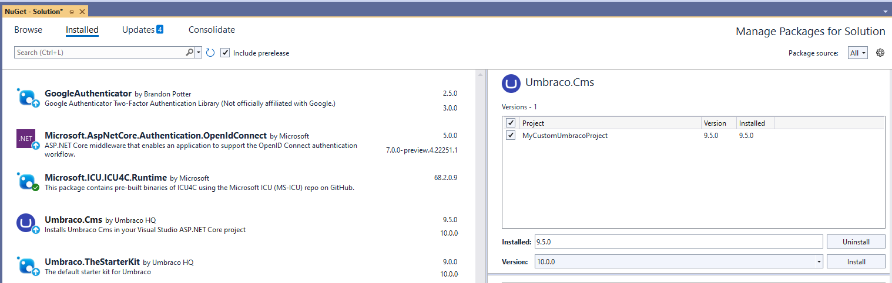

# Major Upgrades


Umbraco 11 release

We currently do **not recommend** upgrading to Umbraco CMS version 11 on Cloud.

This is due to a temporary bug in the hosting services used for hosting Umbraco Cloud.

Please reach out to [Umbraco Support](mailto:support@umbraco.com) if you have any questions.



#### **Are you using any custom packages or code on your Umbraco Cloud project?**

You will need to ensure the packages you use are available in the latest version of  Umbraco and that your custom code is valid with the .NET Framework.

#### **Breaking Changes**

Make sure you know the [Breaking changes](broken-reference) in the latest version of Umbraco CMS.

**Upgrading from Umbraco 9**

If upgrading from Umbraco 9 to a later major version, follow the dropdowns named: _**"Upgrading from Umbraco 9"**_ in the steps of the guide_**.**_

These are extra steps needed when going from Umbraco 9 to the latest major.


## Prerequisites

* Follow the requirements for [local development](../../umbraco-cms/fundamentals/setup/requirements.md#local-development).
* An Umbraco Cloud project running **the latest version of Umbraco**
* The latest .[NET version](https://dotnet.microsoft.com/en-us/download/visual-studio-sdks) is installed locally.
* **At least 2 environments** on your Cloud project.
* A backup of your project database.
  * Directly from your environment. See the [Database backups](../databases/backups.md) article,
  * Or clone down and restore the project, and take a backup of the local database.

## Video Tutorial


Video example.


## Step 1: Enable .NET

* Go to the project in the Umbraco Cloud portal.
* Navigate to **Settings** -> **Advanced**.
* Scroll down to the **Runtime Settings** section.
* **Enable the latest version of .NET** for each environment on your Cloud project.


## Step 2: Clone down your environment

* Clone down the **Development** environment.
* Build and run the [project locally](../set-up/working-locally.md#running-the-site-locally).
* Log in to the backoffice.
* Restore content from your Cloud environment.

## Step 3: Upgrade the project locally using Visual Studio

* Open your project in Visual Studio - use the `csproj` file in the `/src/UmbracoProject` folder.
* Right-click your project solution in **Solution Explorer**.
* Select **Properties**.


* Select the same **.Net** **Target Framework** drop-down in the **General** section of the **Application** tab as on your Cloud project.


* Go to **Tools** > **NuGet Package Manager** > **Manage NuGet Packages for Solution...**.
* Navigate to the **Browse** tab.
* Install the _latest stable_ version of the `Microsoft.Extensions.DependencyInjection.Abstractions`.
* Navigate to the **Installed** tab.
* Choose **Umbraco.Cms**.
* Select your project.
* Choose **the latest stable version** from the **Version** drop-down.
* Click **Install** to upgrade your project.



### Upgrading Add-on packages

Update the following packages as well:

* Umbraco.Deploy.Cloud
* Umbraco.Deploy.Contrib
* Umbraco.Forms
* Umbraco.Deploy.Forms
* Umbraco.Cloud.Identity.Cms
* Umbraco.Cloud.StorageProviders.AzureBlob


Choose the package version corresponding to the CMS version that you are currently upgrading to.

For example, if you are upgrading to "Umbraco.Cms 10.0.0" update the forms package to "Umbraco.Forms 10.0.0" as well. \


Also, if you have more projects in your solution or other packages, make sure that these are also updated to support the latest .NET framework.


With the packages and projects updated, it is time to make some changes to some of the default files.

<details>

<summary>Upgrading from Umbraco 9 - Update program.cs, appSettings.json and remove files.</summary>

*   Update the `Program` class in the `Program.cs` file to the following:\
    using Umbraco.Cms.Web.Common.Hosting;

    ```

    public class Program
        {
            public static void Main(string[] args)
                => CreateHostBuilder(args)
                    .Build()
                    .Run();

            public static IHostBuilder CreateHostBuilder(string[] args) =>
                Host.CreateDefaultBuilder(args)
                    .ConfigureUmbracoDefaults()
                    .ConfigureWebHostDefaults(webBuilder =>
                    {
                        webBuilder.UseStaticWebAssets();
                        webBuilder.UseStartup<Startup>();
                    });
        }
    ```
* Re-enable the appsettings IntelliSense by updating your schema reference in the **appsettings.json** file from:

```json
"$schema": "./umbraco/config/appsettings-schema.json",
```

To:

```json
"$schema": "./appsettings-schema.json",
```

Apply this change to the following files as well:

* **appsettings.Development.json**
* **appsettings.Production.json**
* **appsettings.Staging.json**

Remove the following files and folders _manually_ from your local project:

* `/wwwroot/umbraco`
* `/umbraco/PartialViewMacros`
* `/umbraco/UmbracoBackOffice`
* `/umbraco/UmbracoInstall`
* `/umbraco/UmbracoWebsite`
* `/umbraco/config/lang`

</details>

## Step 4: Finishing the upgrade

* Update the Umbraco Forms-related files and folders according to the [Upgrading - version specific](../../umbraco-forms/installation/version-specific.md) article.
* Choose your Database configuration:
  * To re-use the existing LocalDB database, configure the [ConnectionStrings](../../umbraco-deploy/upgrades/version-specific.md#database-initialization) or use the [`PreferLocalDbConnectionString` setting](../../umbraco-deploy/deploy-settings.md#preferlocaldbconnectionstring).
  * To use the default SQLite database, skip this step.
* Build and run your project locally to verify the Umbraco upgrade.


<details>

<summary>Upgrading from Umbraco 9 - Update global.json</summary>

*   Update the `global.json` in the root repository folder to target the runtime Software Development Kit (SDK) for the latest version of [.NET 6](https://dotnet.microsoft.com/en-us/download/dotnet/6.0).\
    &#x20;

    ```
       {
      "sdk": {
          "allowPrerelease": false,
          "version": "6.0.402",
          "rollForward": "minor"
      }
      }
    ```

&#x20;If `global.json` does not exist in the root of your repository, you need to add it manually.

Learn more about the `global.json` in the official [Microsoft docs.](https://learn.microsoft.com/en-us/dotnet/core/tools/global-json)

</details>

## Step 5: Deploy and test on Umbraco Cloud

Once the project runs locally without any errors, the next step is to deploy and test on the Cloud Development environment.

<details>

<summary>Upgrading from Umbraco 9 - Remove files from the development environment.</summary>
    
* `/wwwroot/umbraco`
* `/umbraco/PartialViewMacros`
* `/umbraco/UmbracoBackOffice`
* `/umbraco/UmbracoInstall`
* `/umbraco/UmbracoWebsite`
* `/umbraco/config/lang`

The files and folder above need to be removed on the **Development** environment through `KUDU` -> `Debug Console` -> `CMD` -> `Site` -> from both the `repository` and `wwwroot` folders.


</details>

* Push the changes to the **Development** environment. See the [Deploying from local to your environments](../deployment/local-to-cloud.md) article.
* Test **everything** in the **Development** environment.

We highly recommend that you go through everything in your Development environment. This can help you identify any potential errors after the upgrade and ensure that you are not deploying any issues onto your Live environment.

## Step 6: Deploying to Staging/Live

<details>

<summary>Upgrading from Umbraco 9 -  Remove files from staging/live the environment.</summary>

Before deploying the upgrade to your next environment, you will need to remove the folders you also removed from Kudu on your Development environment.

The files are:

* `/wwwroot/umbraco`
* `/umbraco/PartialViewMacros`
* `/umbraco/UmbracoBackOffice`
* `/umbraco/UmbracoInstall`
* `/umbraco/UmbracoWebsite`
* `/umbraco/config/lang`

They need to be removed through  `KUDU` -> `Debug Console` -> `CMD` -> `Site` -> from both the `repository` and `wwwroot` folders.


</details>

Once everything works as expected in the development/staging environment, you can push the upgrade to the live environment.

* [Working locally with Umbraco Cloud](https://github.com/umbraco/UmbracoDocs/blob/11.x/umbraco-cloud/set-up/working-locally.md)
* [KUDU on Umbraco Cloud](https://github.com/umbraco/UmbracoDocs/blob/11.x/umbraco-cloud/set-up/power-tools)
