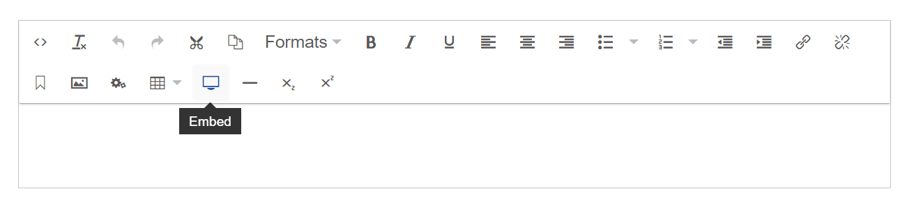

# Embedded Media Providers

The Rich Text Editor in Umbraco has an 'Embed' button, that when pressed, slides open a panel to enable editors to paste the Url of a third-party media resource to embed in content.



For example, a YouTube Video...


It is the job of an 'Embed Provider', to accept the pasted Url, and to write out the appropriate embed markup for the relevant third party provider associated with the Url.

## Embed Provider Configuration

Embed Providers are registered with the `EmbedProvidersCollection` during Composition when Umbraco boots.

The list of available default Embed Providers in an Umbraco install are as follows:

* YouTube
* Twitter
* Vimeo
* Dailymotion
* Flickr
* SlideShare
* Kickstarter
* Getty Images
* Ted
* SoundCloud
* Issuu
* Hulu
* Giphy

You can see the details of these, and any recent editions in the C# developer reference for [Umbraco.Web.Media.EmbedProviders](https://apidocs.umbraco.com/v10/csharp/api/Umbraco.Cms.Core.Media.EmbedProviders.html).

## Configuring a new provider

Create a new provider by creating a C# class that implements the `IEmbedProvider` interface. Umbraco provides a convenient `EmbedProviderBase` class as a starting point.

```csharp
namespace Umbraco.Cms.Core.Media.EmbedProviders
{
    public abstract class EmbedProviderBase : IEmbedProvider
    {
        protected EmbedProviderBase(IJsonSerializer jsonSerializer);

        public abstract string ApiEndpoint { get; }
        public abstract string[] UrlSchemeRegex { get; }
        public abstract Dictionary<string, string> RequestParams { get; }

        public abstract string GetMarkup(string url, int maxWidth = 0, int maxHeight = 0);
        public virtual string GetEmbedProviderUrl(string url, int maxWidth, int maxHeight);
        public virtual string DownloadResponse(string url);
        public virtual T GetJsonResponse<T>(string url) where T : class;
        public virtual XmlDocument GetXmlResponse(string url);
        public virtual string GetXmlProperty(XmlDocument doc, string property);
    }
}
```

If the provider to add supports the *OEmbed* format for embedding a representation of a Url in a website, then make use of the `EmbedProviderBase` base methods to implement the request:

```csharp
    public override string GetMarkup(string url, int maxWidth = 0, int maxHeight = 0)
        {
            var requestUrl = base.GetEmbedProviderUrl(url, maxWidth, maxHeight);
            var oembed = base.GetJsonResponse<OEmbedResponse>(requestUrl);

            return oembed.GetHtml();
        }
```

### Adding a new OEmbed Provider Example

Let's allow our editors to embed artwork from the popular DeviantArt website - the world's largest online social community for artists and art enthusiasts. We can see they have information on using OEmbed: <https://www.deviantart.com/developers/oembed>. The format of their OEmbed implementation returns a JSON format, from a url `https://backend.deviantart.com/oembed?url=[urltoembed]`. We'll need to use the `EmbedProviderBase` and the `base.GetJsonResponse` method. We can see 'links' to media shared on DeviantArt are in the format: `https://fav.me/[uniquemediaidentifier]` so we'll need a regex to match any urls pasted into the embed panel that start with *fav.me*, achieved by setting the `UrlSchemeRegex` property.

The Provider would look like this:

```csharp
using System.Collections.Generic;
using Umbraco.Cms.Core.Media.EmbedProviders;
using Umbraco.Cms.Core.Serialization;

namespace MyNamespace
{
    public class DeviantArtEmbedProvider : EmbedProviderBase
    {
        public DeviantArtEmbedProvider(IJsonSerializer jsonSerializer)
          : base(jsonSerializer)
        {
        }

        public override string ApiEndpoint => "https://backend.deviantart.com/oembed?url=";

        public override string[] UrlSchemeRegex => new string[]
        {
            @"fav\.me/*",
            @"\w+\.deviantart.com\/\w+\/art\/*",
            @"\w+\.deviantart.com\/art\/*",
            @"sta\.sh/*",
            @"\w+\.deviantart.com\/\w+#\/d*",
        };

        public override Dictionary<string, string> RequestParams => new Dictionary<string, string>();

        public override string GetMarkup(string url, int maxWidth = 0, int maxHeight = 0)
        {
            var requestUrl = base.GetEmbedProviderUrl(url, maxWidth, maxHeight);
            var oembed = base.GetJsonResponse<OEmbedResponse>(requestUrl);

            return oembed.GetHtml();
        }
    }
}

```

#### Register the provider with the OEmbedProvidersCollection

Create a new C# class that implements `IUserComposer` and add append your new provider to the EmbedProvidersCollection:

```csharp
using Umbraco.Cms.Core.Composing;
using Umbraco.Cms.Core.DependencyInjection;

namespace MyNamespace
{
    public class RegisterEmbedProvidersComposer : IUserComposer
    {
        public void Compose(IUmbracoBuilder builder)
            => builder.OEmbedProviders().Append<DeviantArtEmbedProvider>();
    }
}
```

The new provider should be available for editors to use:


Notice there isn't really any implementation written here - the regex maps the incoming url to the provider, and the base methods handle the complication of requesting from the third party api, and turning the response into html.

## Custom Embed Providers

If your third-party media provider does not support OEmbed or there is some quirk with the content being embedded that requires custom html. then implement GetMarkup without using the base helper methods.

### Custom Embed Provider Example

Azure Media Services [(https://azure.microsoft.com/en-gb/services/media-services/)](https://azure.microsoft.com/en-gb/services/media-services/) provide 'broadcast-quality' video streaming services. You can embed the Azure Media Player into your site to play a video [using an IFrame](https://ampdemo.azureedge.net/azuremediaplayer.html).

This example creates a custom Embed Provider to do the job of taking the Url of the Media asset and writing out the markup required to embed the IFrame video player inside your content.

```csharp
using System.Collections.Generic;
using System.Net;
using Umbraco.Cms.Core.Media.EmbedProviders;
using Umbraco.Cms.Core.Serialization;

namespace MyNamespace
{
    public class AzureVideoEmbedProvider : EmbedProviderBase
    {
        public AzureVideoEmbedProvider(IJsonSerializer jsonSerializer)
          : base(jsonSerializer)
        {
        }

        // no ApiEndpoint!
        public override string ApiEndpoint => string.Empty;
        public override string[] UrlSchemeRegex => new string[]
        {
            @"windows\.net/*"
        };
        public override Dictionary<string, string> RequestParams => new Dictionary<string, string>();
        public override string GetMarkup(string url, int maxWidth, int maxHeight)
        {
            // format of markup
            string videoFormat = "<div class=\"iplayer-container\"><iframe src=\"//aka.ms/ampembed?url={0}\" name=\"azuremediaplayer\" scrolling=\"no\" frameborder=\"no\" align=\"center\" autoplay=\"false\" width=\"{1}\" height=\"{2}\" allowfullscreen></iframe></div>";
            // pass in encoded Url, with and height, and turn off autoplay...
            var videoPlayerMarkup = string.Format(videoFormat, WebUtility.UrlEncode(url) + "&amp;autoplay=false", maxWidth, maxHeight);
            return videoPlayerMarkup;
        }
    }
}

```

Here the markup to embed has been manually constructed based upon the iframe video player, no request to an Api endpoint is made...

#### Register the Azure Embed Provider with the OEmbedProvidersCollection

Create a new C# class that implements `IUserComposer` and add append your new provider to the EmbedProvidersCollection:

```csharp
using Umbraco.Cms.Core.Composing;
using Umbraco.Cms.Core.DependencyInjection;

namespace MyNamespace
{
    public class RegisterEmbedProvidersComposer : IUserComposer
    {
        public void Compose(IUmbracoBuilder builder)
            => builder.OEmbedProviders().Append<AzureVideoEmbedProvider>();
    }
}

```

Now editors can embed Azure Media video Urls in the format: `//amssamples.streaming.mediaservices.windows.net/3b970ae0-39d5-44bd-b3a3-3136143d6435/AzureMediaServicesPromo.ism/manifest`.
