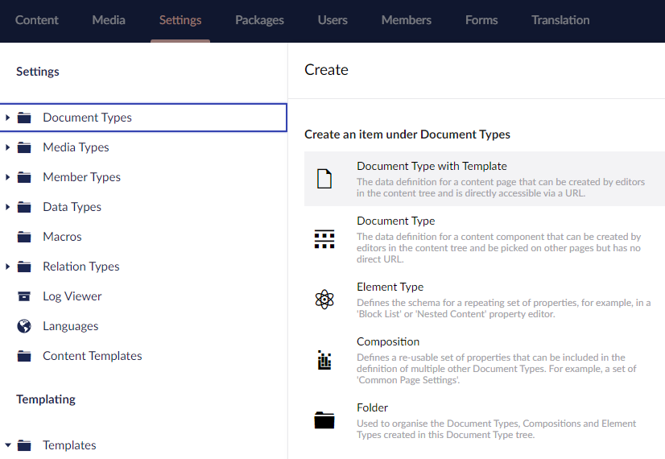
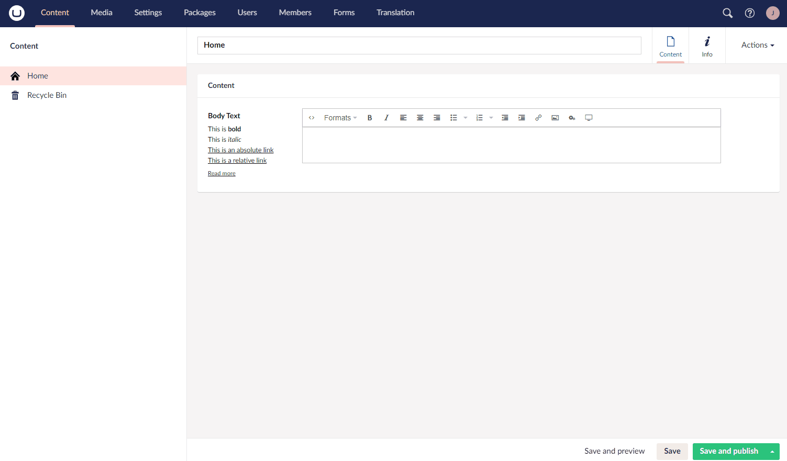

# Defining Content

_Here you'll find an explanation of how content is defined in Umbraco._

Before a piece of content can be created it needs to be defined. That is why, when opening a blank installation of Umbraco, it is not possible to create content in the **Content** section. All content needs a blueprint that holds information about what kind of data can be stored on the content node or which editors are used. Additionally, it also needs information on how it is organized, where in the structure it is allowed, and so forth. This blueprint or definition is called a Document Type.

## What is a Document Type?

A Document Type contains fieldsets (or groups) where you can apply rules about where the content can be created, allowed template(s), backoffice icons, etc.

Document Types can define entire pages or more limited content that can be reused on other nodes ie. a Search Engine Optimization (SEO) group. This means that you are in complete control of what type of content can be created where.

Document Types define what an end user sees and can interact with when they are working in the Umbraco backoffice. For a "Blog post" Document Type containing a thumbnail, a name, and an author image, it needs to be defined in the Document Type. All blog posts using the "Blog post" Document Type, will allow the end user to fill in a thumbnail, author name, and an author image.

### Properties

Each field on a Document Type is called a property. The property is given a name, an alias (used to output the properties contained in a template), and an editor. The editor determines what type of data the property will store and the input method. There is a wide range of default property editors available (Textstring, Richtext, Media Picker, and so forth) and you can customize additional editors.

Some editors require configuration, a configured editor is saved as a Data Type and can be re-used for multiple properties and document types. These can be seen in the **Settings** section under **Data Types**.

## Creating a Document Type

A Document Type is created using the Document Type editor in the **Settings** section.

Go to the **Settings** section in the backoffice. On the **Document Types** node click the menu icon (•••) to bring up the context menu. Here choose **Document Type with Template**. This will create a new Document Type with a template. The Template can be found under **Templates** in the **Settings** section that will be assigned as the default template for the Document Type.

<figure><figcaption></figcaption></figure>

You can also choose to create a **Document Type** without a template and create **Folders** to organize your Document Types.

You can also use **Composition** to create a new Document Type. Compositions allow you to inherit properties from other groups. When using a mixed setup, you can take advantage of nesting and use compositions by visiting the Structure group. A checklist like this should appear:

<figure><figcaption></figcaption></figure>

Finally, you can create a Document Type as an **Element Type** which can be used to build Block Grid and Block List editors. Learn more about [Element Types](defining-content.md#what-is-an-element-type) below.

## What is an Element Type?

An Element Type is a Document Type without a template containing schema configurations for repeating a set of properties. These are for defining schema in the Block List Editor, Nested Content, Block Grid Editor, or other Element Type based editors. Element Types cannot be used to create content that resides in the Content tree. When you create an Element type, it automatically sets the **Is Element Type** flag to **True** on the **Permissions** tab.


Element Types are created using the same workflow as regular Document Types but usually contain fewer properties. You can also create Element Types as part of configuring a Block Grid or Block List Data Type.

### Exporting/Importing the Document Type

You can export document types from a project/installation and import them into another project/installation. Go to the **Settings** section, right-click the **Document type**, and select **Export**. When you click on the **Export** button, the Document Type is saved as \*.udt file.


To import a Document Type, go to the **Settings** section, right-click the **Document type**, and select **Import Document Type**. Click on the **Import** button and browse to the Document Type you exported. The **Name** and **Alias** of the Document Type are displayed. Click **Import** to complete the process.



1. If your Document Type contains compositions or inherits from another Document Type, then you need to export/import the Composition/Document Type too.
2. You cannot export/import document types on Umbraco Cloud.


### Defining the root node

First, we're prompted to give the Document Type a name. This first Document Type will be the root node for our content, name it "Home".

<figure><figcaption></figcaption></figure>


The alias of the Document Type is automatically generated based on the property name. If you want to change the auto-generated alias, click the "lock" icon. The alias must be in camel case. For example: _homePage_.


Having a root node lets you quickly query content as you know everything will be under the root node.

To set an icon for the Document Type click the document icon in the top left corner. This will open the icon select dialog. Search for _Home_ and select the icon. This icon will be used in the content tree. Choosing appropriate icons for your content nodes is a good way to give editors a better overview of the content tree.

<figure><figcaption></figcaption></figure>

Go to the **Permissions** tab and tick the **Allow as root** toggle and save the Document Type by clicking save in the bottom right corner.

<figure><figcaption></figcaption></figure>

### Creating the root node

Now go to the **Content section**, click on the menu icon next to **Content** and Select the Home Document Type. We'll name it "Home" and click the **Save and Publish** button.

<figure><figcaption></figcaption></figure>

As we haven't created our properties, all we can see on the "Home" node is the Properties tab. This tab contains the default properties that are available on all content nodes in Umbraco.

Let's add some properties of our own.

### Groups and properties

Go to the **Settings section**, expand **Document Types** by clicking the arrow to the left, and select the **Home** Document Type.

#### Keyboard Shortcuts

Keyboard shortcuts are available when you are working with the Document Type editor. To see which shortcuts are available, click **ALT + SHIFT + K**.

#### Adding groups

Before we start adding properties to the Document Type we need to create a group to hold the property.

Click **Add group** and name the group "Content".


_If you have multiple groups and/or properties you can order them with drag and drop or by entering a numeric sort order value. This is done by clicking **Reorder**._

To convert a group to a tab, see the [Convert a group to a tab](adding-tabs.md#convert-a-group-to-a-tab) section in the [Using Tabs](adding-tabs.md) article.

#### Adding properties

Now that we have created a group we can start adding properties. Let's add a Rich Text editor to the Content group.

Click the **Add property** link in the Content group. This opens the property settings dialog. Here you can set the metadata for each property (name, alias, description), choose which Data Type/property editor to use, and add validation if needed.

Give the property a name, the name will be shown to the editor to make it relevant and understandable. Notice the alias is automatically generated based on the name. We'll name this "Body Text".


**Property editors**

Clicking **Select editor** will open the Select editor dialog. Here, you can choose between all the available editors on the **Create a new configuration** tab. This will create a new configuration or already configured editors in the **Available configurations** tab. To make it easier to find what you need use the search field to filter by typing "Rich". Filtering will display configured properties first (under **Available configurations**) and all available editors under that.

Select the **Rich Text editor** under **Create new**.


This will let you configure the editor settings - the Rich Text editor for this property.


The name of the Data Type is based on the name of the Document Type, the name of the property, and the property editor. Flor example: _Home - Body Text - Rich Text editor_.


Let's rename it to "Basic Rich Text editor" and only select the most necessary options.

* `bold`
* `italic`
* `alignLeft`
* `alignCenter`
* `link`
* `umbMediaPicker`

When you are happy with the settings click **Submit**.

Selecting the **Mandatory** toggle makes the property mandatory and the content cannot be saved if no value is entered (in this case, the Richtext editor). You have the option to add additional validation by selecting a predefined validation method under the **Custom validation** dropdown (such as email, number, or URL). Or by selecting a custom validation and adding a regular expression.

Submit the property and save the Document Type. If you go to the **Content section** and click on the Home node you will now see the Content group with the Body Text property.

#### Property descriptions

The description for the property is not always necessary, but it will sometimes allow to guide the editor to use the property the right way. The property description supports some markdown and one custom collapse syntax:

**Bold**

You can make text in the description bold by wrapping it with `**`

```md
This is **bold**
```

**Italic**

You can make text in the description italic by wrapping it with `*`

```md
This is *italic*
```

**Links**

You can make links by using the syntax:

```md
[This is an absolute link](https://google.com)
[This is a relative link](/umbraco#/media)
```


Links will always have `target="_blank"` set. This is currently not configureable.


**Images**

You can embed images by using this syntax:

```md

```

**Collapsible description**

You can make the description collapsible by adding `--` on its own line:

```md
This is initially shown
--
This is initially hidden
```

Now if we put it all together we get something like this:

```md
This is **bold**
This is *italic*
[This is an absolute link](https://google.com)
[This is a relative link](/umbraco#/media)
--

```



### Defining child nodes

Next up we'll create a text page Document Type that will be used for subpages on the site.

Go back to the **Settings section** and create a new Document Type and name it "Text Page". Add a group called "Content" and this time we'll add two properties. First, make a property called Summary using the **Textarea** editor and secondly create a property called "Body Text" and reuse the **Rich Text Editor** Data Type.

### Creating child nodes

Before creating a Text Page in **Content** section, allow the Text Page Document Type to be created as a child node to the Home node. Select the Home Document Type and go to the **Permissions** group. Click **Add child** and select Text Page.

<figure><figcaption></figcaption></figure>

Go to the **Content** section and click the menu icon (•••) next to the _Home_ node and select the Text page Document Type. We'll name the page "About us". We now have a basic content structure.

<figure><figcaption></figcaption></figure>

Document Types are flexible and can be used for defining pieces of reusable content or an entire page, to acting as a container or repository.

### More information

* [Rendering Content](../design/rendering-content.md)
* [Customizing Data Types](data-types/)

### Related Services

* [ContentService](../../reference/management/services/contentservice/)
* [ContentTypeService](../../reference/management/services/contenttypeservice/)

### Tutorials

* [Creating a basic website with Umbraco](../../tutorials/creating-a-basic-website/)

### Umbraco Learning Base Channel


Playlist: Document Types in Umbraco

