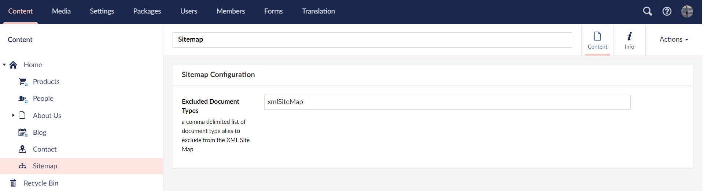

# Creating an XML Site Map

Adding an XML sitemap to your site makes it easier for search engines such as Google to find and index your websites pages. Having a sitemap will improve the Search Engine Optimization (SEO) for your website.

There is not an XML sitemap generator in Umbraco, which is why this tutorial will show you how to create one.

If you are in a hurry, there are some community packages that will do the job for you:

* [SEO Toll Kit](https://marketplace.umbraco.com/package/seotoolkit.umbraco)

## What does an XML sitemap look like?

An XML sitemap is a list of URLs for the content on your site.

See [Sitemaps XML format](https://www.sitemaps.org/protocol.html) for the XML schema the sitemap needs to conform to.

```xml
<?xml version="1.0" encoding="UTF-8"?>
<urlset xmlns="http://www.sitemaps.org/schemas/sitemap/0.9">
    <url>
        <loc>https://www.example.com/</loc>
        <lastmod>2005-01-01</lastmod>
        <changefreq>monthly</changefreq>
        <priority>0.8</priority>
    </url>
</urlset>
```

The XML sitemap is a guide for search engines to discover and index your content. Each page on your site that you wish to feature will be represented by a `<url>` entry in the list.

## Approach

There are different ways of approaching this task. The best approach will be determined by the size of your site, and your preference for implementing functionality in Umbraco.

In this tutorial we are going to write the code directly in a Template using Razor and `IPublishedContent`. You may want to take a different approach, like using route hijacking to write the code in an MVC controller.

The following will be covered in this tutorial:

* We'll create a new Document Type called 'XmlSiteMap' with a corresponding 'XmlSiteMap' Template. Visiting page based on this Document Type will trigger the rendering of the XML sitemap.
  * The XmlSiteMap Document Type will contain an 'Excluded Document Types' property to list types of content we wish to exclude from the sitemap. Alternatively, you could create an 'Included Document Types' to specify types that should be included rather than excluded.
* We'll create a 'SiteMap' composition, containing a consistent set of sitemap related properties. This composition will be added to all of the different Document Types in the site.
  * The 'SiteMap' composition will contain a 'hide from Xml Site Map' checkbox, to give editors the ability to hide a certain page from the XML Sitemap.

## 1. Create an XmlSiteMap Document Type

In this first step of the tutorial we will be creating a new Document Type for our sitemap page.


1. Navigate to the **Settings** section in the Umbraco backoffice.
2. Create a new "Document Type with Template" under the Document Types folder.
3. Name the new Document Type **XmlSiteMap**.
4. Add a TextString property called "Excluded Document Types" (alias: `excludedDocumentType`).
5. Save the XmlSiteMap Document Type.
6. Open the Document Type used in the root of your website.
7. Select the "Permissions" tab and add the new XmlSiteMap under "Allowed child node types".
8. Navigate to the **Content** section and create a new XmlSiteMap page in your content tree.
9. Use the alias to add the XmlSiteMap Document Type to the "Excluded Document Type" list: `xmlSiteMap`.



## 2. Create an XmlSiteMapSettings Composition

In this step we will be creating a Composition Document Type. This Document Type will be used to add sitemap options to all Document Types used to add content pages to the website.

A sitemap entry will allow you to state the *relative priority* of any particular page in terms of its importance within your site. A value of 1.0 is the highest level of importance and 0.1 is at the other end of the scale.

You can add a *change frequency* to define how often the content on a particular page is expected to change. This will help the search engine know when to return to reindex any regularly updated content.

1. Navigate to the **Settings** section in the Umbraco backoffice.
2. Create a new **Composition** under the Document Types folder.
3. Name the new Document Type **XmlSiteMapSettings**.
3. Add the following properties:
  a. Slider named **Search Engine Relative Priority** (searchEngineRelativePriority): MinValue: 0.1, MaxValue: 1, Step Increments 0.1, InitialValue 0.5.
  b. Dropdown named **Search Engine Change Frequency** (searchEngineChangeFrequency): Always, hourly, daily, weekly, monthly, yearly and never.
  c. Checkbox named **Hide From Xml Sitemap** (hideFromXmlSitemap).

<figure><figcaption></figcaption></figure>

## 3. Add composition to all relevant Document Types

Add the XmlSiteMapSettings composition to all Document Types used to create content pages in the Content section.

<figure><figcaption></figcaption></figure>

This will give editors the ability to set these values for each page on the site. We will use the values from the parent or parents parent page in case the values are not specified on a particular page. This enables the values to be set in one place for a particular section.

### 4. Building the XmlSiteMap.cshtml template

In this step we will be building the XmlSiteMap template to display the XML schema on the sitemap page.

We will start by adding the XML schema for the sitemap. Since we do not want our template to inherit any 'master' HTML layouts we will set the `layout` to be `null`.

Editing the template can be done in two different ways:

1. Locate the XmlSiteMap Template in the **Settings** section of the Umbraco backoffice and use the editor to make the changes, or
2. Open and work with the `Views/XmlSiteMap.cshtml` file in your preferred Integrated Development Environment (IDE) on your machine.

```csharp
@using Umbraco.Cms.Web.Common.PublishedModels;
@inherits Umbraco.Cms.Web.Common.Views.UmbracoViewPage<ContentModels.XmlSiteMap>
@using ContentModels = Umbraco.Cms.Web.Common.PublishedModels;
@{
    Layout = null; 
    Context.Response.ContentType = "text/xml";
 }
 
<urlset xmlns="http://www.sitemaps.org/schemas/sitemap/0.9" 
        xmlns:xsi="http://www.w3.org/2001/XMLSchema-instance" 
        xsi:schemalocation="http://www.google.com/schemas/sitemap/0.9 http://www.sitemaps.org/schemas/sitemap/0.9/sitemap.xsd" 
        xmlns:image="http://www.google.com/schemas/sitemap-image/1.1">
    // Insert sitemap content here.
</urlset>
```

### Getting a reference to the sitemap starting point

The sitemap should start at the homepage at the root of the site. Since our XmlSiteMap page is created as a subpage page to this, we can use the `Root()` helper to define the starting point as `IPublishedContent`.

1. Add `IPublishedContent siteHomePage = Model.Root();` within the first set of curly brackets in the template.

### Rendering a sitemap entry

We will retrieve each page in the site as **IPublishedContent** and read in the properties we added in step 3: SearchEngineChangeFrequency and SearchEngineRelativePriority. We will also read the URL of the page as well as when it was last modified.


You can include HTML markup in the body of a method declared in a code block. This is a great way to organize your razor view implementation and to avoid repeating code and HTML in multiple places.


1. Add the following code snippet to the XML schema in the XmlSiteMap template:

    ```csharp
    @{
        void RenderSiteMapUrlEntry(IPublishedContent node)
        {
            // The change frequency is recursive, and should 'fallback to ancestor' when no value is given.
            var changeFreq = node.Value("searchEngineChangeFrequency", 
                                        fallback: Fallback.To(Fallback.Ancestors, Fallback.DefaultValue), 
                                        defaultValue: "monthly");

            // The relative priority is a per-page setting only. We will not set Fallback.ToAncestors and instead default to 0.5 if no value is set.
            var priority = node.HasValue("searchEngineRelativePriority") ? node.Value<string>("searchEngineRelativePriority") : "0.5";

            <url>
                <loc>@node.Url(mode: UrlMode.Absolute)</loc>
                <lastmod>@(string.Format("{0:s}+00:00", node.UpdateDate))</lastmod>
                <changefreq>@changeFreq</changefreq>
                <priority>@priority</priority>
            </url>
        }
    }
    ```

2. Update the XML schema to include `RenderSiteMapUrlEntry(siteHomePage)`:

    ```csharp
    <urlset xmlns="http://www.sitemaps.org/schemas/sitemap/0.9" 
            xmlns:xsi="http://www.w3.org/2001/XMLSchema-instance" 
            xsi:schemalocation="http://www.google.com/schemas/sitemap/0.9 http://www.sitemaps.org/schemas/sitemap/0.9/sitemap.xsd" 
            xmlns:image="http://www.google.com/schemas/sitemap-image/1.1">
        @{
            RenderSiteMapUrlEntry(siteHomePage)
        }
    </urlset>
    ```


We are using `IPublishedContent` in this example. Using **ModelsBuilder** instead will enable you to take advantage of the fact that the XMl Sitemap Settings composition will create an interface called `IXmlSiteMapSettings`. This will allow you to adjust the helper to accept `RenderSiteMapUrlEntry(IXmlSiteMapSettings node)` and read properties without the `Value` helper. You would still need to create an extension method on `IXmlSiteMapSettings` to implement the recursive functionality we make use of on the `SearchEngineChangeFrequency` property.


Visit the URL of your sitemap page (`http://yoursite.com/sitemap`) to render a single sitemap entry for the homepage.


### Looping through the rest of the site

We need to go through each page created beneath the homepage to see if they should be added to the sitemap.

We can use the `.Children` method from `IPublishedContent` to return all the pages directly beneath a particular page.

1. Add `IEnumerable<IPublishedContent> sitePages = siteHomePage.Children();` within the first set of curly brackets in the template.
2. Loop through each of these 'child' pages, and write out their sitemap markup using the helper:

    ```csharp
    foreach (var page in sitePages){
        @RenderSiteMapUrlEntry(page)
        if (page.Children.Any()){
            var childPages = page.Children();
            foreach (var childPage in childPages){
                @RenderSiteMapUrlEntry(childPage)
                if (childPage.Children.Any()){
                    var grandChildPages = childPage.Children();
                    foreach (var grandChildPage in grandChildPages){
                        // ... can go on forever. How do we stop?
                    }
                }
            }
        }
    }
    ```

Do you see the potential problem here? How deep do we go and how do we handle the repetition?

One option is to use recursion. We can create a Razor helper that 'calls itself'.


Before moving on, make sure the remove any code pieces related to the two steps directly above this box.
The code in those steps was to showcase what not to do.


We will add a `RenderSiteMapUrlEntriesForChildren` helper which accepts a 'Parent Page' parameter as the starting point. Then we will find the children of this Parent Page and write out their sitemap entry. Finally we will call this same method again from itself.

1. Add the following code snippet below the `RenderSiteMapUrlEntry` helper in the XmlSiteMap Template:

    ```csharp
    void RenderSiteMapUrlEntriesForChildren(IPublishedContent parentPage)
    {
        foreach (var page in parentPage.Children)
        {
            RenderSiteMapUrlEntry(page);
            if (page.Children.Any()){
                RenderSiteMapUrlEntriesForChildren(page);
            }
        }
    }
    ```

2. Update the XML schema to include `RenderSiteMapUrlEntriesForChildren(siteHomePage)`:

    ```csharp
    <urlset xmlns="http://www.sitemaps.org/schemas/sitemap/0.9" 
            xmlns:xsi="http://www.w3.org/2001/XMLSchema-instance" 
            xsi:schemalocation="http://www.google.com/schemas/sitemap/0.9 http://www.sitemaps.org/schemas/sitemap/0.9/sitemap.xsd" 
            xmlns:image="http://www.google.com/schemas/sitemap-image/1.1">
        @{
            RenderSiteMapUrlEntry(siteHomePage);
            RenderSiteMapUrlEntriesForChildren(siteHomePage);
        }
    </urlset>
    ```

You will now see the XML sitemap rendered for the entire site.


As everything is rendered on the sitemap, we have yet to take into account the pages that should be excluded.

We added a **HideFromXmlSitemap** checkbox to all Document Types via our `XmlSiteMapSettings` composition. This configuration needs to be included when rendering the sitemap.

The helper needs to only return pages that do not have the HideFromXmlSitemap checked.

1. Update the `RenderSiteMapUrlEntriesForChildren` helper like shown below:

    ```csharp
    void RenderSiteMapUrlEntriesForChildren(IPublishedContent parentPage)
    {

        foreach (var page in parentPage.Children.Where(x =>!x.Value<bool>("hideFromXmlSiteMap")))
        {
            RenderSiteMapUrlEntry(page);
            if (page.Children.Any(x =>!x.Value<bool>("hideFromXmlSiteMap"))){
                RenderSiteMapUrlEntriesForChildren(page);
            }
        }
    }
    ```

Revisit a page in the Content tree, and check the HideFromXmlSitemap option. This page will now be excluded from the from the sitemap.

Another way to control which and how many pages are shown in the sitemap is to filter by **depth**. It is possible to add a number that 

If we add to our XmlSiteMap document type a new property of numeric type called 'maxSiteMapDepth'... we can use that value to determine when to stop iterating:

```csharp
@inherits Umbraco.Cms.Web.Common.Views.UmbracoViewPage
@{
    Layout = null;
    Response.ContentType = "text/xml"; 
    IPublishedContent siteHomePage = Model.Root();
    int maxSiteMapDepth = Model.HasValue("maxSiteMapDepth") ? Model.Value<int>("maxSiteMapDepth") : int.MaxValue; 
}
    <urlset xmlns="http://www.sitemaps.org/schemas/sitemap/0.9" xmlns:xsi="http://www.w3.org/2001/XMLSchema-instance" xsi:schemalocation="http://www.google.com/schemas/sitemap/0.9 http://www.sitemaps.org/schemas/sitemap/0.9/sitemap.xsd" xmlns:image="http://www.google.com/schemas/sitemap-image/1.1">@RenderSiteMapUrlEntry(siteHomePage)@RenderSiteMapUrlEntriesForChildren(siteHomePage, maxSiteMapDepth)</urlset>

.....

void RenderSiteMapUrlEntriesForChildren(IPublishedContent parentPage)
{
    foreach (var page in parentPage.Children.Where(f=>!f.Value<bool>("hideFromXmlSiteMap")))
    {
        @RenderSiteMapUrlEntry(page)
        if (page.Level < maxSiteMapDepth && page.Children.Any(f=>!f.Value<bool>("hideFromXmlSiteMap"))){
            @RenderSiteMapUrlEntriesForChildren(page, maxSiteMapDepth)
        }
    }
}
```

Set your `MaxSiteMap` depth to be 2 on your XmlSiteMap content item, and save and republish. Your sitemap will now only contain entries for the top two levels. Leaving the value blank, will mean that no Maximum Depth restriction will be applied.

**Excluded DocumentType list**

Our Xml Sitemap includes an entry for itself on the XML Sitemap, I thought we had excluded that document type, when we created the excludedDocumentType property...

... we did but we haven't checked this value in the helper yet.

```csharp
string excludedDocumentTypeList = Model.Value<string>("excludedDocumentTypes");
string[] excludedDocumentTypes = (!String.IsNullOrEmpty(excludedDocumentTypeList)) ? excludedDocumentTypeList.Split(new char[] { ',' }, StringSplitOptions.RemoveEmptyEntries).Select(p => p.Trim()).ToArray() : new string[] { };
```

now we can pass this value into our helper

```csharp
void RenderSiteMapUrlEntriesForChildren(IPublishedContent parentPage)
{
    foreach (var page in parentPage.Children.Where(f => !excludedDocumentTypes.Contains(f.ContentType.Alias) && !f.Value<bool>("hideFromXmlSiteMap")))
    {
        @RenderSiteMapUrlEntry(page)
        if (page.Level < maxSiteMapDepth && page.Children.Any(f => !excludedDocumentTypes.Contains(f.ContentType.Alias) && !f.Value<bool>("hideFromXmlSiteMap")))
        {
            @RenderSiteMapUrlEntriesForChildren(page, maxSiteMapDepth, excludedDocumentTypes)
        }
    }

}
```

### The finished sitemap template

```csharp
@inherits Umbraco.Cms.Web.Common.Views.UmbracoViewPage

@{
    Layout = null;
    var siteHomePage = Model.Root();
    Context.Response.ContentType = "text/xml";
    int maxSiteMapDepth = Model.HasValue("maxSiteMapDepth") ? Model.Value<int>("maxSiteMapDepth") : int.MaxValue;

    string excludedDocumentTypeList = Model.Value<string>("excludedDocumentTypes");
    string[] excludedDocumentTypes = (!String.IsNullOrEmpty(excludedDocumentTypeList)) ? excludedDocumentTypeList.Split(new char[] { ',' }, StringSplitOptions.RemoveEmptyEntries).Select(p => p.Trim()).ToArray() : new string[] { };
}


<urlset xmlns="http://www.sitemaps.org/schemas/sitemap/0.9" xmlns:xsi="http://www.w3.org/2001/XMLSchema-instance" xsi:schemalocation="http://www.google.com/schemas/sitemap/0.9 http://www.sitemaps.org/schemas/sitemap/0.9/sitemap.xsd" xmlns:image="http://www.google.com/schemas/sitemap-image/1.1">
    
    @{
        RenderSiteMapUrlEntry(siteHomePage);
        RenderSiteMapUrlEntriesForChildren(siteHomePage);
    }
    

</urlset>


@{
    void RenderSiteMapUrlEntry(IPublishedContent node)
    {
        var changeFreq = node.Value("searchEngineChangeFrequency", fallback: Fallback.To(Fallback.Ancestors, Fallback.DefaultValue), defaultValue: "monthly");
        // with the relative priority, this is a per page setting only, so we're not using recursion, so we won't set Fallback.ToAncestors here and we'll default to 0.5 if no value is set
        var priority = node.HasValue("searchEngineRelativePriority") ? node.Value<string>("searchEngineRelativePriority") : "0.5";

        <url>
            <loc>@node.Url(mode: UrlMode.Absolute)</loc>
            <lastmod>@(string.Format("{0:s}+00:00", node.UpdateDate))</lastmod>
            <changefreq>@changeFreq</changefreq>
            <priority>@priority</priority>
        </url>

    }

    void RenderSiteMapUrlEntriesForChildren(IPublishedContent parentPage)
    {
        foreach (var page in parentPage.Children.Where(x => !excludedDocumentTypes.Contains(x.ContentType.Alias) && !x.Value<bool>("hideFromXmlSiteMap")))
        {
            RenderSiteMapUrlEntry(page);
            if (page.Level < maxSiteMapDepth && page.Children.Any(x => !x.Value<bool>("hideFromXmlSiteMap")))
            {
                RenderSiteMapUrlEntriesForChildren(page);
            }
        }

    }

}
```

#### Add sitemap to robots.txt

Finally let search engines know the url for your sitemap by updating your robots.txt file accordingly:

```
Sitemap: https://www.yourlovelysite.com/xmlsitemap
User-agent: *
```

Once you introduce a Sitemap for the first time, you might suddenly find yourself being crawled by multiple different search engine bots. This is exactly what you want! However if your site or hosting is a little creaky, you might want to add a crawl rate to the robots.txt to instruct well behaved search engine bots to give a bit of space to your site between requests:

```
Sitemap: https://www.yourlovelysite.com/xmlsitemap
User-agent: *
Crawl-delay: 10
```

#### Test your Xml SiteMap in a validation tool

Visit [Xml-Sitemaps.com](https://www.xml-sitemaps.com/validate-xml-sitemap.html) to test the validity of your generated Xml Site Map.

#### Summary

This is one way to add an XML Sitemap to your site, depending on your site it might not always be the 'best way' eg it will be much faster using XSLT. Particularly for large sites.

This tutorial aims to serve as an introduction to Razor, Helpers, Functions, IPublishedContent, and working with the Umbraco Content Tree. It is not trying to establish the 'only best practice' way to achieve an Xml SiteMap.
