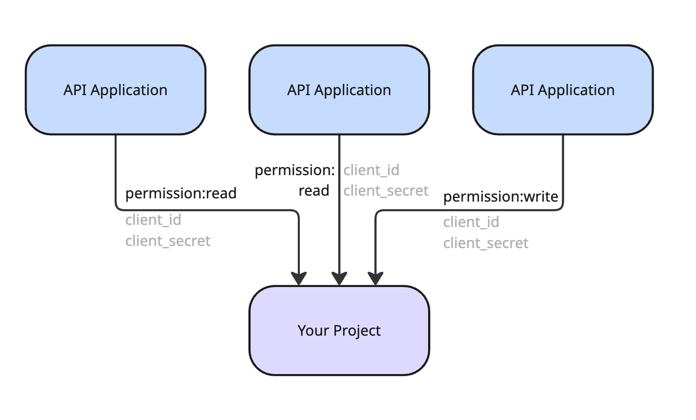

# API Applications

Creating an API Application results in the generation of a set of client credentials (ID and secret) that can be used for issuing an access token. Such a token is used when authorizing the [Management Api](./).

An API Application is project-scoped and is not tied to a user (even though it does have an owner). Instead, it is associated with a project and allows access only to this project's resources.

This approach minimizes the risk of accidental changes to the wrong project and allows for more granular access control over resources.


The endpoints to get all projects and all user API keys are not available for usage with a token generated from API Application credentials. As an API application is scoped to a single project, it cannot access anything other than that project and its resources. And since API keys belong to a user, not a project, they cannot be accessed with such a token.

