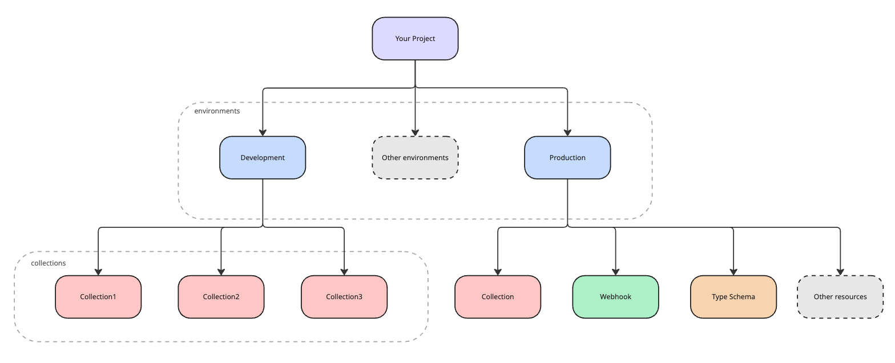

# Environments

Environments are used to set up deployment workflows, roll out features, or keep test data isolated from production.


A **production** environment is automatically created along with your project.


Create and manage existing environments using the [_/environments_ endpoints](https://apidocs.umbracocompose.com/#tag/environments) in the Management API.

Resources of the following types can be created in an environment:

* Collection
* IngestFunction
* TypeSchema
* Webhook
* PersistedDocument

See how different resources relate to each other here:


Across a single environment, resources of the same type need to be created with unique aliases.

