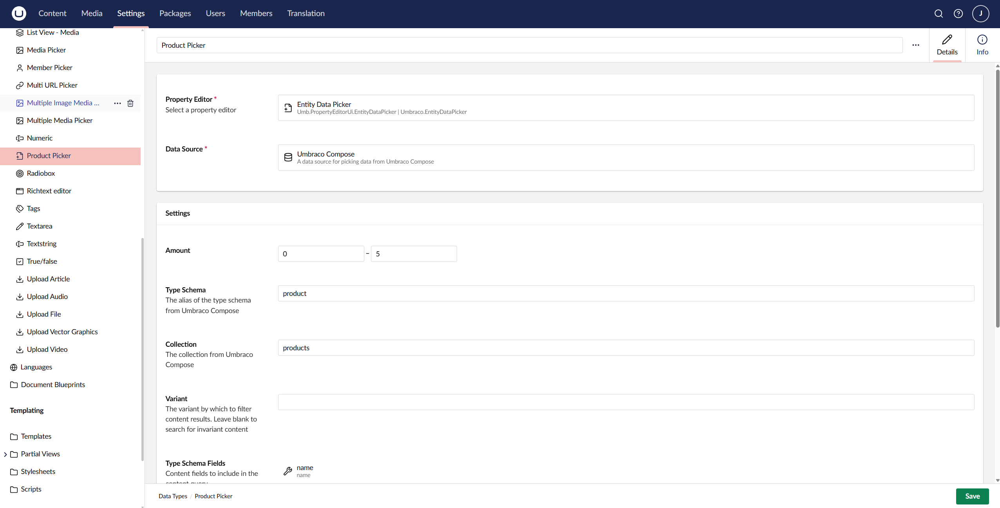

# Integrating with Umbraco CMS

The Umbraco Compose integration packages allow you to connect an Umbraco CMS installation to your Compose project. Once configured, content types and content are automatically synchronized to Compose whenever changes are made in the CMS.

The integration provides three main capabilities:

* **Content Type Synchronization** - Document Types in Umbraco CMS are automatically converted to JSON type schemas and saved to Compose.
* **Content Synchronization** - Published content is automatically ingested into Compose, keeping your headless content in sync with your CMS.
* **Data Source Integration** - Use Compose as a data source for content pickers in the Umbraco backoffice.

## Prerequisites

To follow this guide, you will need the following:

* An Umbraco CMS project running Umbraco 14 or later.
* An Umbraco Compose project with an API Application, environment, and collection configured. See the [Working with Content](./working-with-content.md) guide for an example of how to create these.
* The **Client Id** and **Client Secret** for your API Application.
* Your Compose project alias and environment alias (typically `production` for live environments).

If you do not yet have an API Application, see [Working with Content in Compose](working-with-content.md#create-a-management-api-application) for instructions on how to create one.

Your API Application will need the following scopes:

* `environment:your-environent:typeschema:write` - Required for creating type schemas.
* `ingestion` - Required for syncing content.
* `graphql` - Required if using the data source feature.

## Installing the Integration Packages

The integrations are distributed as NuGet packages. Each package provides specific functionality that you can install based on your needs.

| Package | Description |
| ------- | ----------- |
| `Umbraco.Compose.Integrations.UmbracoCms` | Meta-package that includes all of the below, plus automatic startup configuration. |
| `Umbraco.Compose.Integrations.UmbracoCms.Core` | Core authentication and configuration. Required by all other packages. |
| `Umbraco.Compose.Integrations.UmbracoCms.Schema` | Automatic content type to JSON schema synchronization. |
| `Umbraco.Compose.Integrations.UmbracoCms.Ingestion` | Automatic content synchronization on publish and unpublish. |
| `Umbraco.Compose.Integrations.UmbracoCms.DataSource` | Use Compose as a data source for content pickers. |

Install the packages using the .NET CLI or your preferred package manager. For example, to install all integrations:

```bash
dotnet add package Umbraco.Compose.Integrations.UmbracoCms
```

## Configuring the Integration

Configuration is provided through the standard .NET configuration system. Add the following section to your `appsettings.json` file:

```json
{
  "Umbraco": {
    "Compose": {
      "ClientId": "your-client-id",
      "ClientSecret": "your-client-secret",
      "ProjectAlias": "your-project-alias",
      "EnvironmentAlias": "production",
      "Ingestion": {
        "CollectionAlias": "content"
      }
    }
  }
}
```


The Client Secret is sensitive and should not be committed to source control. Consider using environment variables, user secrets, or a secure configuration provider for production deployments.


### Configuration Options

The following table describes all available configuration options:

| Property | Required | Description |
| -------- | -------- | ----------- |
| `ClientId` | Yes | The OAuth client id from your Compose API Application. |
| `ClientSecret` | Yes | The OAuth client secret from your Compose API Application. |
| `ProjectAlias` | Yes | The alias of your Compose project. |
| `EnvironmentAlias` | Yes | The Compose environment to synchronize with (for example, `production`). |
| `Region` | Yes | The Compose deployment region in which your project resides. |
| `Endpoints:BaseDomain` | No | Override the base domain for Compose APIs. Defaults to `https://umbracocompose.com`. |
| `Ingestion:CollectionAlias` | Yes* | The collection to ingest content into. Required when using the Ingestion package. |

## Registering Services

If you are not using the meta `Umbraco.Compose.Integrations.UmbracoCms` package, then you will need to manually register services in your startup file. This is done by way of extension methods on an `IUmbracoBuilder` instance/

Add the appropriate extension methods to your Umbraco builder:

```csharp
WebApplicationBuilder builder = WebApplication.CreateBuilder(args);

builder.CreateUmbracoBuilder()
    .AddBackOffice()
    .AddWebsite()
    .AddComposers()
    .AddUmbracoComposeAuthentication()       // Required: Core authentication
    .AddUmbracoComposeTypeSchemaManagement() // Optional: Content type sync
    .AddUmbracoComposeIngestion()            // Optional: Content sync
    .AddUmbracoComposeDataSource()           // Optional: Data source picker
    .Build();

WebApplication app = builder.Build();

await app.BootUmbracoAsync();

app.UseUmbraco()
    .WithMiddleware(u =>
    {
        u.UseBackOffice();
        u.UseWebsite();
    })
    .WithEndpoints(u =>
    {
        u.UseBackOfficeEndpoints();
        u.UseWebsiteEndpoints();
    });

await app.RunAsync();
```

## Automatic Content & Type Synchronization

Once configured, the Schema package automatically synchronizes content types to Compose whenever they are saved in the Umbraco backoffice.

When you create or modify a Document Type, the integration:

1. Intercepts the save event.
2. Converts the Document Type to a JSON Schema that conforms to the Compose format.
3. Sends the schema to the Compose Management API as a type schema.

The type schema alias in Compose will match the Document Type alias in Umbraco. Properties are mapped to their JSON Schema equivalents based on their Umbraco property editor types.


Type schemas are only synchronized when Document Types are saved. If you have existing Document Types that you want to synchronize, open each one in the backoffice and save it.


Likewise, a similar process occurs whenever you publish a content node. The integration:

1. Intercepts the publish event.
2. Builds a content payload including properties, metadata, and routing information.
3. Sends the payload to the Compose Ingestion API.


Support for removing content from Compose on unpublish or delete is not presently available. This is an upcoming feature of the integration.


### Multi-lingual Content

The integration supports content that varies by language. When a content item has multiple language variants, each variant is ingested separately with its culture code as the variant identifier.

## Using Compose as a Data Source

The Data Source package allows you to configure the [Entity Data Picker](https://docs.umbraco.com/umbraco-cms/fundamentals/backoffice/property-editors/built-in-umbraco-property-editors/entity-data-picker) in the Umbraco backoffice to retrieve content from Compose. This allows you to relate content nodes in the CMS with other content from Compose.

### Configuring a Data Source

To use Compose as a data source for a content picker:

1. Create or edit an Entity Data Picker Data Type in the Umbraco backoffice.
2. Configure the data source with the following settings:

| Setting            | Description |
| ------------------ | ----------- |
| Amount             | The minimum and maximum number of items to allow content authors to select. |
| Type Schema        | Alias of the type schema to filter by. |
| Collection         | The Compose collection that contains the content you wish to query. |
| Variant            | The content variant/culture to retrieve. |
| Type Schema Fields | The set of all fields to return from the underlying GraphQL query. Must include the fields used for searching (Search Field) and uniquely identifying the item (Key Field). |
| Search Field       | The field to search when filtering items. |
| Key Field          | The field to use as the unique identifier. |
| Entity Icon        | An icon to display next to items in the picker. |

The data source queries Compose using GraphQL to retrieve matching content items, which are then displayed in the picker interface.



## Troubleshooting

If content is not being synchronized to Compose:

1. **Verify credentials** - Ensure your Client Id and Client Secret are correct and that the API Application has the required scopes.
1. **Verify project / environment / collection** - Confirm that you have specified the correct project, environment, and collection in your app settings, environment variables, or entity data picker configuration.
1. **Check logs** - Check your Umbraco logs for errors.
1. **Re-save affected content / types** - Sometimes a transient failure might disrupt delivery. Try re-saving the Document Type or content a second time and see whether it succeeds.
1. **Contact support** - If nothing else works, create a ticket from the Umbraco Cloud portal.