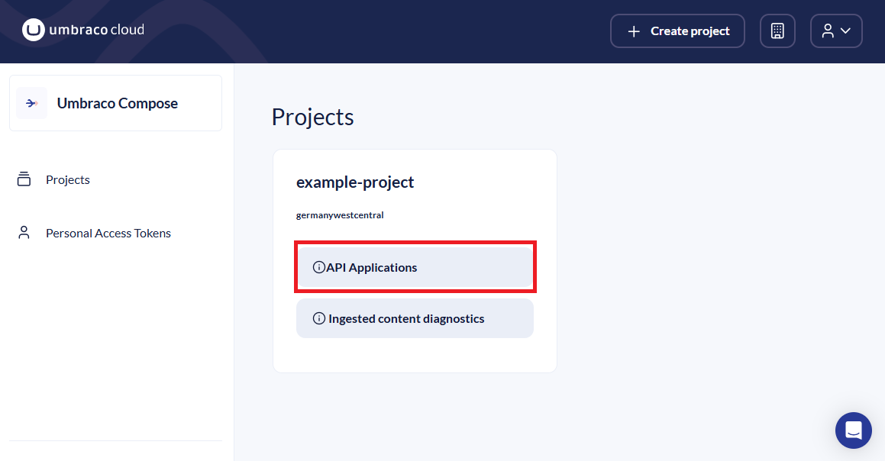
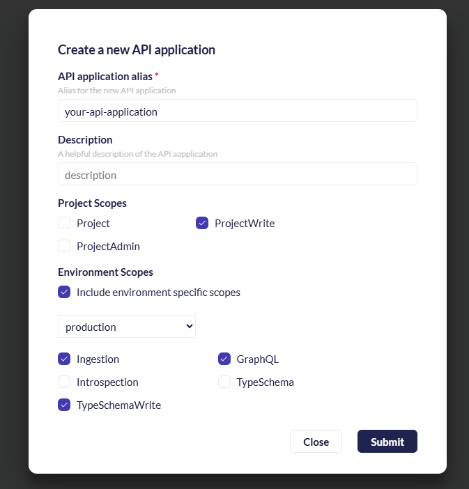
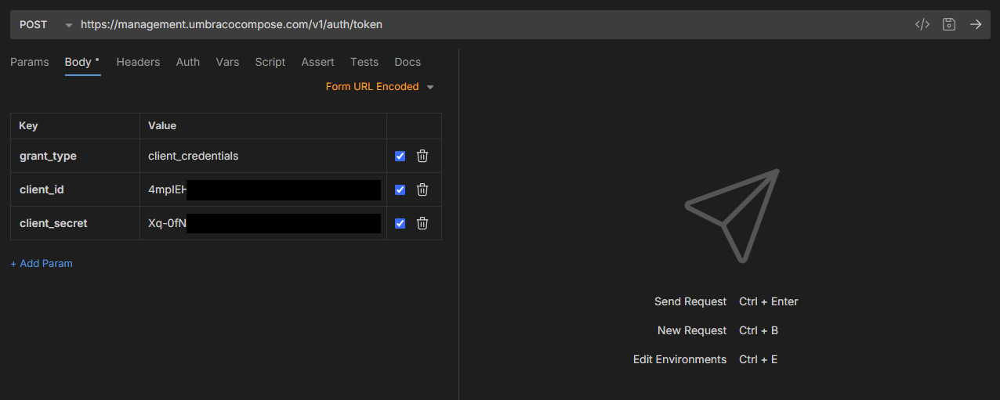
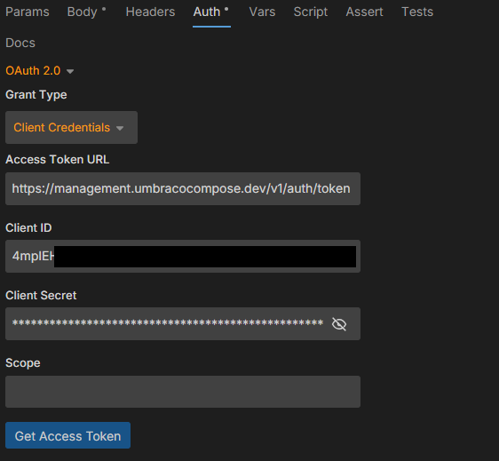
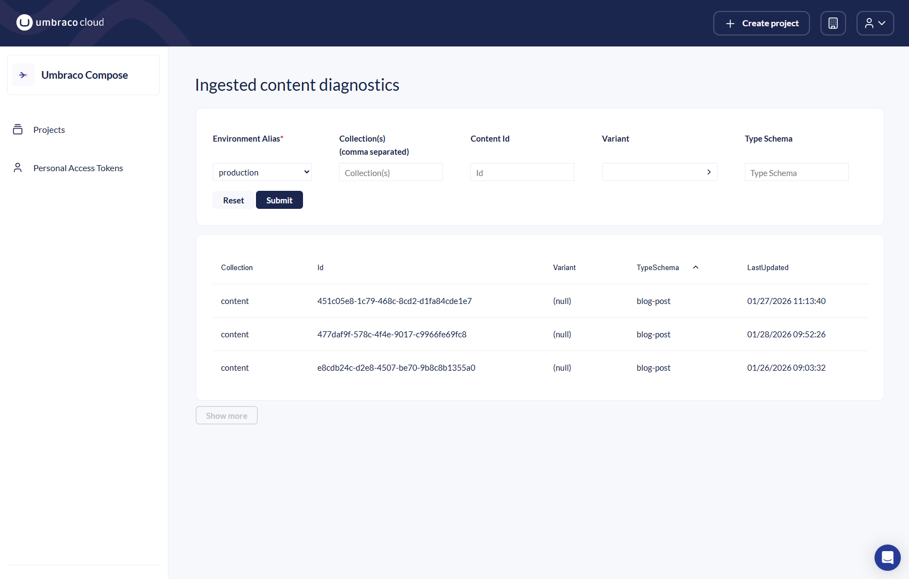

# Working With Content in Compose

This guide provides an end-to-end overview of how to work with Umbraco Compose, from initial setup to delivering content through APIs.

## Prerequisites

To follow this guide, you will need the following:

* An Umbraco Cloud account.
* An Umbraco Compose project to which your account has access.
* A developer API tool, such as Bruno or Postman. Ideally your tool should also support:
  * Automatic refresh of OAuth access tokens.
  * GraphQL requests.

## Create a Management API Application

To work with your Compose project you will need an API Application. This application is used to call the Management API to configure the project. It can also be used later to call the [Ingestion](../apis/ingestion/) and [GraphQL](../apis/graphql/) APIs.

Creating an API application is done in the [Umbraco Cloud Portal](https://s1.umbraco.io/compose).

1. Open the Umbraco Cloud Portal and select the relevant project.
2. Select **API Applications**.
3. Select **Create API Application**.



4. Provide an **alias** for the API Application and, optionally, a **description**.

In many real-world use cases, you will use different API Applications for calling Compose APIs from different sources. For example, you might have one for ingesting content and a different one for retrieving it from GraphQL.

Additionally, you may later wish to configure different environments. For example, you may wish to use a test environment to keep your non-production content clearly separated from live. Compose projects have a `production` environment created by default.

For simplicity, this guide uses a single API Application and the default `production` environment.

Scopes are how Compose determine which APIs an Application is authorized to call. For this guide your application will need the following scopes:

* `ProjectWrite`
* `Ingestion`
* `GraphQL`
* `TypeSchemaWrite`

The `ProjectWrite` scope is granted at the project level. The others apply only to a single environment. Make sure to apply them to the `production` environment.



5. Submit the form. If successful, the portal will now show you the client secret for your new Application.


The client secret is shown only once, immediately after the API Application is created. Store it securely, as it is required to authenticate the application.


## Requesting an Access Token

Once you have an API Application you can use it to request an OAuth access token, which may in turn be used to call other Compose APIs.

To request an access token, you need to send a request to the Management token exchange endpoint. Eventually it will be your applications sending these requests. However, in this guide you will perform the request manually with your API tool of choice.

In your API tool:

1. Create a POST request to `https://management.umbracocompose.com/v1/auth/token`.
2. Set the content type to `application/x-www-form-urlencoded`.
3. Configure the following form properties:

| Property        | Value                                                                                                              |
| --------------- | ------------------------------------------------------------------------------------------------------------------ |
| `grant_type`    | `client_credentials`                                                                                               |
| `client_id`     | The client id for your Application. Can be retrieved from the Cloud portal page where you created the Application. |
| `client_secret` | The client secret value that was displayed immediately after creating your Application.                            |



Send the request using your tool. You should receive a response that looks like the following:

```json
{
  "access_token": "eyJhb...", // Truncated for brevity
  "token_type": "Bearer",
  "expires_in": 300
}
```

The `access_token` in the response can be used to authenticate to Compose _**as**_ your API application. It is only valid for 5 minutes.

In the rest of the guide, it is assumed that you have a valid access token. You may wish to save this request so that you can run it again after your token has expired.

### Using an Access Token

In all subsequent requests that you make to Compose APIs in this guide, you will need to add a valid access token.

This is done by setting the `Authorization` HTTP request header to have a value of `Bearer {access-token}`, where `{access-token}` is replaced by your actual token:

`Authorization: Bearer {access-token}`

### Automatic Token Renewal

Instead of manually issuing a new access token each time the previous one expires, you may wish to configure your tool to automatically refresh the token for you. This varies by tool, but can typically be found under an "Auth" section.

1. Select **OAuth 2.0** as your auth type.
2. Select **Client Credentials** as the grant type.
3. Use `https://management.umbracocompose.com/v1/auth/token` as the Access Token URL.
4. Enter the **Client ID** and **Client Secret** for the API application.



Your tool should now be able to request and use access tokens without you needing to manually copy-paste them in different requests.

## Create a Collection

[Collections](../content-orchestration/collections.md) are a container in which content can be stored. You can create them from the Management API. In this step, you will create a collection called "content".

Create a `POST` request to the Create Collection endpoint of the Compose Management API. You will need to replace `{projectAlias}` with the actual alias of your project.

```http
POST https://management.umbracocompose.com/v1/projects/{projectAlias}/environments/production/collections
```

For the body of the request, use the following JSON:

```json
{
    "collectionAlias": "content"
}
```

Optionally add a description for your collection using the `description` property in the above JSON.

Finally, send the request and look for an HTTP `201: Created` response to indicate that your collection was successfully created.

## Create Your First Type Schema

Compose needs to know about the structure of your content to surface it through the [GraphQL delivery API](../apis/graphql/). You can tell Compose about this structure by configuring one or more [Type Schemas](../content-orchestration/type-schemas.md).

In this guide, you will define a type schema that describes a simple blog article.

First, create a `POST` request to the Create Type Schema endpoint of the Compose Management API. You will need to replace `{projectAlias}` with the actual alias of your project.

```http
POST https://management.umbracocompose.com/v1/projects/{projectAlias}/environments/production/type-schemas

```

For the body of the request, use the following JSON:

```json
{
  "typeSchemaAlias": "blog-article",
  "schema": {
    "$schema": "https://umbracocompose.com/v1/schema",
    "allOf": [{
      "$ref": "https://umbracocompose.com/v1/node"
    }],
    "properties": {
      "title": {
        "type": "string"
      },
      "body": {
        "type": "string"
      },
      "author": {
        "type": "object",
        "properties": {
          "name": {
            "type": "string"
          }
        }
      },
      "publishDateTime": {
        "type": "string",
        "format": "date-time"
      }
    }
  }
}
```

This creates a type schema called `blog-article`. The type has four properties: `title`, `body`, `author`, and `publishDateTime`. `author` has a nested property called `name`. Most properties are strings, but the `publishDateTime` property will be served from GraphQL as `DateTime`.

This type schema is straightforward. However, it is possible to have much more complicated structures, reference other type-schemas, and even re-use parts of type schemas. See [Type Schemas](../content-orchestration/type-schemas.md) for more advanced examples.

Send the request and look for an HTTP `201: Created` response to indicate that your type schema was successfully created.

## Create Content Instances

You are now ready to store some content in Compose. To do this, make a request to the [Ingestion API](../apis/ingestion/).

Adding content to Compose can be done in two ways: either using [RESTful Ingestion](../apis/ingestion/restful-ingestion.md) or by using a transformation [Ingestion Function](../apis/ingestion/functions.md). In this guide, you will add content from your API tool and have full control over its structure. This makes RESTful Ingestion the more straightforward of the two.

First, create a PUT request to the Ingestion API. Unlike Management API requests, you will also need to include your project region in the URL. Also make sure to replace `{projectAlias}` with the actual alias of your project.

```http
PUT https://ingest.germanywestcentral.umbracocompose.com/v1/{projectAlias}/production/content
```

In the body of the request, you specify content entries to modify.

```json
[
  {
    "id": "1",
    "type": "blog-article",
    "action": "upsert",
    "data": {
      "title": "Umbraco Compose: The Best Thing Since Sliced Bread?",
      "body": "Lorem ipsum dolor sit amet...",
      "publishDateTime": "2026-02-03T15:30:00",
      "author": {
        "name": "Umbraco HQ"
      }
    }
  }
]
```

A brief summary of how these parameters affect ingestion of the content entry is as follows:

* The `action` parameter states how you would like to modify the entry. `upsert` is used for adding content if it does not already exist in the collection, or updating it if it does.
* The `type` parameter is the alias of the type schema that it conforms to. In this case, you use the `blog-article` schema that was saved earlier.
* `data` contains the actual content item itself. It is not strictly necessary for this object to match the `blog-article` type schema exactly. However, any properties that do not match those defined on the type schema will not be served from GraphQL.

This example only adds a single blog post item. The root level of this body is an array. By adding more items to the array, you can batch insert (or update/delete) multiple content items in a single call.

Send the request, making sure to include your access token in the `Authorization` header. Unlike the Management API, the Ingestion API is asynchronous, so a successful response will be HTTP `204: Accepted`.

## Verify Ingested Content

Sometimes your integrations may perform unexpected behaviour and cause ingested content that does not match a type schema. Since the GraphQL API returns only properties that you have defined in type schemas, it may not show the problem content.

To address this, you can see the raw ingested content on the Ingested Content Diagnostics page in the [Umbraco Cloud Portal](https://s1.umbraco.io/compose).

Navigate to the portal and select _Ingested content diagnostics_ on the relevant project.

You will be presented with a data view where, by default, you can see your most recently ingested content. The filters at the top of the page let you refine the display by collection, variant, type schema, and so on.



## Delivery With GraphQL

Now that you have stored some content in Compose, it is time to get it back out again.

This is done from the [GraphQL delivery API](../apis/graphql/).

In your API tool, create a GraphQL `POST` request to the API. Make sure to replace `{projectAlias}` with the actual alias of your project.

```http
POST https://graphql.germanywestcentral.umbracocompose.com/{projectAlias}/production
```

For the GraphQL body of the request, use the following:

```graphql
{
  content {
    items {
      ... on BlogPost {
        title,
        body,
        publishDateTime,
        author {
          name
        }
      }
    }
  }
}

```

This query first tells Compose to use the `content` collection. It will retrieve all items from that collection, and for any that use the `blog-post` type schema, it requests the given fields.

Make sure to add your access token as usual and send the request. You should receive an HTTP 200 response from GraphQL containing your blog post, structured in the same way as the query!

## Next Steps

You've now seen how to configure your Compose project and get content into and out of the platform.

There is plenty of other functionality available in Compose that was not covered in this guide. Head to the [API Overview](../apis/api-overview.md) or [Content Orchestration](../content-orchestration/environments.md) section to learn more.
