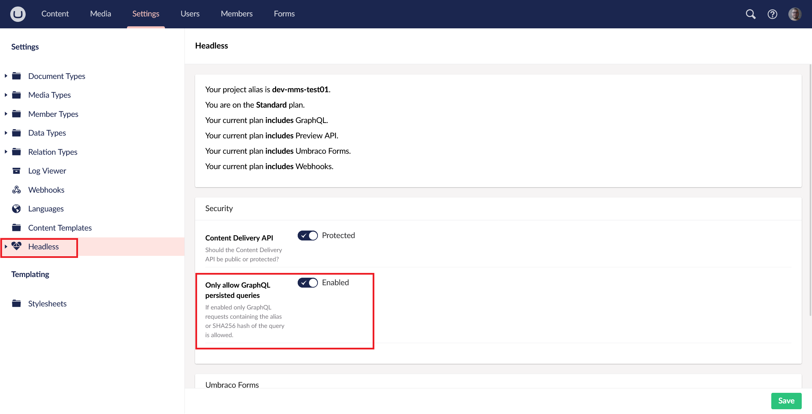

# Persisted queries

Persisted queries allow you to store GraphQL queries on the server. This enables clients to execute them by referencing an alias rather than sending the full query each time. this approach streamlines client-server communication and enhances security.

## Why use persisted queries?

* Reducing the payload size

    By sending only the alias and necessary variables, you minimize the data transmitted over the network. This reduction in payload size leads to faster request times and is particularly beneficial for mobile applications or environments with limited bandwidth.

* Enhanced Security

    Persisted queries provide improved security by ensuring that only predefined, server-stored GraphQL queries can be executed, preventing clients from running arbitrary or malicious queries.

    However, to fully benefit from this security enhancement, it is essential that the content delivery API is set to private, and GraphQL is configured to only allow persisted queries. Without these settings in place, the security advantages of using persisted queries are not realized.

## Enable Persisted queries only

In order to fully benefit from the security enhancement that comes with persisted queries you need to enable the ` Only allow GraphQL persisted queries` setting. This can be done from the headless options section within the backoffice

Please be aware this will also disable the execution of queries in the playground.

