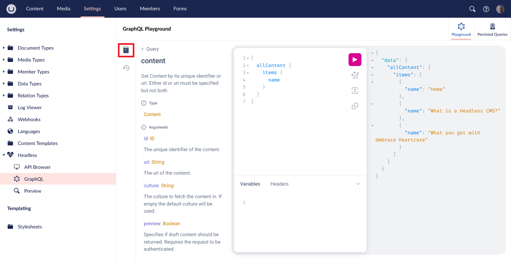
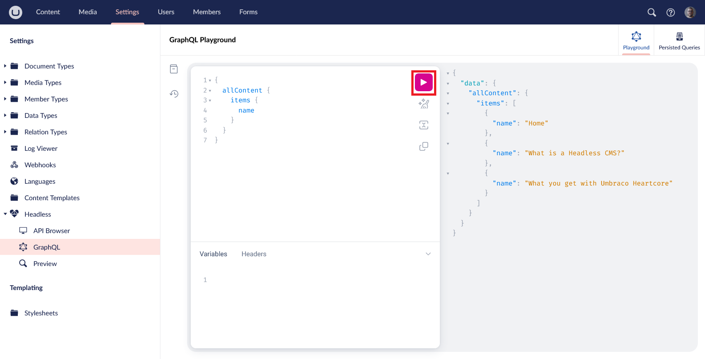
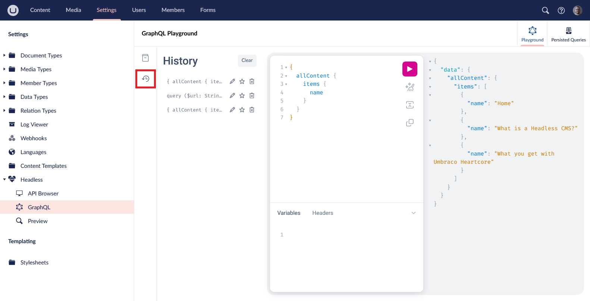
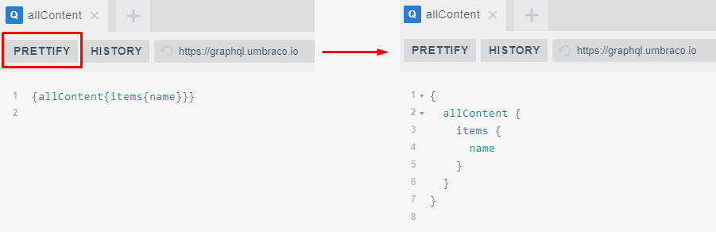
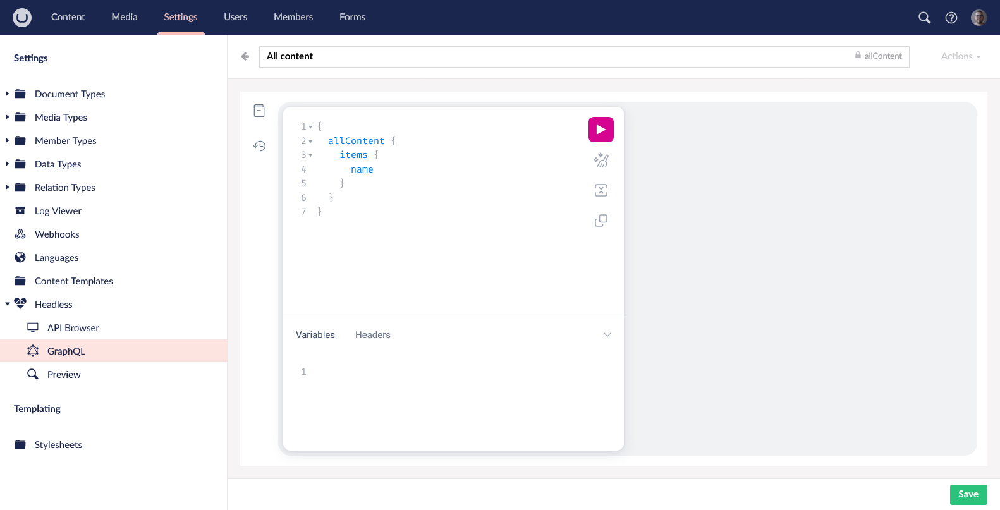
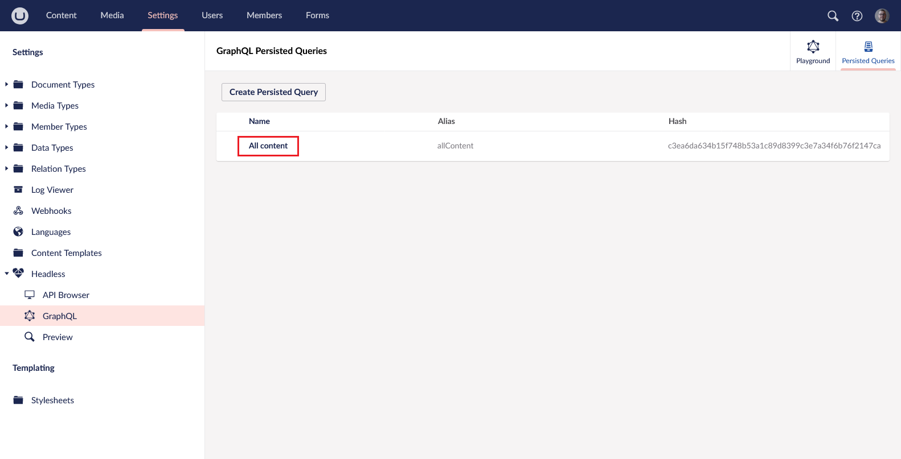

# GraphQL Playground

With the GraphQL query language, you will be able to limit the amount of data transferred to and from your Heartcore instance and the client by specifying exactly what kind of information you would like to get in your API calls.

You can test and build GraphQL queries directly in the backoffice-integrated GraphQL Playground.

In the Settings section in the Umbraco Backoffice, you will find the Headless tree. From there you can use the GraphQL Playground to test your queries against your project's schema.

The Playground comes with basic features such as real-time error highlighting, syntax highlighting, formatting, query history and more.

## Accessing GraphQL Playground

1. Log into the project backoffice
2. Navigate to the Settings dashboard
3. Find the Headless tree near the bottom of the navigation list
4. Click on GraphQL


From there, you can start querying as soon as your content is published.

## Features

### Documentation & Schema

The GraphQL Playground's build-in documentation and schema browser can be found on the left toolbar

This button will open a panel that grants you a quick overview of how content is structured using the Document Types in your solution.

It also gives an idea of how to access specific properties on each Document Type, nested properties, and properties from compositions.

At the same time, it also explains relationships between specific objects and properties in your solution.

This will be updated automatically as you change the project's schema meaning Document Types, Data Types, Document Type Compositions, and Document Type Elements.




## Running GraphQL queries

To run a query use the left side of the GraphQL Playground to type in your query - could be something as basic as getting the names of all your content pages:

```graphql
{
  allContent {
    items {
      name
    }
  }
}
```

To learn more about querying, visit our [API documentation for GraphQL](../api-documentation/graphql/).


The Heartcore GraphQL endpoint only supports queries - other operation types, that is mutations and subscriptions, are not supported.


After that, press the "Play" button sitting in the center of the Playground. If the query is constructed correctly, the results will be loaded into the right section.



When you are satisfied with the result, you can copy the client URL (CURL) by clicking the `COPY CURL` button located in the top part of the Playground, next to the address bar.

## Sending HTTP headers

GraphQL Playground supports requests with HTTP headers if an authorization token is needed. The `HTTP HEADERS` section can be accessed from the bottom-right corner of the Playground window. By default, it contains the `umb-project-alias` header, the alias of your Heartcore project. It is possible to add multiple headers.

## Query variables

It is also possible to define variables for queries - such variables's values can be changed in the bottom-left corner of the Playground window, next to the `HTTP HEADERS` section.


## History

If you happen to make an amazing query and afterward erase it by accident, you can re-use it by finding it in the History.

The History pane can be opened by clicking the history button in the toolbar to the left.



## Prettify

The Playground gives you an option to "prettify" your query with a click of a button, which makes it easier for humans to read.



## Persisted Queries

The Graphql playground supports [persisted Graphql queries](../api-documentation/graphql/persisted-queries.md).
To access Persisted queries you have to go to the [GraphQL Playground](#accessing-graphql-playground) and click the persisted queries tab


### Create a new persisted query

1. Click the `Create Persisted Query` button
2. Enter a name for the query in the new query editor that appears
3. Write your query in the editor
4. Click the `Save` button



### Update a persisted query

1. Find the query you want to update in the persisted queries list
2. Click on the name of the query
3. Make your changes in the editor that appears with the query
4. Click the `Save` button



### Delete a persisted query

1. Find the query you want to delete in the persisted queries list
2. Click on the name of the query
3. Click the action menu in the top right corner of the editor with the query
4. Click the `Delete` button
5. Confirm the deletion


