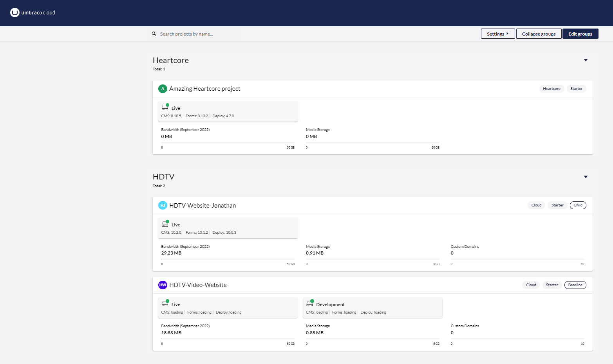
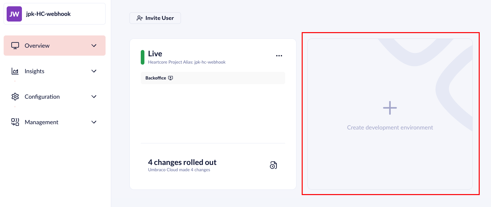

# The Umbraco Cloud Portal

In this article, you will learn more about the Umbraco Cloud Portal and what options are available to you.

## Umbraco Cloud Portal Overview

After you have logged into the [Umbraco Cloud Portal](https://www.umbraco.io), you are presented with the project list overview.

From here you can see a list of all your projects. If you have multiple projects, you can sort specific projects into groups.

Clicking on a project will take you to the project page where you will get an overview of your environment(s).

<figure><figcaption>
Project Overview.
</figcaption></figure>

## Manage Environments

From here, you can create multiple environments, so that you can have a Development and eventually also a Staging environment. Depending on what plan you have chosen, you will have access to one or more environments on your project.

<figure><figcaption>
Add environment.
</figcaption></figure>

If you want to add an environment, all you have to do is click **Create Development Environment**. Umbraco will create the environment for you.

When you are done, you can go back to the project overview.

## Invite member

In the top-left corner, you will find the **invite member** option. This will allow you to quickly invite new team members to your project from a modal that pops up. This makes it very fast to invite new team members.

<figure><figcaption>
Invite Team Member Modal.
</figcaption></figure>

## Settings

In the left side menu, you can find the different settings and configurations available for your Heartcore project.

<figure><figcaption>
Project Menu Overview.
</figcaption></figure>

### Edit Team

As with the **invite member** option, you can add new team members to your project. It is also possible to change the roles of your team members here, provided that you have sufficient permissions. You can remove team members from this page as well as see any pending invitations you might have sent.

It is also here, that you are able to add or edit the Technical Contact information such as Name, Email, and telephone number.

<figure><figcaption>
Edit team.
</figcaption></figure>


When you invite a Team Member to your Heartcore project, they will automatically get access to the backoffice of the project as well.

You can add as many members to your project as you want.


### Webhooks

Here you are able to set up a webhook that will gather all the information about each deployment. You can integrate webhooks with applications such as Slack. Doing so, you can get Heartcore to post a message in a chosen Slack channel after each deployment.

### Usage

On the Usage page, you will find an overview that displays your usage and evaluates it against the plan limitations of your project. On the page, you will also find the top 10 for the bandwidth usage of your project. This can give you important insight into where you can optimize resource management.

<figure><figcaption>
Usage page on Heartcore project.
</figcaption></figure>

### Upgrade plan

Here you will be able to upgrade your trial to a plan that fits your needs.

### Rename project

Here you can rename your project. All default umbraco.io hostnames will be updated to match the new name. When renaming a project you will also need to update the `Umb-Project-Alias` header when you are sending requests to the API, as changing the name of the project will also change the project alias.

<figure><figcaption>
Rename Project.
</figcaption></figure>

### Delete project

From this page, you can delete your project. When deleting the project your subscription will automatically be cancelled as well. Deleting the project is a **permanent action**.

<figure><figcaption></figcaption></figure>

## Go to backoffice

Clicking on the 'Go to backoffice' link will open up a new tab with the login screen for the Backoffice. If you would like to learn more, you can read our documentation for the[ Heartcore Backoffice](the-umbraco-backoffice.md).
